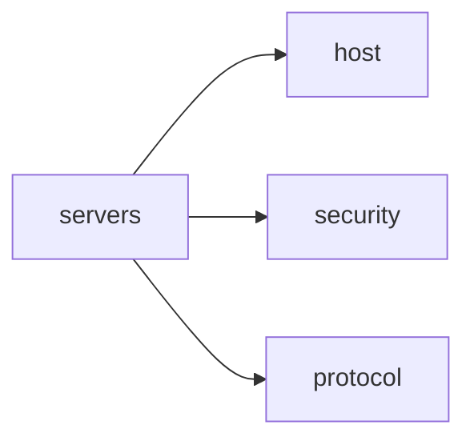

A server may represent a message broker handling communication between producers and consumers. It can also represent other things so please first familiarize first with [Server](/docs/concepts/server) concept.

Adding and defining servers is useful because it specifies where and how to connect. The connection facilitates where to send and receive messages.

A unique key identifies the server and contains information about the server's connection details, such as the host, protocol, and authentication. 

Here is an illustration of server information with selected fields: 



Server is one of main sections of AsyncAPI document next to others like `info`, `channels` or `operations`.

## Define servers

Define the servers in your AsyncAPI specification file. Server definitions specify the server to which a channel or operation is connected. Here's an example of how to define a server in AsyncAPI:

```yaml
servers:
  prod:
    host: test.mosquitto.org
    protocol: mqtt
    description: Test MQTT server
```

In this example, you define a server that uses MQTT protocol and messages are sent or received from `test.mosquitto.org` host.

## Server reusability

Reuse servers by adding their definitions in one place, like `components.servers` and then reference to them using `$ref` keyword.

Here's an example of AsyncAPI document with two servers referenced from `components` section:
```yaml
servers:
  kafka-test:
    $ref: '#/components/servers/kafka-test
  mqtt-test:
    $ref: '#/components/servers/mqtt-test
components
  servers:
    kafka-test:
      host: my.kafka.pl
      protocol: kafka-secure
      description: Test Kafka server
    mqtt-test:
      host: test.mosquitto.org
      protocol: mqtt
      description: Test MQTT server
```

In this example main `servers` section contains a list of servers but their definitions are sharable. You can also put servers definitions in a separate location and share across multiple AsyncAPI documents.

## Channel only on specific server

Your AsyncAPI document can describe an application that receives messages on one channel from server operating over MQTT, but sends messages on another channel operating over Kafka. This means you have two servers defined, but your channels are not available on all servers. In other words, you have one channel available only on MQTT server, and one channel available only on Kafka server. You can describe it in AsyncAPI document by adding `servers` array directly to channel. It should contain references to respective servers definitions.

Here's an example of how to add a server reference to a channel:

```yaml
servers:
  kafka-test:
    host: my.kafka.pl
    protocol: kafka-secure
    description: Test Kafka server
  mqtt-test:
    host: test.mosquitto.org
    protocol: mqtt
    description: Test MQTT server
channels:
  myChannel:
    servers:
      $ref: "#/servers/mqtt-test"
    message:
      $ref: '#/components/messages/myMessage'
```

In this example, `myChannel` channel is available only on `mqtt-test` server.
