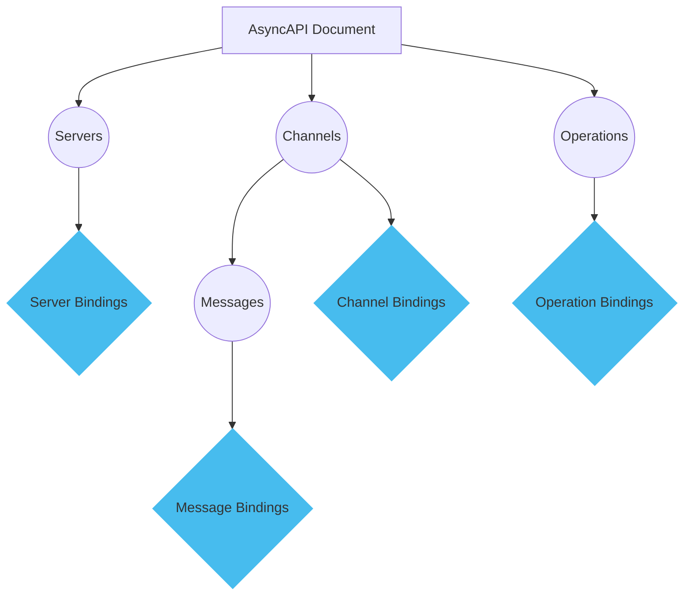
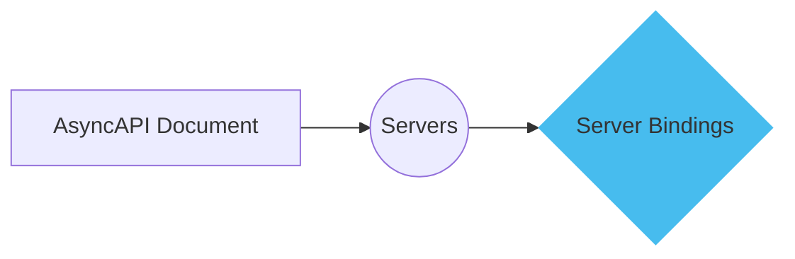
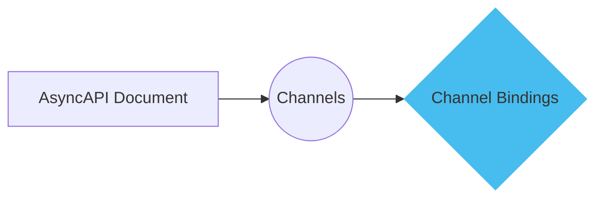
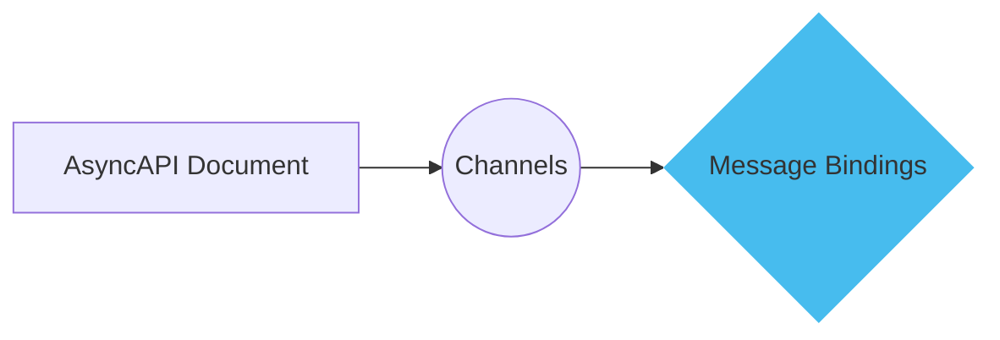
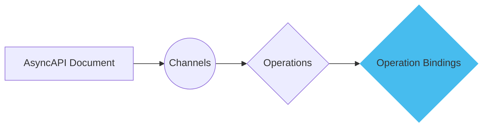

Bindings in AsyncAPI provide a way to add protocol-specific information to the AsyncAPI documentation. They can be added to different document parts, such as servers, channels, or messages, to specify standard details specific to a particular protocol. The purpose of bindings is to enhance the understanding and usage of the API by providing additional context and configuration options for different protocols.

Here is a diagram explaining binding:



This diagram illustrates the structure of an AsyncAPI document and the areas where bindings can be applied.

## Server bindings

Server bindings provide protocol-specific information related to the server configuration. For example, if you use RabbitMQ (AMQP protocol) as your message broker, you can specify the exchange name, type, durability, and virtual host in the server bindings.

Here is a diagram explaining server binding:



This diagram shows where server bindings fit into the AsyncAPI document structure.

Here is an example of using server bindings to specify protocol-specific information related to the server configuration:

```yml
servers:
    - url: amqp://localhost
    protocol: amqp
    bindings:
        amqp:
        exchange:
            name: myExchange
            type: direct
            durable: true
            vhost: /
```

## Channel bindings

Channel bindings are used to specify protocol-specific information for a specific channel. For example, in RabbitMQ, you can specify the exchange type, durability, and virtual host for a specific channel.

Here is a diagram explaining channel binding:



This diagram shows where channel bindings fit into the AsyncAPI document structure.

Here is an example of using channel bindings to specify protocol-specific information for a specific channel:

```yml
channels:
  user/signedup:
    bindings:
      amqp:
        is: routingKey
        queue:
          name: my-queue-name
          durable: true
          exclusive: true
          autoDelete: false
          vhost: /
        exchange:
          name: userExchange
          type: topic
          durable: true
          autoDelete: false
          vhost: /
        bindingVersion: 0.2.0
```

This document shows how to set up channel bindings for a RabbitMQ channel.

## Message bindings

Message bindings provide protocol-specific information for a specific message. You can define properties like the timestamp and acknowledgment settings for a message in the bindings.

Here is a diagram explaining message binding:



This diagram shows where Message Bindings fit into the AsyncAPI document structure.

Here is an example of using message bindings to provide protocol-specific information for a specific message:

```yml
channels:
  user/signedup:
  publish:
    message:
      bindings:
        amqp:
          timestamp: true
          ack: false
```

This document shows how to set up message bindings for a RabbitMQ message.

## Operation Bindings

Operation bindings allow you to specify protocol-specific information for a specific operation. For example, in AMQP, you can specify the operation frequency.

Here is a diagram explaining operation binding:



This diagram shows where operation bindings fit into the AsyncAPI document structure.

Here is an example of using operation bindings to specify protocol-specific information for a specific operation:

```yml
channels:
  user/signedup:
    subscribe:
      x-microcks-operation:
        frequency: 30
      message:
        $ref: '#/components/messages/UserSignedUp'
```

This document shows how to set up operation bindings for a RabbitMQ operation.

By using bindings, you can enhance the AsyncAPI documentation with protocol-specific details, making it easier for developers to understand and implement the API.
