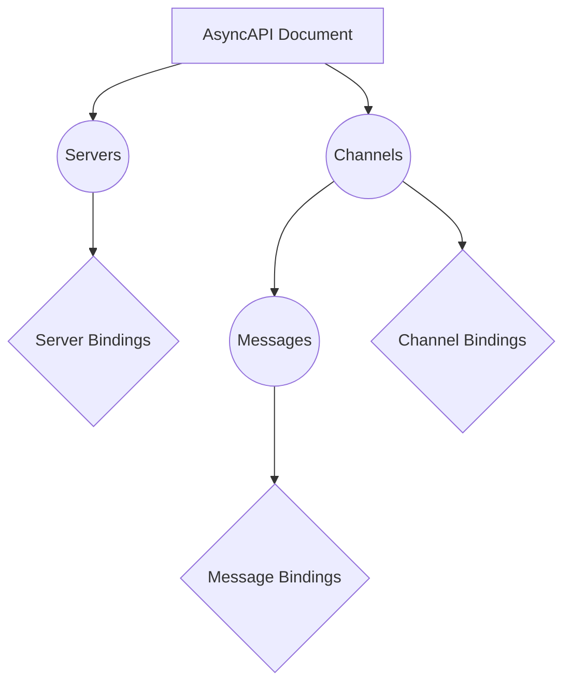
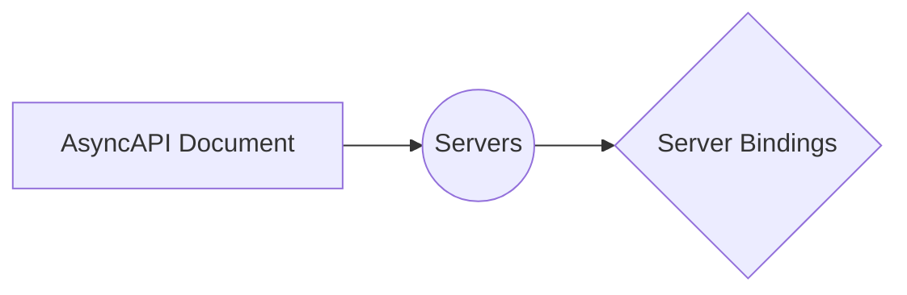
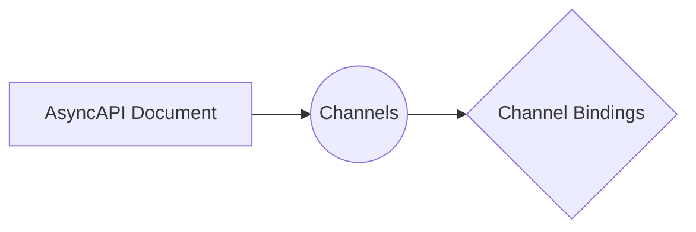
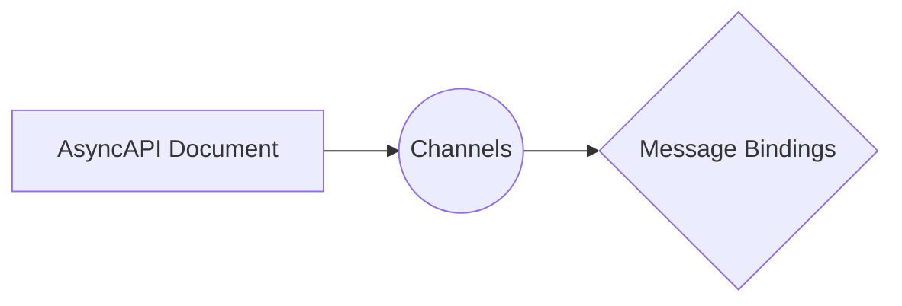

Bindings in AsyncAPI provide a way to add protocol-specific information to the AsyncAPI documentation. They can be added to different parts of the document, such as servers, channels, or messages, to specify common details specific to a particular protocol. The purpose of bindings is to enhance the understanding and usage of the API by providing additional context and configuration options for different protocols.



## Server Bindings

Server bindings provide protocol-specific information related to the server configuration. For example, if you are using RabbitMQ as your message broker, you can specify the exchange name, type, durability, and virtual host in the server bindings.



Here is an example of how to use server bindings in the AsyncAPI document to specify protocol-specific information related to the server configuration.

```yml
servers:
    - url: amqp://localhost
    protocol: amqp
    bindings:
        amqp:
        exchange:
            name: myExchange
            type: direct
            durable: true
            vhost: /
```


## Channel Bindings

Channel bindings allow you to specify protocol-specific configurations for a particular channel. For example, you can define the exchange type, durability, and virtual host for a specific channel in RabbitMQ.



 Here is an example of how to use channel bindings in the AsyncAPI document to define protocol-specific configurations for a specific channel.

```yml
channels:
    user-registered:
    bindings:
        amqp:
        exchange:
            name: userExchange
            type: direct
            durable: true
            vhost: /
```

## Message Bindings

Message bindings provide protocol-specific information for a specific message. You can define properties like the timestamp and acknowledgment settings for a message in the bindings.

Here is an example of how to use message bindings in the AsyncAPI document to provide protocol-specific information for a specific message.



Here is an example of how to use message bindings in the AsyncAPI document to provide protocol-specific information for a specific message.

```yml
channels:
    user-registered:
    publish:
        message:
        bindings:
            amqp:
            timestamp: true
            ack: false
```

By using bindings, you can enhance the AsyncAPI documentation with protocol-specific details, making it easier for developers to understand and implement the API.
