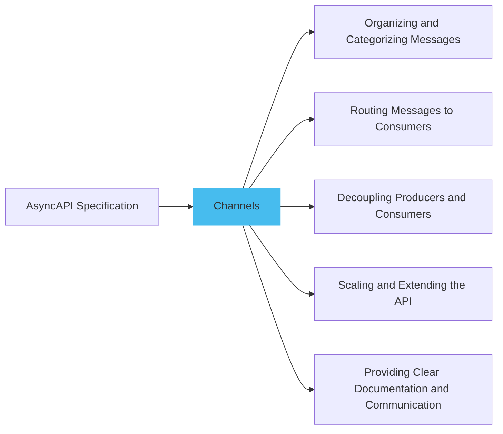
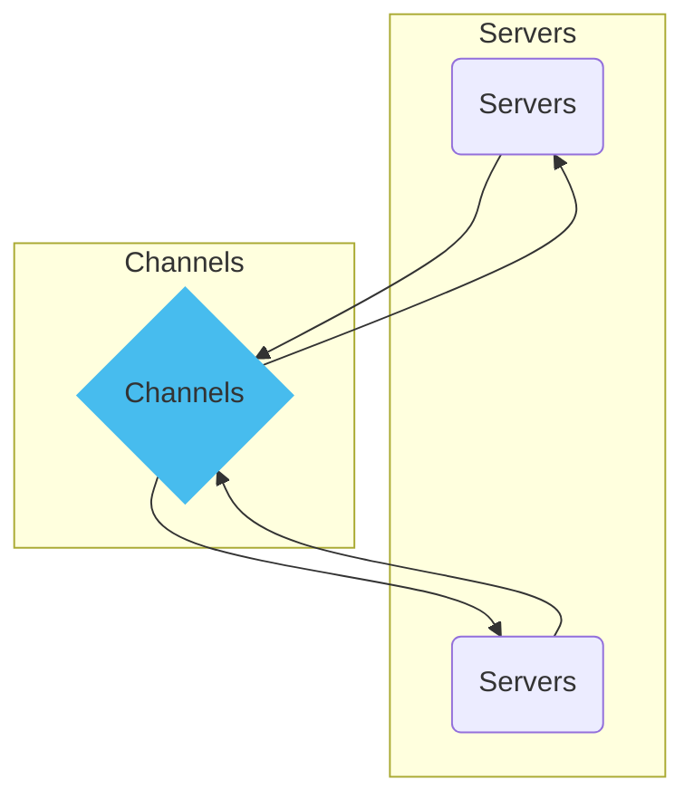
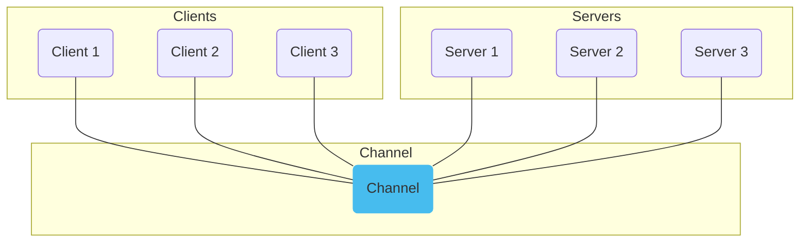
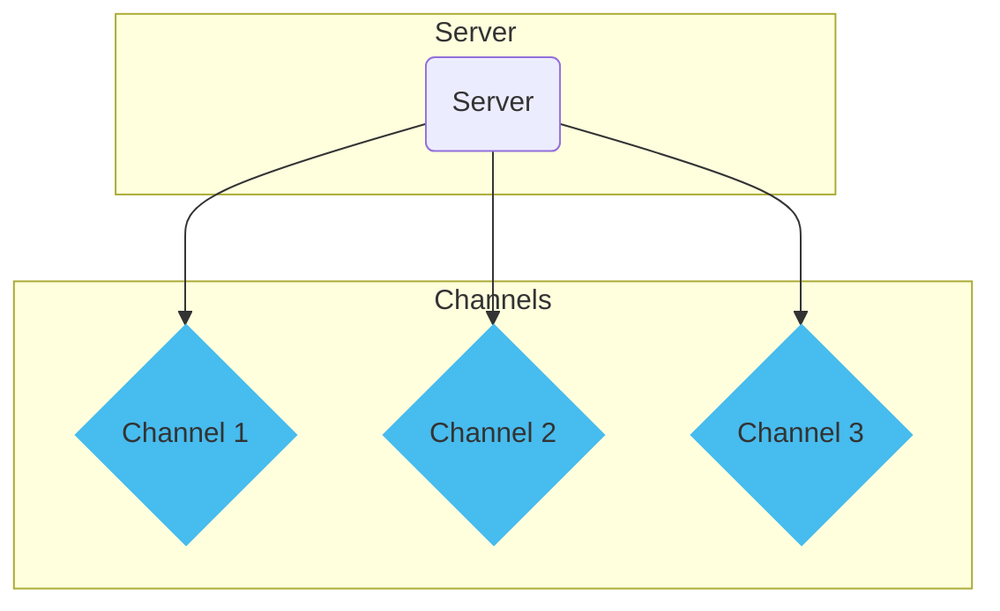

Adding [channels](../channel.md) in AsyncAPI specification allows organizing and categorizing messages, routing messages to the appropriate consumers, decoupling producers and consumers, scaling and extending the API, and providing clear documentation and communication about API's communication patterns. Additionally, alternative names for channels can be user-defined to suit specific context and preferences.



The diagram above represents the flow of communication between producers, channels, consumers, and messages.

Here is an example of how to define channels:

```yml
asyncapi: 3.0.0
info:
  title: Channel Example
  version: 0.1.0
channels:
  userSignedUp:
    address: user/signedup
    messages:
      userSignedUp:
        description: An event describing that a user just signed up.
```

This AsyncAPI specification sets up an interface for a `userSignedUp` channel, where the `address` field holds the actual address of the channel (`user/signedup`).

## Channel Server Relationship

Channels and [servers](../server.md) have a close relationship in asynchronous messaging systems. Channels act as message communication pathways, while servers generate and publish messages to these channels. Channels serve as logical destinations where messages are organized based on purpose or topic. Acting as producers, Servers generate messages and publish them to specific channels. Consumers, including servers, send to channels to receive messages. Channels ensure that messages are routed to the appropriate consumers based on their subscriptions. This relationship between channels and servers forms the foundation for building scalable and flexible messaging systems.



### Channel Availability on Specific Servers

A channel can be designed to be available on all servers, which means that the channel is globally accessible, allowing messages published to it to reach all connected clients, regardless of their server connection.



Here is an example of how you might specify that a channel is available only on specific servers:

```yml
channels:
  userSignedUp:
    address: user/signedup
    messages:
      userSignedUp:
        description: An event describing that a user just signed up.
servers:
  serverA:
    url: serverA.example.com
  serverB:
    url: serverB.example.com
```

The above code defines a channel `user/signedup` for subscribing to user signup events and two servers, `Server A` and `Server B`, with their respective URLs, enabling clients to receive user signup notifications from either server.

Specifying a channel and servers allows the AsyncAPI document to clarify where each channel can be found. This method is particularly beneficial in complex systems where different servers might be responsible for different operations.

### Multiple Channels in Single Server

Having multiple channels in one server allows for better organization and management of different events or messages within the same server instance, providing a more modular and scalable architecture for handling various functionalities. It enables clients to send to specific channels based on their interests or requirements, ensuring efficient message delivery and reducing complexity in the overall system design.



Here is an example of multiple channels available on specific servers:

```yml
channels:
  userSignedUp:
    address: user/signedup
    messages:
      userSignedUp:
        description: An event describing that a user just signed up.
  userActivated:
    address: user/activated
    messages:
      userActivated:
        description: An event describing that user activation events.      
servers:
  serverA:
    url: serverA.example.com
```

The YAML code defines multiple channels, `user/signedup` and `user/activated`, within the `serverA` server, enabling clients to subscribe and receive user signup and activation events.

To know more details on how to add server check [add servers](add-server.md).
