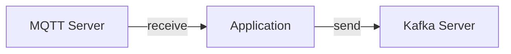

Adding [channels](/docs/concepts/channel) in AsyncAPI document allows organizing and categorizing messages, routing messages to the appropriate consumers, decoupling producers and consumers, scaling and extending the API, and providing clear documentation and communication about API's communication patterns. Additionally, alternative names for channels can be user-defined to suit specific context and preferences.

Here is an example of how to define channels:

```yml
userSignedUp:
  address: 'user.signedup'
  messages:
    userSignedUp:
      $ref: '#/components/messages/userSignedUp'
```

This AsyncAPI document sets up an interface for a `userSignedUp` channel, where the `address` field holds the actual address of the channel (`user.signedup`).

### Channel availability on specific servers

When you add a channel to the AsyncAPI document, by default it is expected to be available on any server described in the document. In other words, if you have two servers, `production-kafka-secure` and `development-kafka`, the channel described in AsyncAPI document must be present on both servers.

You can have a situation that you have an AsyncAPI document that describes an application that communicates in production through two or more servers that also operate on different protocols. For example application may receive messages from a channel on MQTT server, and send messages to another channel on Kafka server. This means you need a way to specify that one channel is available only on MQTT server, and another channel only on Kafka server.



Here is an example of how you might specify that a channel is available only on specific servers:

```yml
channels:
  lightTurnOn:
    address: light.on
    messages:
      lightOn:
        description: An event describing that lights are on
    servers:
      - $ref: '#/servers/serverA'
  lightTurnOnOff:
    address: light/onoff
    messages:
      lightOnOff:
        description: An event describing that light is either on or off
    servers:
      - $ref: '#/servers/serverB'
servers:
  serverA:
    host: serverA.example.com
    protocol: kafka
  serverB:
    host: serverB.example.com
    protocol: mqtt
```

Above example shows two different channels available only on selected server. Notice `servers` field under each individual channel. It means that `lightTurnOn` channel is available only on server `serverA` that uses Kafka protocol, and `lightTurnOnOff` channel is available only on server `serverB` that uses MQTT protocol.
