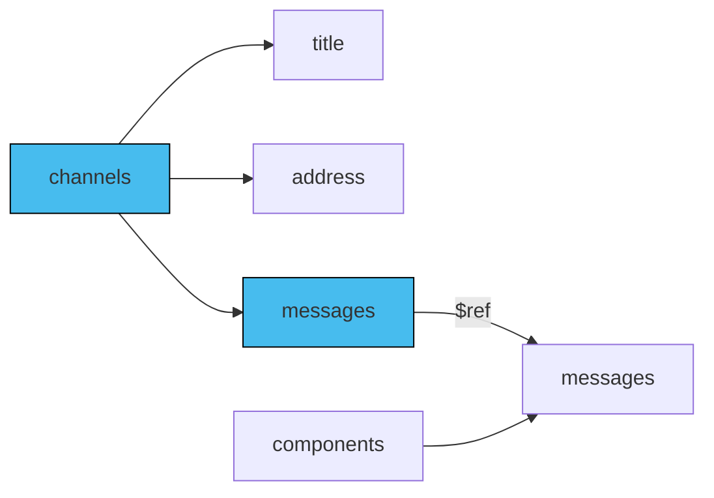

In an AsyncAPI document, adding [messages](/docs/reference/specification/v3.0.0#messageObject) mainly means setting up channels and operations. This is key for explaining how data moves between your applications. However, sometimes you might just want to use the AsyncAPI document to describe the messages themselves, without anything else.

## Add messages

In an AsyncAPI document, you define message definitions under channels. However, the best practice is to first define these messages under the 'components' section as reusable definitions. That way, you can reference them easily from a channel.

Here is a diagram showing some channel fields and the relation between channel messages and components messages:



### Channels section

Define the channels section in your AsyncAPI document, including the `messages` your channel accepts. For example:

```yaml
channels:
  allCommentLiked:
    address: comment/liked
    messages:
      commentLiked:
        description: Message that is being sent when a comment has been liked by someone.
        payload:
           type: object
           title: commentLikedPayload
           additionalProperties: false
           properties:
               commentId: 
                 type: string
                 description: Id of the comment that was liked
    description: Notification channel for all the services that need to know comment is liked.
```

The above example presents an application that communicates over the `allCommentLiked` channel, which only accepts one message called `commentLiked`.

### `messages` section

Define the `components.messages` section in your AsyncAPI document. For each message relevant to your application, provide reusable message definition so when defininig multiple channels you avoid repeating the message definitions. For example:

```yaml
components:
  messages:
    commentLiked:
        description: Message that is being sent when a comment has been liked by someone.
        payload:
           type: object
           title: commentLikedPayload
           additionalProperties: false
           properties:
               commentId: 
                 type: string
                 description: Id of the comment that was liked
```

You can reuse messages using the [Reference Object](/docs/reference/specification/v3.0.0#referenceObject) like in the following example:

```yml
    messages:
      commentLiked:
        $ref: '#/components/messages/commentLiked'
```

Here's the complete AsyncAPI document with channels reusing the same message:
```yml
asyncapi: 3.0.0
info:
  title: Example API
  version: '1.0.0'
channels:
  allCommentLiked:
    address: comment/liked
    messages:
      commentLiked:
        $ref: '#/components/messages/commentLikedUnliked'
    description: Notification channel for all the services that need to know comment is liked.
  allCommentUnliked:
    address: comment/unliked
    messages:
      commentUnliked:
        $ref: '#/components/messages/commentLikedUnliked'
    description: Notification channel for all the services that need to know comment is liked.
components:
  messages:
    commentLikedUnliked:
        description: Message that is being sent when a comment has been liked or unliked by someone.
        payload:
           type: object
           title: commentInfoPayload
           additionalProperties: false
           properties:
               commentId: 
                 type: string
                 description: Id of the comment that was liked or unliked
```

### Identifier of the message

Name of the key that represents a message in AsyncAPI document must be interpreted as `messageId`. In case your document defines channels, the key of the message defined in the channel is the `messageId`.

```yaml
channels:
  allCommentLiked:
    address: comment/liked
    messages:
      commentLiked:
        $ref: '#/components/messages/commentLikedUnliked'
    description: Notification channel for all the services that need to know comment is liked.
```

Above example shows a `commentLiked` message under `allCommentLiked` channel. It references a reusable message definition from the `components` section that is represented by `commentLikedUnliked` key. In this setup `commentLiked` key is the `messageId` and not `commentLikedUnliked`.

### Messages under operations

Operations reference what channels the are performed against. If channel definition contains multiple different messages but your operation relates to only one of these, you need to specify under operation what message it uses.

```yaml
channels:
  allComments:
    address: comments
    messages:
      commentLiked:
        $ref: '#/components/messages/commentLikedMsg'
      commentUnliked:
        $ref: '#/components/messages/commentUnlikedMsg'
    description: Notification channel for all the services that need to know comment is liked.
operations:
  onCommentLiked:
    action: receive
    channel:
      $ref: '#/channels/allComments'
    messages:
      - $ref: '#/channels/allComments/messages/commentLiked'
```

Above example shows how you can specify what message `onCommentLiked` operation will receive from the `allCommentLiked` channel. Notice that the reference information about the message points to the channel, not components section. This way you get a proper information about the `messageId`, which is `commentLiked` and not `commentLikedMsg`.
