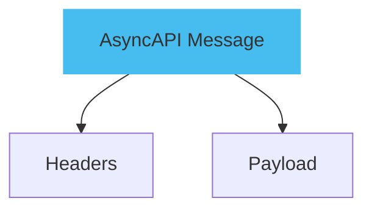
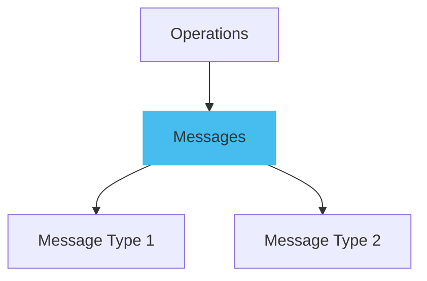
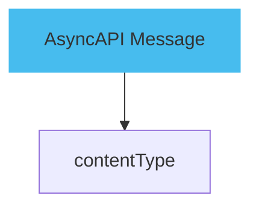
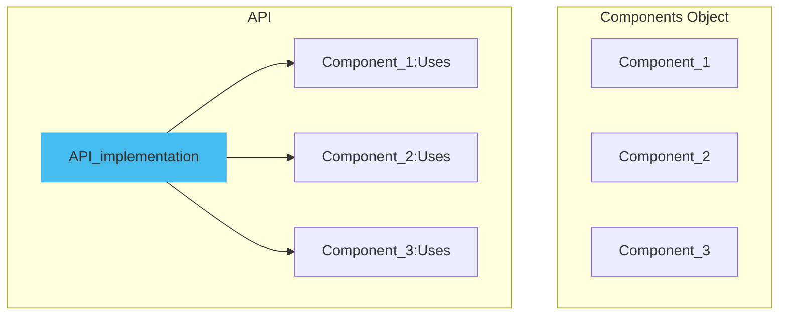

Adding [messages](../message) in an AsyncAPI document primarily involves defining channels, operations, and messages, which is crucial for documenting the exchange of data between your applications. In AsyncAPI, you define the interaction of your application with a message broker in terms of channels and operations. [Channels](../channel) are the medium through which messages are sent or received, while operations represent the actions of publishing or subscribing to these channels.

Here is a diagram explaining messages:



The above diagram shows the components of AsyncAPI messages: headers and payload.

Here is an example of a simple message:

```yml
channels:
  user/signedup:
    address: 'application/json'
    messages:
      userSignUp:
        $ref: '#/components/messages/userSignUp'
```

This document defines a `user/signedup` channel where a `userSignUp` message can be made.

## Using multiple message types

AsyncAPI supports defining multiple possible message types for a single channel.

Here is a diagram showing the use of multiple message types:



This diagram shows how AsyncAPI uses multiple message types for a single channel.

Here is an example document of how AsyncAPI supports the use of multiple message types for a single channel:

```yml
channels:
  userSignupWithReply:
    messages:
      signup:
        $ref: '#/components/messages/userSignedUp'
      reply:
        $ref: '#/components/messages/userSignedUpReply'
```

The above document shows a channel `userSignupWithReply` under which two messages can be sent or received: `userSignedUp` or `userSignedUpReply`.

## Specifying `contentType` in messages

The `contentType` field specifies the format of the payload. If it's not provided, the default payload format is `application/json`.

Here is a diagram showing how to specify `contentType` in messages:



The above diagram shows an AsyncAPI message that can specify a content type (`contentType`), which defaults to `application/json`.

The following code shows how `contentType` is added to the Message:

```yml
messageId: userSignup
name: UserSignup
title: User signup
summary: Action to sign a user up.
description: A longer description
contentType: application/json
```

In this document, the `contentType` is specified as `application/json` for the `userSignup` message.

## Reusing components

The components object in the AsyncAPI specification contains reusable objects, but they will only impact the application if they are specifically referred to outside the components object.

Here is a diagram explaining how to reuse components:



The above diagram shows how components in the API implementation are used by various components, emphasizing their impact when referred to outside the components object.

Here is an example demonstrating how components are reused in AsyncAPI:

```yml
components:
  messages:
    user:
      contentType: 'application/json'
      schema:
        $ref: '#/components/schemas/User'

  schemas:
    User:
      type: object
      properties:
        id:
          type: string
        name:
          type: string
```

The above document shows reuse of a component by defining a `User` schema.
