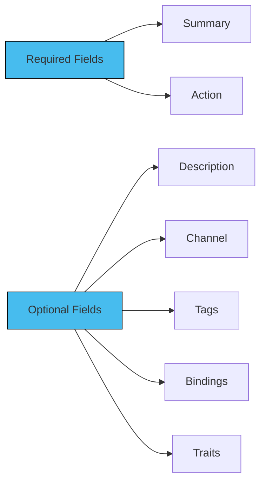

In a messaging system, the term "operations" refers to the various methods by which messages are exchanged between participants or components. Operations are useful for understanding how the messaging system in AsyncAPI works, and how different components within the system communicate with each other asynchronously. They help developers and users to understand the tasks that API can perform.

In a AsyncAPI document, Operations describe the behaviors and capabilities of the messaging channels described in the AsyncAPI document. In a messaging channel, an `operation` represents a particular action or interaction that can be performed. The purpose of operations is to provide a standardized means for describing the process of sending, receiving from, requesting, or replying to messages within the messaging system. 

## Defining Operations

Operations can be defined as an independent object in the AsyncAPI document. Operations have the following components for their definition. More information about each field name that is used to define operations can be found [here](https://v3.asyncapi.com/docs/reference/specification/v3.0.0-next-major-spec.12#operationObject). 
Additionally, an example to show the usage of each field name in defining operations can be found [here](https://v3.asyncapi.com/docs/reference/specification/v3.0.0-next-major-spec.12#operationsObject).

The following diagram briefs the some field names that are frequently used to define operations in a AsyncAPI document:



## Adding Operations

`operations` are separate objects in the AsyncAPI document on the root level together with `channels` and other objects. 
Operations must specify on what channel it is performed. You do it by referencing the `channel` with `$ref`, just like in the following example:

```
onUserSignUp:
 title: User sign up
  summary: Action to sign a user up.
  description: A longer description
  action: send
  channel:
    $ref: '#/channels/userSignup'
```

## Field Names in Operations

### Summary:

This section has a short summary of what the operation is about

```
"summary": "Action to sign a user up.",
```

### Actions:

Uses the value `send` when the application sends a message to a given channel and uses the value `receive` when the application receives a message from a given channel.

```
"action": "receive",
```

### Description

A detailed explanation of the operation.

```
"description": "A longer description"
```

### Channel

A `$ref` link is added to link the channels.

```
"channel": {
      "$ref": "#/channels/userSignup"
    }
```

### Tags

A list of tags are used for logical grouping and categorization of operations

```
"tags": [
      { "name": "user" },
      { "name": "signup" },
      { "name": "register" }
    ]
```

### Bindings

A map that stores names of protocols as keys, and protocol-specific definitions as values.

```
"bindings": {
      "amqp": {
        "ack": false
      }
    }
```

### Traits

A list of traits is added to Operations, which are merged into operations using `JSON Merge Patch`.

```
"traits": [
      { "$ref": "#/components/operationTraits/kafka" }
    ]
```
