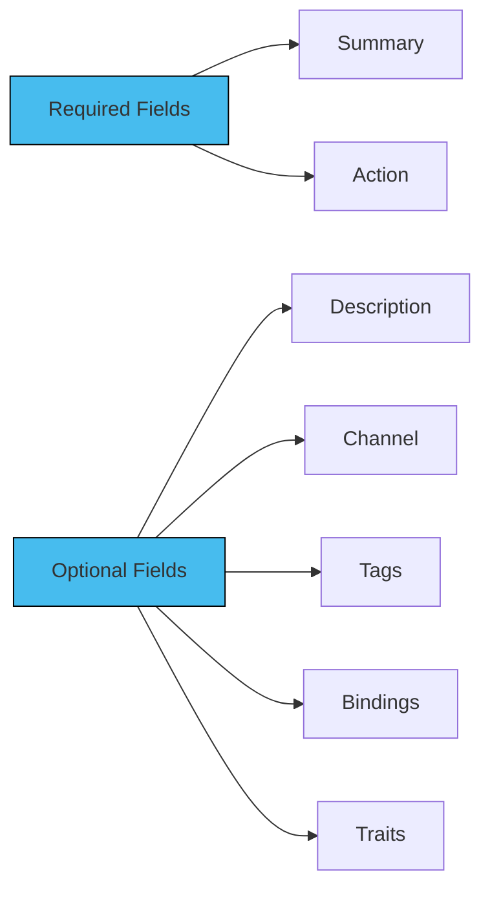

In a messaging system, the term "operations" refers to the various methods by which messages are exchanged between participants or components. 

## Features

- Operations describe the behaviors and capabilities of the messaging channels described in the AsyncAPI document.

- In a messaging channel, an operation represents a particular action or interaction that can be performed. 

- The purpose of these operations is to provide a standardized means for describing the process of sending, receiving from, requesting, or replying to messages within the messaging system.

## Defining Operations

Operations can be defined as an independent object in the AsyncAPI document. Operations have the following components for their definition. More information about each field name that is used to define operations can be found [here](https://v3.asyncapi.com/docs/reference/specification/v3.0.0-next-major-spec.12#operationObject). 
Additionally, an example to show the usage of each field name in defining operations can be found [here](https://v3.asyncapi.com/docs/reference/specification/v3.0.0-next-major-spec.12#operationsObject).

The following diagram briefs the important field names that are frequently used to define AsyncAPI operations in Spec 3.0.0 -



## Adding Operations

`operations` are separate objects in the AsyncAPI document on the root level together with `channels` and other objects. 
Operations must specify on what channel it is performed. You do it by referencing the `channel` with `$ref`, just like in the following example:

```
onUserSignUp:
  title: User sign up
  summary: Action to sign a user up.
  description: A longer description
  action: send
  channel:
    $ref: '#/channels/userSignup'
```
