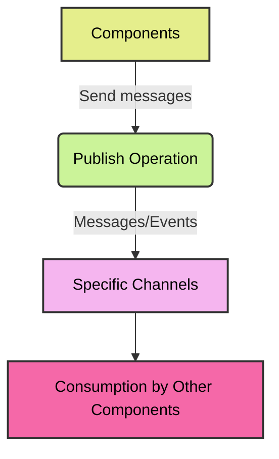
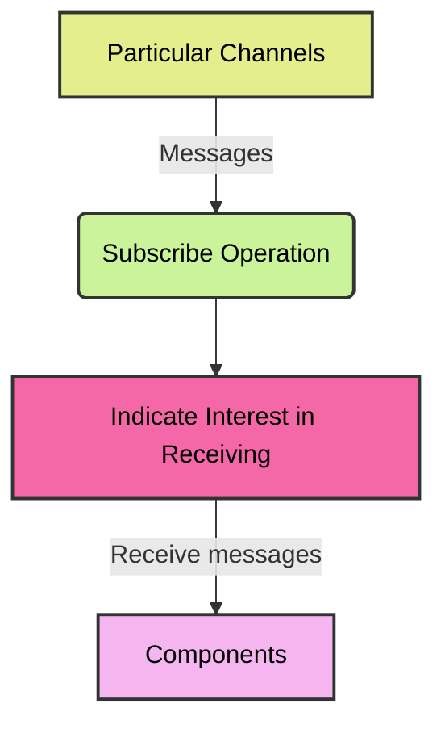
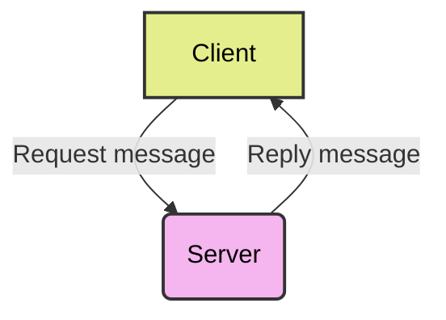
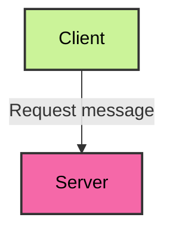
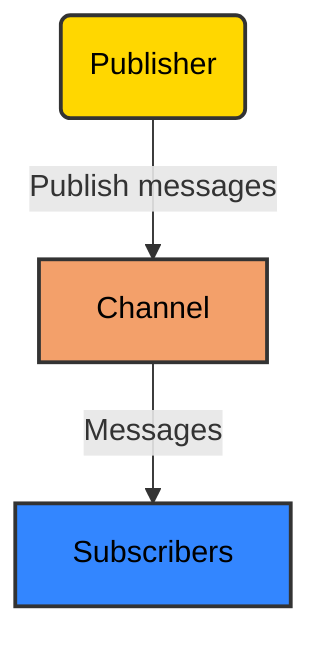

In a messaging system, the term "operations" refers to the various methods by which messages are exchanged between participants or components. 

## Features

- Operations describe the behaviors and capabilities of the messaging channels described in the AsyncAPI document.

- In a messaging channel, an operation represents a particular action or interaction that can be performed. 

- The purpose of these operations is to provide a standardized means for describing the process of sending, receiving from, requesting, or replying to messages within the messaging system.

## Adding Operations

`operations` are separate objects in the AsyncAPI document on the same level. 
`channels` can be linked within `operations` by referencing them within the `channels`, just like the following example -
For adding operations to an AsyncAPI document, we need to define them within the channels section of the document. You can add operations to an AsyncAPI document as follows - 

```
onUserSignUp:
  title: User sign up
  summary: Action to sign a user up.
  description: A longer description
  channel:
    $ref: '#/channels/userSignup'
```

Operations can be defined as an independent object in the AsyncAPI document. Operations have the following components for it's definition -
- Locate the `channels` section in your AsyncAPI document. The `channels` section defines the messaging channels and their associated operations.

|  Field Name | Type | Description |
|---|---|---|
| title | string | An easy to understand headline about the operation |
| summary | string | A brief overview of the purpose of the operation |
| description | string | A detailed explanation of the operation |
| Channel | Reference Object Link | A `ref` pointer to the definition of the channel in which the operation is performed |
| Action | "send" or "receive" | Uses `send` when the application sends a message to the given channel, and uses `receive` when the application receives a message from the given channel |
| Tags | Tag Object | List of tags for logical grouping and categorization of operations |
| Bindings | Bindings Object | A map where keys store the name of protocol and the values store protocol-specific definitions for the operation |
| Traits | Traits Object | A list of traits to apply to the operation object. Traits must be merged using Traits Merge Mechanism. The resulting object should be a valid Operation Object |

```
onUserSignUp:
  title: User sign up
  summary: Action to sign a user up.
  description: A longer description
  channel:
    $ref: '#/channels/userSignup'
  action: send
  tags:
    - name: user
    - name: signup
    - name: register
  bindings:
    amqp:
      ack: false
  traits:
    - $ref: '#/components/operationTraits/kafka'
```

## Types

The operations of the AsyncAPI document are divided into the following categories based on the purpose they serve -

- <b> Publishing: </b> In the publish operation, components are able to send messages to specific channels. This operation allows publishers to publish messages or events for consumption by other components.



- <b> Subscribing: </b> By using the subscribe operation, components are able to receive messages from a particular channel. The subscriber can use this operation to indicate whether they are interested in receiving messages from a particular channel.



- <b> Request-Reply: </b> Request/Reply establishes a pattern of request-response communication between components. The client can send a request message, and the server will respond with a corresponding reply message. Typically, this operation is used for synchronous communication in which the client anticipates a response from the server.



- <b> Request: </b> A request operation allows components to submit a request message without requiring a response from the server. This is typically used in situations where the client does not need a direct response from the server, such as fire-and-forget or one-way communication.



- <b> Publish-Subscribe: </b> With the publishSubscribe operation, messages published to a channel are distributed to multiple subscribers in a publish-subscribe pattern. Messages can be broadcast to a number of consumers interested in a particular topic or event at the same time.


