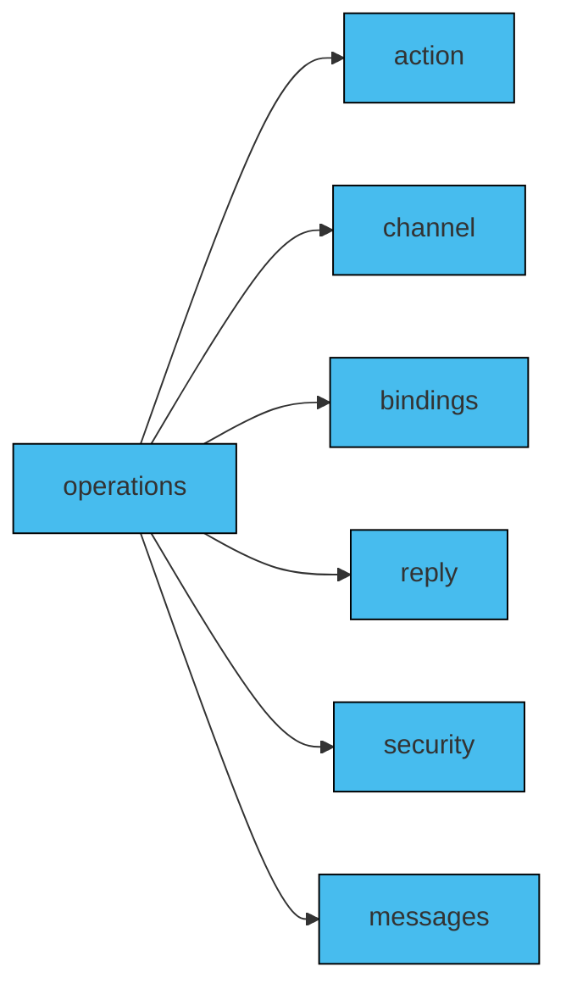

In a messaging system, 'operations' are how messages are sent and received between participants or components. In AsyncAPI, understanding operations helps you see how the system sends asynchronous messages back and forth without waiting for responses. They serve as a vital tool, aiding users in comprehending the range of tasks and functionalities that the API is capable of performing.

In a AsyncAPI document, operations describe the behaviors and capabilities of the application that exchange messages through channels described in the AsyncAPI document. An `operation` represents a particular action or interaction that can be performed. The purpose of operations is to provide a standardized means for describing the process of sending, receiving from, requesting, or replying to messages within the messaging system. 

## Defining Operations

Operations can be defined as an independent object in the AsyncAPI document. More information about each field name that is used to define operations can be found [in reference documentation of the specification](/docs/reference/specification/v3.0.0#operationObject). 

The following diagram briefs the some field names that are frequently used to define operations in a AsyncAPI document:



## Adding Operations

`operations` are separate fields in the AsyncAPI document on the root level together with `channels` and other fields. 
Operations must specify on what channel it is performed. You do it by referencing the `channel` with `$ref`, just like in the following example:

```
onUserSignUp:
  title: User sign up
  summary: React and process information about new user sign up.
  description: Process information about user sign up and update the information in the table that counts numbers of currently signed up users.
  action: receive
  channel:
    $ref: '#/channels/userSignup'
```

Above operation definition provides information that the application performs a `send` action. From the `title` and `summary` you can understand that it receives an event with information that new user just signed up to the system.

Some fields are missing from this example:
- No `messages` field means that this operation process any message comming from `userSignup` channel
- No `security` field means that there are no special security measures related to this operation and that the security that should be applied is the same as for other operations. This means that security from server level should be respected
- No `reply` field means that after reacting to user sign up, this application will not send any reply as a reaction
