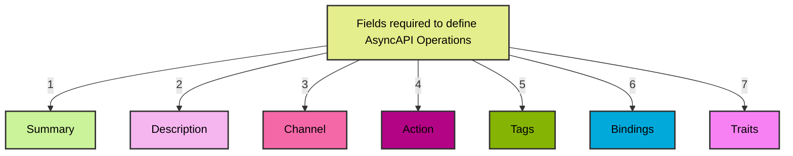

In a messaging system, the term "operations" refers to the various methods by which messages are exchanged between participants or components. 

## Features

- Operations describe the behaviors and capabilities of the messaging channels described in the AsyncAPI document.

- In a messaging channel, an operation represents a particular action or interaction that can be performed. 

- The purpose of these operations is to provide a standardized means for describing the process of sending, receiving from, requesting, or replying to messages within the messaging system.

## Defining Operations

Operations can be defined as an independent object in the AsyncAPI document. Operations have the following components for it's definition. More information about each field names that are used to define operations can be found [here](https://v3.asyncapi.com/docs/reference/specification/v3.0.0-next-major-spec.12#operationObject). 
Additionally, an example to show the usage of each field names in defining operations can be found [here](https://v3.asyncapi.com/docs/reference/specification/v3.0.0-next-major-spec.12#operationsObject).
`operations` are separate objects in the AsyncAPI document on the same level. 
`channels` can be linked within `operations` by referencing them within the `channels`, just like the following example -
For adding operations to an AsyncAPI document, we need to define them within the channels section of the document. You can add operations to an AsyncAPI document as follows - 

The following diagram briefs the important field names that are frequently used to define AsyncAPI operations in Spec 3.0.0 -



## Adding Operations

`operations` are separate objects in the AsyncAPI document on the root level together with `channels` and other objects. 
`channels` can be linked within `operations` by referencing them within the `channels`, just like the following example - 

```
onUserSignUp:
  title: User sign up
  summary: Action to sign a user up.
  description: A longer description
  action: send
  channel:
    $ref: '#/channels/userSignup'
```
