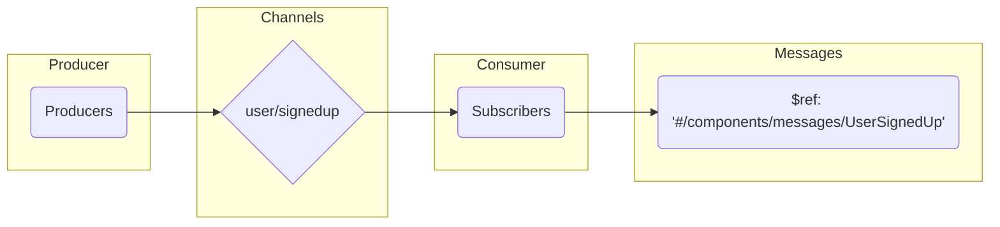
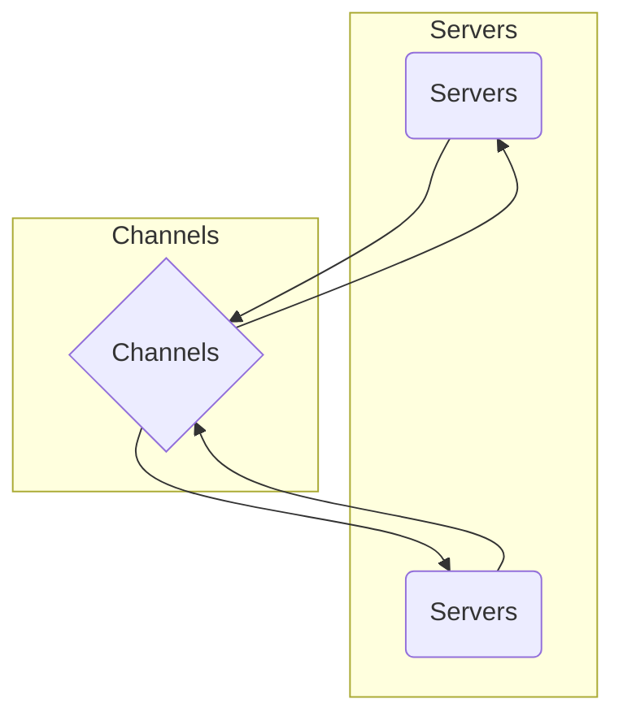
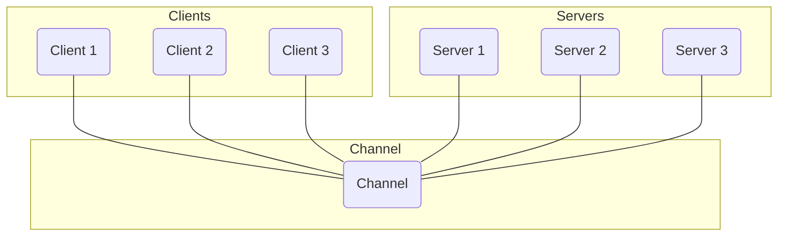
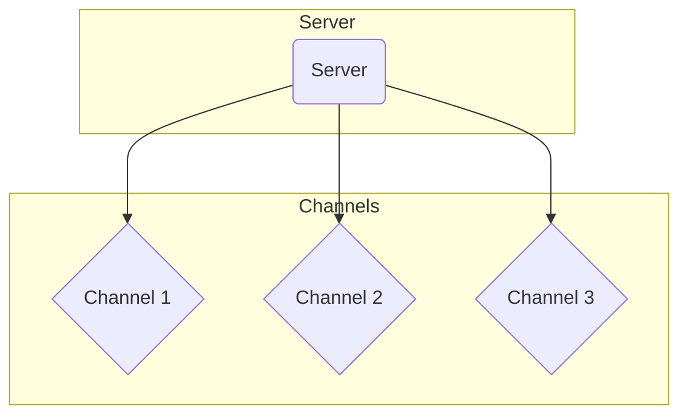

Adding [channels](../channel.md) in AsyncAPI specification, allows to organize and categorize messages, route messages to the appropriate consumers, decouple producers and consumers, scale and extend the API, and provide clear documentation and communication about API's communication patterns.

In addition to the term "channel," alternative names can be used to refer to the concept of channels in asynchronous messaging systems. These names may vary depending on the messaging protocol or system being used. Some examples include "topic," "queue," "routing key," and "path." These alternative names represent the same underlying concept of organizing and transmitting messages between producers and consumers.

Here's an example of how to define channels:

```yml
channels: 
  user/signedup: 
    subscribe: 
      message: 
        $ref: '#/components/messages/UserSignedUp'
```

In this example, `user/signedup` is the channel. This means that the application allows consumers to subscribe to the `user/signedup` channel to receive userSignUp messages.



The diagram above represents the flow of communication between producers, channels, consumers, and messages. Producers generate messages, which are transmitted through the `user/signedup` channel and received by subscribing consumers. The actual data being transmitted is specified as `$ref: '#/components/messages/UserSignedUp'`.

## Channel Server Relationship

Channels and servers have a close relationship in asynchronous messaging systems. Channels act as communication pathways for messages, while servers generate and publish messages to these channels. Channels serve as logical destinations where messages are organized based on their purpose or topic. Servers, acting as producers, generate messages and publish them to specific channels. Consumers, including servers, subscribe to channels to receive the messages. Channels ensure that messages are routed to the appropriate consumers based on their subscriptions. This relationship between channels and servers forms the foundation for building scalable and flexible messaging systems.



Here's an example on how channels and servers can be intertwined:

```yml
asyncapi: 3.0.0
info:
  title: User Signup API
  version: '1.0.0'
channels:
  user/signedup:
    subscribe:
      summary: Subscribes to user signup events
      message:
        $ref: '#/components/messages/UserSignedUp'

```

The example demonstrates a channel named `user/signedup` where clients can subscribe to receive user signup events, establishing a communication pathway between the server and the clients for notifying them about user signup events.

## Channel Availability on Specific Servers

In a distributed messaging system, a channel can be designed to be available on all servers. This means that the channel is globally accessible, allowing messages published to it to reach all connected clients, regardless of their server connection.



Here is an example of how you might specify that a channel is available only on certain servers:

```yml
channels:
  user/signedup:
    subscribe:
      summary: Subscribes to user signup events
      message:
        $ref: '#/components/messages/UserSignedUp'

servers:
  serverA:
    url: serverA.example.com
  serverB:
    url: serverB.example.com
```

In this code code defines a channel `user/signedup` for subscribing to user signup events, and two servers `Server A` and `Server B` with their respective URLs, enabling clients to receive user signup notifications from either server.

So, when one specify a channel and servers, it allows the AsyncAPI document to clarify where each channel can be found. This is particularly beneficial in complex systems where different servers might be responsible for different sets of operations.

## Multiple Channels in Single Server

Having multiple channels in one server allows for better organization and management of different types of events or messages within the same server instance, providing a more modular and scalable architecture for handling various functionalities. It enables clients to subscribe to specific channels based on their interests or requirements, ensuring efficient message delivery and reducing complexity in the overall system design.



Here is an example of multiple channels are available on certain servers:

```yml
channels:
  user/signedup:
    subscribe:
      summary: Subscribes to user signup events
      message:
        $ref: '#/components/messages/UserSignedUp'
  user/activated:
    subscribe:
      summary: Subscribes to user activation events
      message:
        $ref: '#/components/messages/UserActivated'

servers:
  serverA:
    url: serverA.example.com

```

The YAML code defines multiple channels, `user/signedup` and `user/activated`, within the `serverA` server, enabling clients to subscribe and receive events for user signup and activation.
