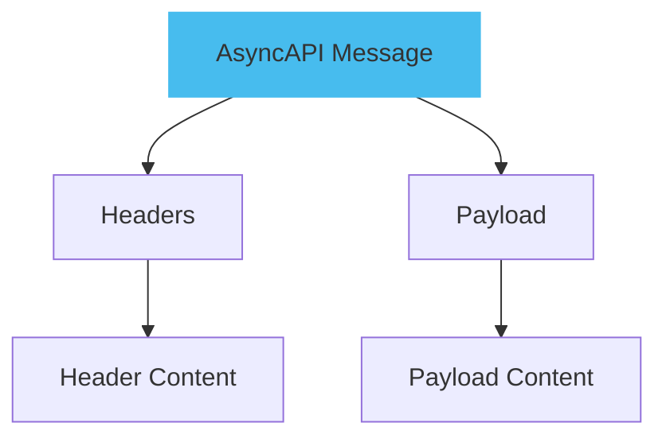
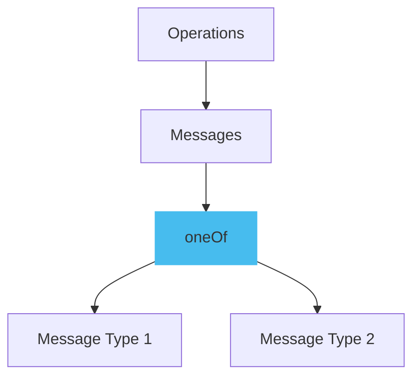
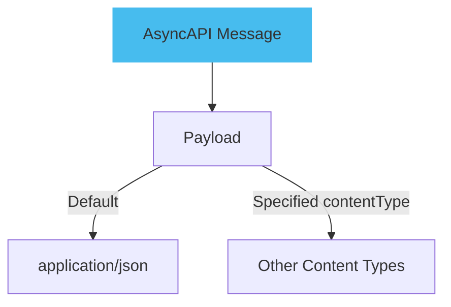
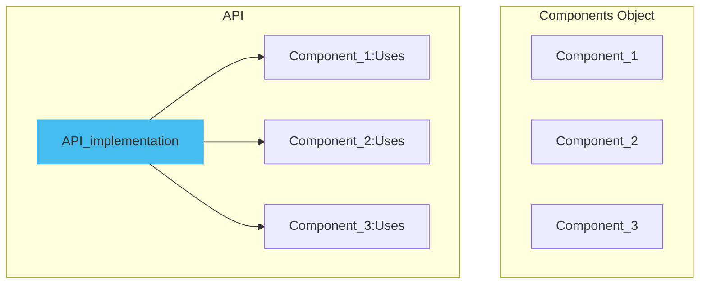

[Messages](../message.md) represent the data being transmitted between your systems. They always include a payload, which is the data the application is sending or receiving, and they may also include headers, which are used to provide additional context or information about the message exchange.



Here is an example of a simple message:

```yml
channels:
  user/signedup:
      address: 'application/json'
      messages:
        userSignUp:
          name: User SignUp
          summary: Action to sign a user up.
```

This document defines a `user/signedup` channel where a `userSignUp` message can be made.

## Using `oneOf` for Multiple Message Types

AsyncAPI supports the use of `oneOf` for messages under operations, allowing you to define multiple possible message types for a single operation.



Here is an example document of how `oneOf` permits the use of multiple message types for a single operation:

```yml
channel:
$ref: '#/channels/userSignupReply'
messages:
  oneOf:
      - $ref: '#/components/messages/userSignedUp'
      - $ref: '#/components/messages/userSignedUpReply'
```

The above document shows a channel `userSignupReply` under which two messages can be sent or received: `userSignedUp` or `userSignedUpReply`.

## Specifying `contentType` in Messages

The `contentType` field specifies the format of the payload. If it's not provided, the default payload format is `application/json`. However, it's recommended always to specify the contentType for clarity and to avoid potential misinterpretations.



The following code shows how `contentType` is added to the Message:

```yml
messageId: userSignup
name: UserSignup
title: User signup
summary: Action to sign a user up.
description: A longer description
contentType: application/json
```

In this example, the `contentType` is specified as `application/json` for the `userSignup`.

## Reusing Components

The components object in the AsyncAPI specification contains reusable objects, but they will only impact the API if they are specifically referred to outside the components object.



Here is an example demonstrating how components are reused in AsyncAPI:

```yml
components:
  messages:
    user:
      contentType: application/json
      schema:
        $ref: "#/components/schemas/User"

  schemas:
    User:
      type: object
      properties:
        id:
          type: string
        name:
          type: string
```

This code enables the reuse of a component by defining a `User` schema.
