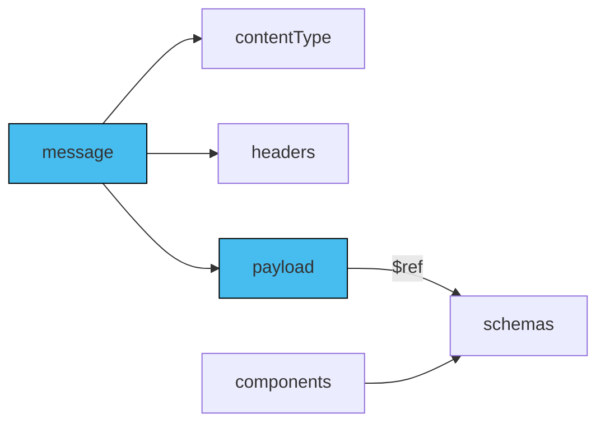

The payload schema defines a message's format, data types, and properties to ensure that the payload follows a specific structure and data format.

It is recommended to use AsyncAPI Schema (superset of JSON Schema) or JSON Schema to handle complex messages and structured data models. Enabling consumers to gain insights into the structure and data types of the payload. Remember though that AsyncAPI enables you to use any schema format you want. For example if you use Avro schema format, then define your message payload using Avro, and not try to represent your Avro schemas in JSON Schema format

## Define schema

Define the schema for the message payload with one of the following methods:

- Inline: Define the JSON schema within the message payload property.
- Components reference: Specify the schema using a reference to `components.schemas` section, such as `$ref: '#/components/schemas/user`.
- Remote reference: Specify the schema using an absolute remote endpoint, such as `$ref: 'https://schemas.example.com/user'`.
- Local file reference: Specify the schema using a relative reference, such as `$ref: './user-signedup.json'`.

The diagram below describes how payload referencing works within component reference:



Here is an example of an AsyncAPI document file that defines schema of the payload inline:

```yaml
channels:
  exampleChannel:
    address: exampleChannel
    messages:
      SimpleSignup:
        payload:
          type: object
          properties:
            name:
              type: string
            email:
              type: string
```

## Attach examples

Although optional, it is highly recommended to attach examples to the AsyncAPI document. You can use JSON or YAML format for binary encodings. Attach the examples to the examples property within the message payload definition. Here is an example,

```yaml
examples:
  - name: SimpleSignup
    summary: A simple UserSignup example message
    payload:
      user:
        name: Demo
        email: demo@demo.io
```

## Reuse schemas between messages

To reuse a schema in your AsyncAPI document, define it in the `components/schemas` section and reference it using the `$ref` keyword. Using `$ref` helps to avoid duplication and ensures consistency. Here's an example of reusing a schema from components in AsyncAPI.

```yaml
components:
  messages:
    SimpleSignup:
      name: SimpleSignup
      contentType: application/json
      payload:
        $ref: '#/components/schemas/SimpleSignup'
    examples:
    - name: SimpleSignup
      payload: 
        user:
          name: Demo
          email: demo@demo.io
schemas:
    SimpleSignup:
      type: object
      properties:
        name:
          type: string
        email:
          type: string
```

## Schema formats

Default schema that you use is AsyncAPI schema. You can also use different schema formats, like JSON Schema, Avro, OpenAPI Schema, Protobuf and others. To use different schema formats you need to specify in your AsyncAPI document what schema you want to use.

You specify format of the schema inside the `payload` field. Type of the information you can put in `payload` can be described as tuple. This means that if you use AsyncAPI Schema, `payload` must represent a reference or the payload schema definition like described in previous sections. 

In case you use different formats `payload` field consists of `payload.schemaFormat` and `payload.schema`. For example:
```yaml
  payload:
    schemaFormat: application/vnd.apache.avro;version=1.9.0
    schema:
      $ref: "https://www.asyncapi.com/resources/casestudies/adeo/CostingRequestPayload.avsc"
```

Above example specifies that provided schema of the message payload is in Avro 1.9.0 version. It also specifies where the file with the Avro schema is located.

## Schema formats and limitations related to their structures

Some schema formats are complicated to handle in JSON/YAML. In cases like Avro schema or AsyncAPI schema (and others JSON-based schemas) you can easily inline such schemas inside AsyncAPI document, and you can also use `$ref` to point to specific parts of it:
```yaml
    payload:
        schemaFormat: 'application/vnd.apache.avro;version=1.9.0'
        schema: # The following is an Avro schema in YAML format (JSON format is also supported)
          type: record
          name: User
          namespace: com.company
          doc: User information
          fields:
            - name: displayName
              type: string
            - name: email
              type: string
            - name: age
              type: int
```

In case of Protobuf it is more complex, as Protocol Buffers are not based on JSON. You cannot reference just part of it with `$ref` and you need to remember to pass Protobuf schema definition as a string:

```yaml
      payload:
        schemaFormat: application/vnd.google.protobuf;version=3
        schema: |
            message Point {
                required int32 x = 1;
                required int32 y = 2;
                optional string label = 3;
            }

            message Line {
                required Point start = 1;
                required Point end = 2;
                optional string label = 3;
            }
```


