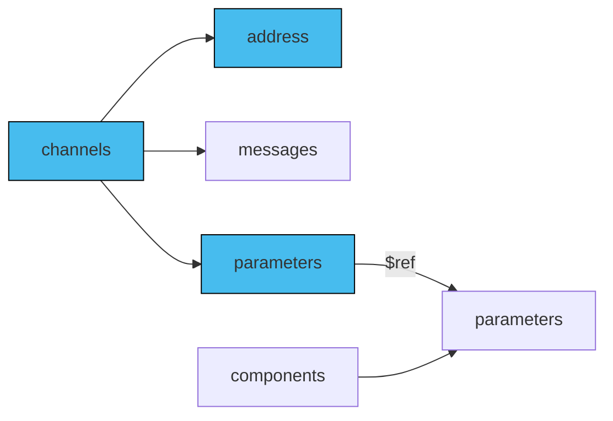

In the context of channel addresses within AsyncAPI documents, parameters play a crucial role in defining the dynamic components of an address. That aspect is particularly beneficial in setups like IoT, where topics are often assigned per device or device segment. In this scenario, your AsyncAPI document would describe a system composed of multiple channels. While these channels share the same definition, messages, and purpose, they differ in their channel addresses, which vary according to each device's identifier. To efficiently manage this setup, you provide a singular channel definition. The dynamic segment of each channel address, which corresponds to the device identifier, is then articulated through the use of parameters. 

## Add parameters

You can add parameters to the `channel.address` by adding a parameter between curly braces like `{braces}`. Next, use `channel.parameters` to define your parameters. Finally, leverage the `components.parameters` to enable reusable parameters' definitions across multiple channels.

The diagram below describes how to use reusable parameters in AsyncAPI.



First, configure the variables in `address`. Next, define reusable variables in `components.parameters`. Finally, ensure that your `channel.parameters` references definitions in the `components.parameters` using `$ref`.

### Channels section

Here is an example of a parametrized channel address:

```yml
  lightingMeasured:
    address: 'smartylighting/streetlights/1/0/event/{streetlightId}/lighting/measured'
    description: The topic on which measured values may be produced and consumed.
    parameters:
      streetlightId:
        description: The ID of the streetlight.
```

In the above example, you can see a definition of a `lightingMeasured` channel that contains a `streetlight` parameter. During runtime, there can be two or more channels serving the same purpose, but with different devices. For example, you could have channels for  `smartylighting/streetlights/1/0/event/2/lighting/measured` and `smartylighting/streetlights/1/0/event/1/lighting/measured`.

### `parameters` section

In your AsyncAPI document, it's important to carefully define the `components.parameters` section. For each parameter utilized in the channel `address`, provide a comprehensive description along with other pertinent details. Avoid repeating the parameter definitions. For example:

```yaml
components:
  parameters:
    streetlightId:
      description: The ID of the streetlight.
```

You can reuse parameters using the [Reference Object](/docs/reference/specification/v3.0.0#referenceObject) like in the following example:

```yml
    parameters:
      streetlightId:
        $ref: '#/components/parameters/streetlightId'
```

Here's the complete AsyncAPI document with the channels' parameters for the `address` field:
```yaml
asyncapi: 3.0.0
info:
  title: Example API
  version: '1.0.0'
channels:
  lightingMeasured:
    address: 'smartylighting/streetlights/1/0/event/{streetlightId}/lighting/measured'
    description: The topic on which measured values may be produced and consumed.
    parameters:
      streetlightId:
        $ref: '#/components/parameters/streetlightId'
components:
  parameters:
    streetlightId:
      description: The ID of the streetlight.
```
