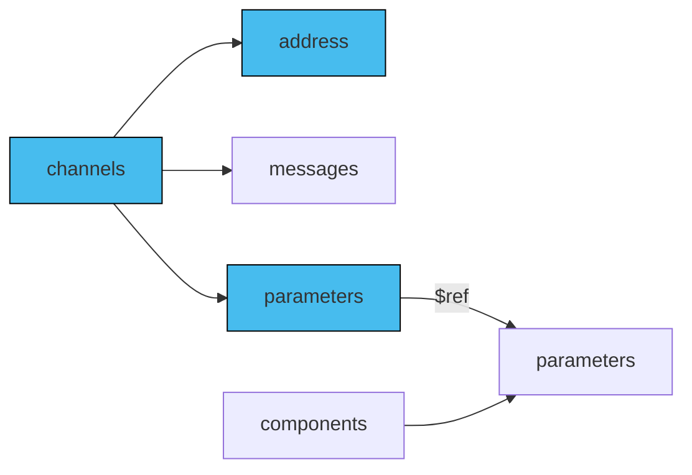

Parameters in channel addresses specify dynamic parts of an address, which becomes particularly useful is a setup like for example IoT, where you have topic per device or segment of devices. This way the setup you describe with your AsyncAPI document is a system with multiple channels that have the same definition, messages and purpose and the only difference is the channel address that is different per device because of device identifier. In such cases you provide one channel definition, and part of the address that is dynamic, you describe using parameters. 

## Add parameters

You can add parameters to `channel.address` by adding a parameter between curly braces like `{braces}`. Next, you use `channel.parameters` to provide definitions of your parameters. Finally, leverage `components.parameters` to enable reusable parameters' definitions across multiple channels.

The diagram below describes how to use reusable parameters in AsyncAPI.



First, configure the variables in `address`. Next, define reusable variables in `components.parameters`. Finally, ensure that your `channel.parameters` reference definitions in the `components.parameters` using `$ref`.

### Channels section

Here is an example of parametrized channel address:

```yml
  lightingMeasured:
    address: 'smartylighting/streetlights/1/0/event/{streetlightId}/lighting/measured'
    description: The topic on which measured values may be produced and consumed.
    parameters:
      streetlightId:
        description: The ID of the streetlight.
```

In above example you can see a definition of a `lightingMeasured` channel that contains a `streetlightId` parameter. This means that in runtime there can be two or more channels that serve the same purpose but different devices. There can be for example channel `smartylighting/streetlights/1/0/event/2/lighting/measured` and `smartylighting/streetlights/1/0/event/1/lighting/measured`.

### `parameters` section

Define the `components.parameters` section in your AsyncAPI document. For each parameter used in the channel `address`, provide a good description and other details that help understand what parameter represents. Avoid repeating the parameter definitions. For example:

```yaml
components:
  parameters:
    streetlightId:
      description: The ID of the streetlight.
```

You can reuse parameters using the [Reference Object](/docs/reference/specification/v3.0.0#referenceObject) like in the following example:

```yml
    parameters:
      streetlightId:
        $ref: '#/components/parameters/streetlightId'
```

Here's the complete AsyncAPI document with the channels' parameters for the `address` field:
```yaml
asyncapi: 3.0.0
info:
  title: Example API
  version: '1.0.0'
channels:
  lightingMeasured:
    address: 'smartylighting/streetlights/1/0/event/{streetlightId}/lighting/measured'
    description: The topic on which measured values may be produced and consumed.
    parameters:
      streetlightId:
        $ref: '#/components/parameters/streetlightId'
components:
  parameters:
    streetlightId:
      description: The ID of the streetlight.
```
