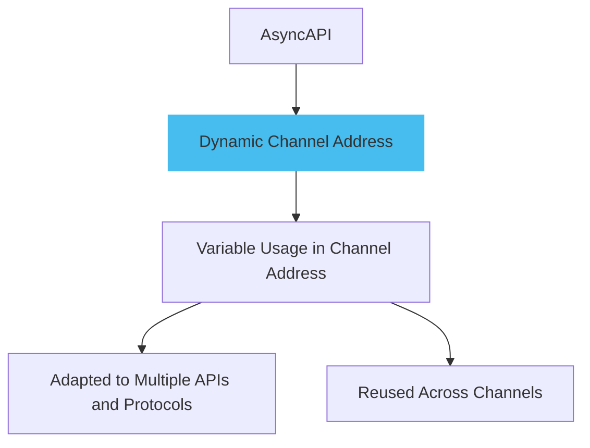
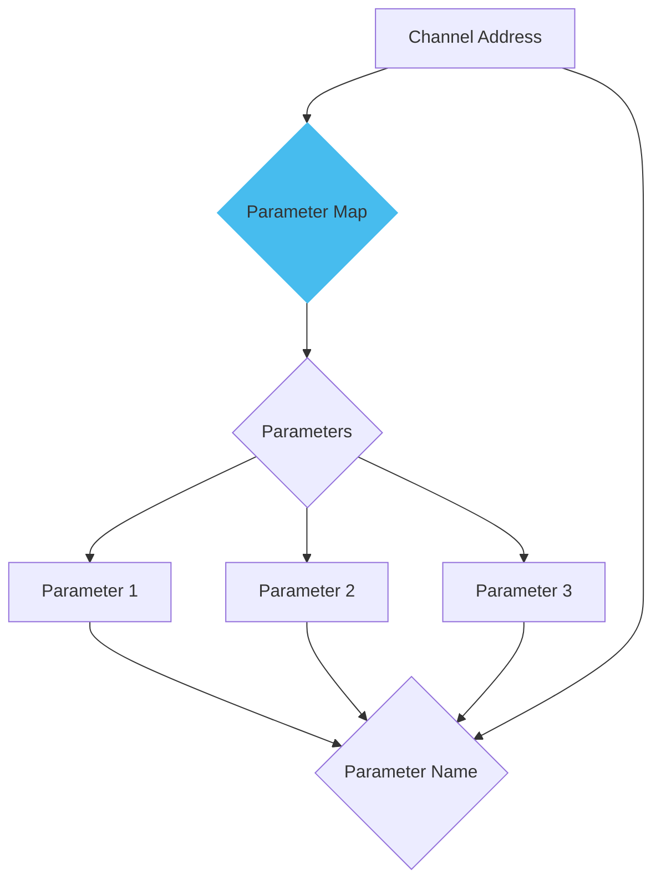
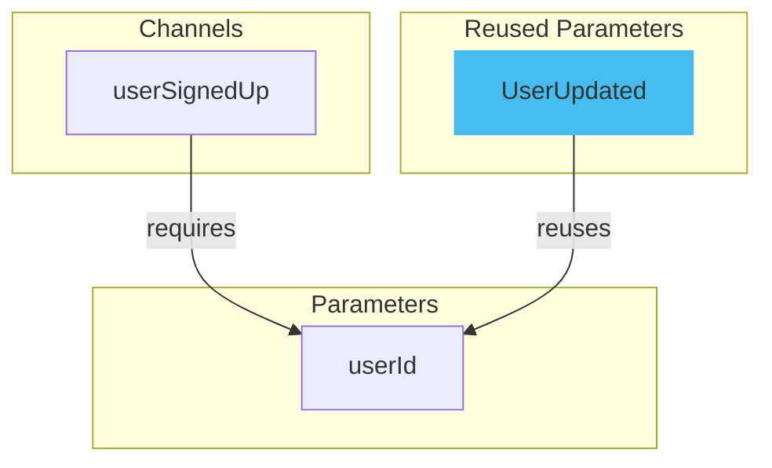

Dynamic channel addresses are used to specify dynamic parts of a channel name, which becomes particularly useful when you want to use and reuse parameters in the channel name. It provides flexibility in how you structure your event-driven interfaces.

Here is the diagram explaining dynamic channel address:



The diagram shows how dynamic channel addresses allow flexible event-driven interfaces by using and reusing parameters in channel names, adapting well to various APIs and protocols.

Here is an example of dynamic channel address:

```yml
userSignedUp:
  address: 'user.signedup'
  messages:
    userSignedUp:
      $ref: '#/components/messages/userSignedUp'
```

This document defines a dynamic channel address for a `userSignedUp` event message, making it easy to include and reuse specific details in the channel address.

## Parameter context

In a channel address, there's a map of parameters, which needs to include all the same parameters that are in the main channel address. The names you use for the parameters in this map must be exactly the same as the names you used in the channel address.

Here is a diagram explaining parameter context:



This diagram shows how the channel address includes the same parameters as the channel address, and each parameter's name matches the one used in the address.

Here is an example of parameter context:

```yml
user/{userId}/signup:
  parameters:
    userId:
      description: Id of the user.
      location: $message.payload#/user/id
  subscribe:
    message:
      $ref: "#/components/messages/userSignedUp"
```

In the above document, `user/{userId}/signedup` is the endpoint where `{userId}` is a path parameter.

## Reusing parameters

Parameters can be reused. This reuse optimizes the usage of parameters within the event-driven interface by letting you use the parameters again.

If there is another message, for example, a `UserUpdated` message, which also requires the `userId`, the parameter can be reused like the following following diagram:



In this diagram, a channel named `userSignedUp` that requires a parameter `userId` .Additionally, the parameter `userId` is reused for another message, `UserUpdated`.

Here is a code of reusing parameters:

```yml
channels:
  userSignedUp:
    address: 'user/{userId}/signedup'
    parameters:
      userId:
        description: Id of the user.
    parameters:
      UserUpdated:
        description: Updated Id of the user.    
operations: 
  userSignedUp:
    action: receive
    channel: 
      $ref: '#/channels/userSignedUp'  
```

In this AsyncAPI document, the previously defined `userId` parameter is reused to form the channel address for `UserUpdated` message.
