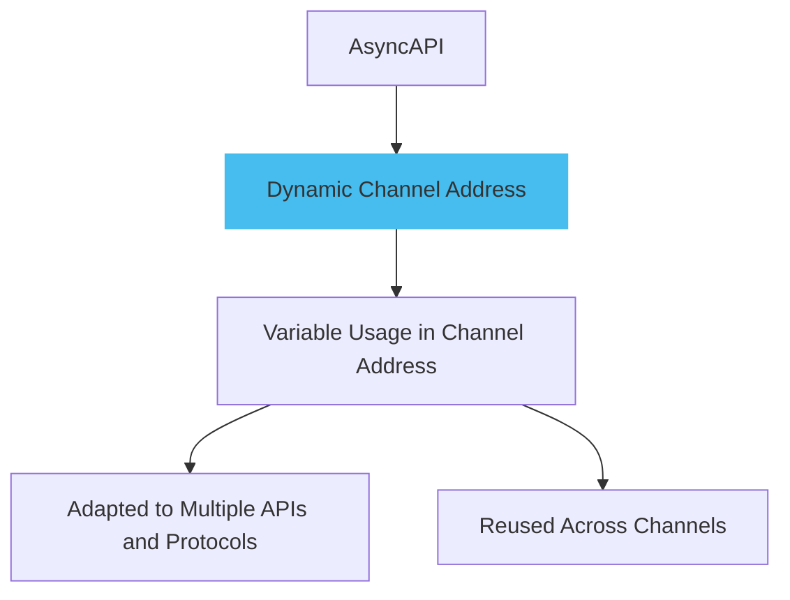
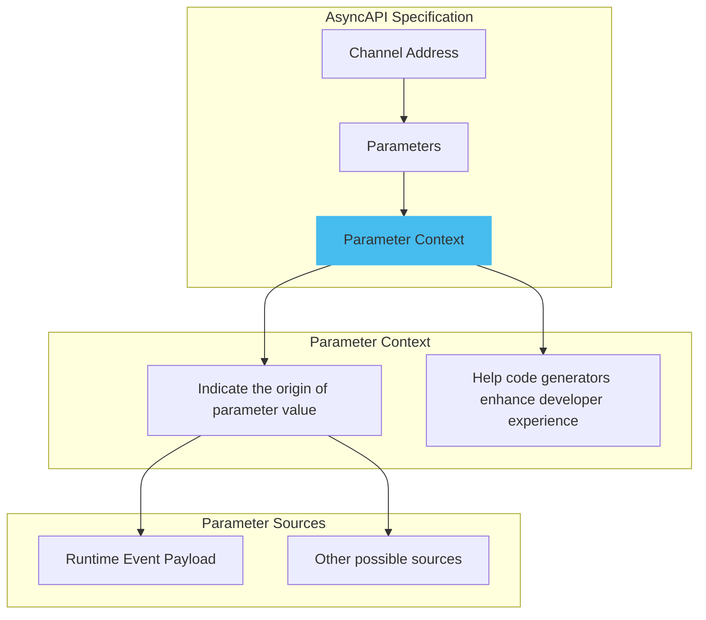

Dynamic channel address in AsyncAPI provide flexibility, reusability, and standardization in asynchronous APIs. They allow for the use of variable values in channel address, enabling the creation of parameterized channel templates. This feature has real-world use cases such as supporting API versioning, facilitating multi-tenancy, and enabling event filtering and routing. By incorporating dynamic channel address, developers can enhance the scalability, personalization, and efficiency of their APIs.



## Parameter Context

The parameter context in AsyncAPI clarifies the origin of parameters, ensuring consistent understanding across teams. It enables efficient code generation, accelerating development and enhancing the developer experience. By noting the context in the AsyncAPI document, code generators can simplify the developer experience by automatically handling parameter values.



Here is an example of parameter context:

```yml
address: 'user/{userId}/signedup'
parameters:
  userId:
    description: Id of the user
```

## Reusing Parameters

An important thing about parameters is that they can be reused. If there is another message, for example, a `UserUpdated` message, which also requires the userId, the parameter can be reused like the following example:

```yml
channels:
  userSignedUp:
    address: 'user/{userId}/signedup'
    parameters:
      userId:
        description: Id of the user.
        location: '$message.payload#/userid'
    parameters:
      userId:
        description: Id of the user.
        location: $message.payload#/UserUpdated      
operations: 
  userSignedUp:
    action: receive
    channel: 
      $ref: '#/channels/userSignedUp'  
```

In this AsyncAPI document, the previously defined userId parameter is reused to form the channel address for `UserUpdated` event.

Defining and reusing parameters in this way can make your API definition cleaner, more maintainable, and less likely to contain errors.
