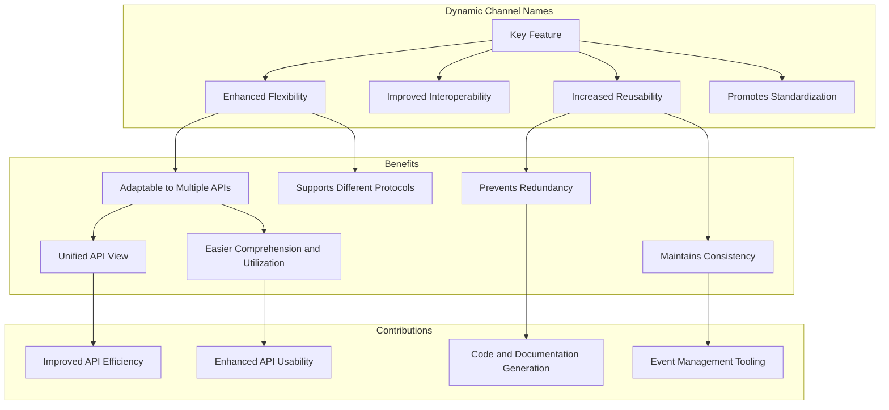
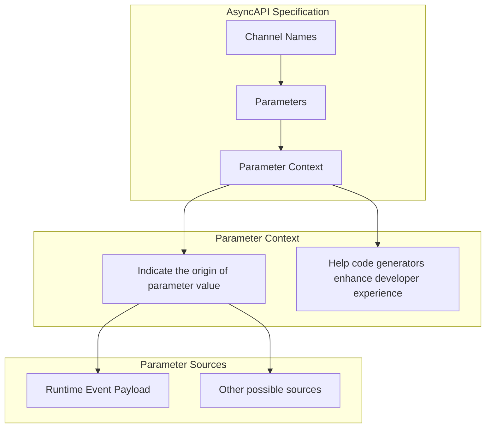

Dynamic channel names, also known as channel address expressions, are a key feature of AsyncAPI. Dynamic channel names in AsyncAPI are pivotal for enhancing the flexibility, interoperability, reusability, and standardization of asynchronous APIs. They allow for variable usage in channel names that can be adapted to multiple APIs, used across different protocols, and reused across channels, thus preventing redundancy and maintaining consistency. This adaptability to different APIs aids in creating a unified view of the API, making it easier to comprehend and utilize. Dynamic channel names contribute to code and documentation generation and event management tooling, thereby improving APIs' overall efficiency and usability.



## Parameter Context

The Parameter Context clarifies the origin of parameters, ensuring consistent understanding across teams. It also enables efficient code generation, thereby accelerating development and enhancing the developer experience.

In AsyncAPI, the context of parameters in channel names often refers to where the parameter value comes from. For example, the parameter might be populated from the runtime event payload. This context can be noted in the AsyncAPI document, and code generators can use it to make the developer experience easier.



Here is an example of parameter context:

```yml
address: user/{userId}/signedup
parameters:
  userId:
    description: Id of the user.
```

## Reusing Parameters

An important thing about parameters is that they can be reused. If there is another event, for example, a `UserUpdated` event, which also requires the userId, the parameter can be reused like the following example:

```yml
asyncapi: 3.0.0
info:
  title: Cool Example
  version: 0.1.0
channels:
  userSignedUp:
    address: user/{userId}/signedup
    parameters:
      userId:
        description: Id of the user.
        location: $message.payload#/userid
    parameters:
      userId:
        description: Id of the user.
        location: $message.payload#/UserUpdated      
operations: 
  userSignedUp:
    action: receive
    channel: 
      $ref: '#/channels/userSignedUp'  
```

In this code, the previously defined userId parameter is reused to form the channel name for `UserUpdated` event.

Defining and reusing parameters in this way can make your API definition cleaner, more maintainable, and less likely to contain errors.
