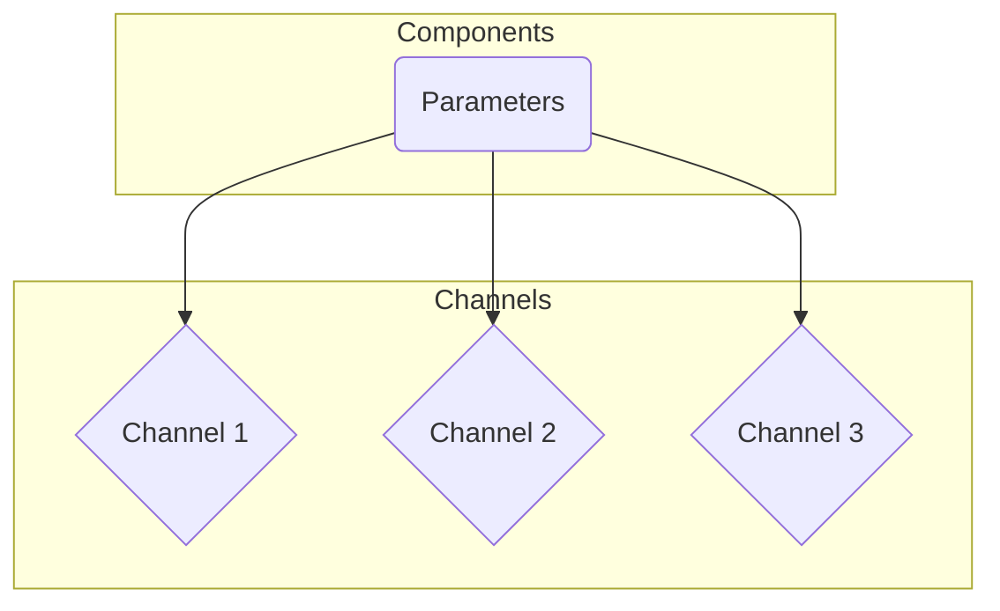
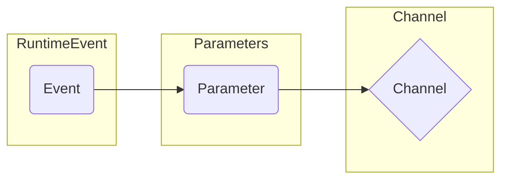

In AsyncAPI, dynamic parts of a channel name can be specified using parameters. These parameters are typically defined in the components section of AsyncAPI document. They can be used throughout the document and specifically, they can be referenced in the channels section to denote dynamic parts of channel names.



To understand the concept better, let's consider an example where we are modeling a `UserSignedUp` event. This event would involve a channel name like `user/{userId}/signedup`. Here, `{userId}` is a dynamic part, which will vary depending on which user has signed up. You want to define this `{userId}` part as a parameter -

```yml
components:
  parameters:
    userId:
      description: The ID of the user.
      schema:
        type: string
```

The `userId` parameter is defined in the components section under parameters.

Next, this parameter can be used in the channels section to form the dynamic part of a channel name. It is done using its reference ($ref) -

```yml
channels:
  user/{userId}/signedup:
    parameters:
      userId:
        $ref: '#/components/parameters/userId'
    publish:
      message:
        $ref: '#/components/messages/UserSignedUp'
```

In the above AsyncAPI document, the `user/{userId}/signedup` channel is publishing a `UserSignedUp` message. The `{userId}` in the channel name is replaced dynamically at runtime by the specific ID of the user who signed up.

## Parameter Context

In AsyncAPI, the context of parameters in channel names often refers to where the parameter value comes from. For example, the parameter might be populated from the runtime event payload. This context can be noted in the AsyncAPI document, and it can be used by code generators to make the developer experience easier.



Here is an example for parameter context -

```yml
channels:
  user/{userId}/signup:
    parameters:
      userId:
        description: "Id of the user."
        context: "payload"
        schema:
          type: "string"
    subscribe:
      message:
        $ref: "#/components/messages/UserSignedUp"
```

In this example, the `userId` parameter in the channel name `user/{userId}/signup` is populated from the payload of the UserSignedUp event. The (context: "payload") line indicates this.

## Reusing Parameters

An important thing about parameters is that they can be reused. If there is another event, for example, a `UserUpdated` event, which also requires the userId, the parameter can be reused like following example -

```yml
channels:
  user/{userId}/signedup:
    parameters:
      userId:
        $ref: '#/components/parameters/userId'
    publish:
      message:
        $ref: '#/components/messages/UserSignedUp'
  user/{userId}/updated:
    parameters:
      userId:
        $ref: '#/components/parameters/userId'
    subscribe:
      message:
        $ref: '#/components/messages/UserUpdated'
```

In this code, the previously defined userId parameter is reused to form the channel name for `UserUpdated` event.

Defining and reusing parameters in this way can make your API definition cleaner, more maintainable, and less likely to contain errors.
