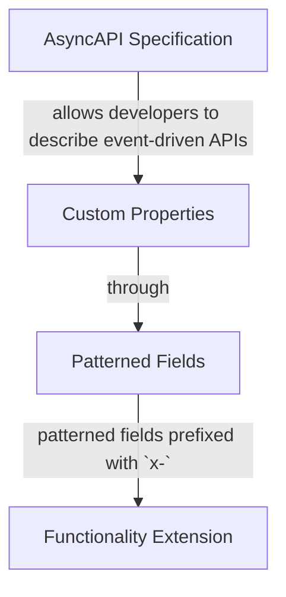
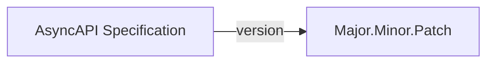
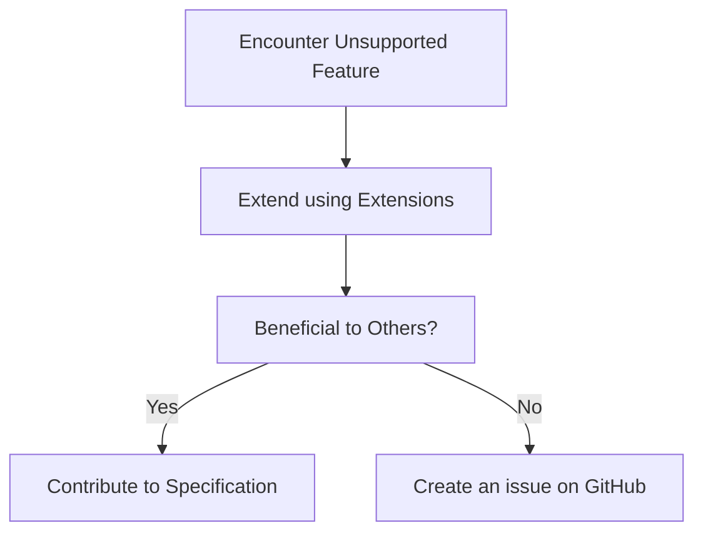
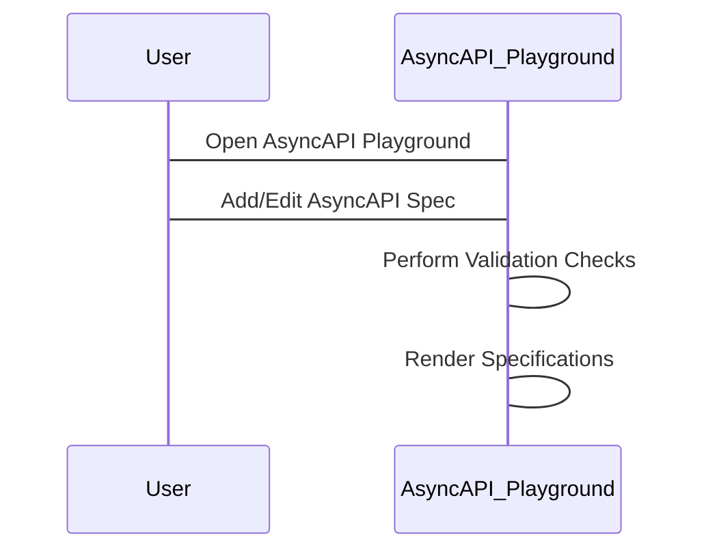

AsyncAPI allows developers to describe their event-driven APIs in a machine-readable way. If there is a instance where the AsyncAPI specification does not support a specific field or a use case is needed, the specification can be extended.

## AsyncAPI Specification Extensions

The specification allows the addition of custom properties through patterned fields prefixed with `x-`. This feature enables accommodating specific functionalities, which are not initially covered in the AsyncAPI specification.



Here is a simple example of how to extend the AsyncAPI specification:

```yml
channels:
  user/signedup:
    subscribe:
      message:
        $ref: '#/components/messages/UserSignedUp'
      x-custom-property: Custom Value
```

In the above example, under the `user/signedup` channel, a custom property `x-custom-property` is added to the subscribe operation. The value assigned to this property is `Custom Value`.

The newly added custom property is compatible with the extended tooling and can supplement it with additional functionalities.

<Remember>
AsyncAPI extensions might not be supported by all available tooling. To counter this, the tooling can be extended to understand and handle the added data, especially if the tools are internal or open source.
</Remember>

## Versioning and Extensions

AsyncAPI specification and its extensions are versioned. This means that it is necessary to specify the AsyncAPI version your document complies with. The format for this string should be `major.minor.patch`.



## Extending Unsupported Features

When encountering a case where the AsyncAPI specification does not support the feature which is required, that functionality can be extended using these extensions. If the extended feature proves beneficial to other developers as well, contributing to the AsyncAPI specification can be an advisable step. This contribution can be done by creating an issue on the AsyncAPI GitHub repository.



## Extending Specification Tools

When extending the AsyncAPI specification, the use of the [AsyncAPI Playground](https://studio.asyncapi.com/) is recommended. This dedicated editor for AsyncAPI specifications presents specification file in a legible way. Simultaneously, it performs validation checks and renders the specifications as you continue your work on it.



Extending the AsyncAPI specification when it doesn't support something which is needed involves using patterned fields prefixed with `x-`, specifying the version of AsyncAPI the extensions comply with, and using the AsyncAPI Playground for easy visualization and validation of the specifications. Contributions to support the community can also be made by issuing the extension on the AsyncAPI GitHub repository.
