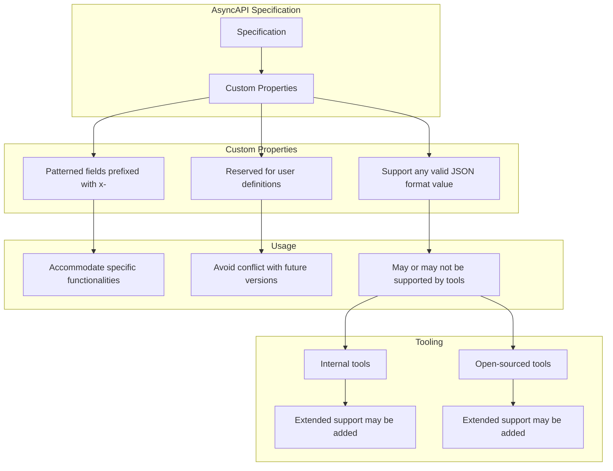
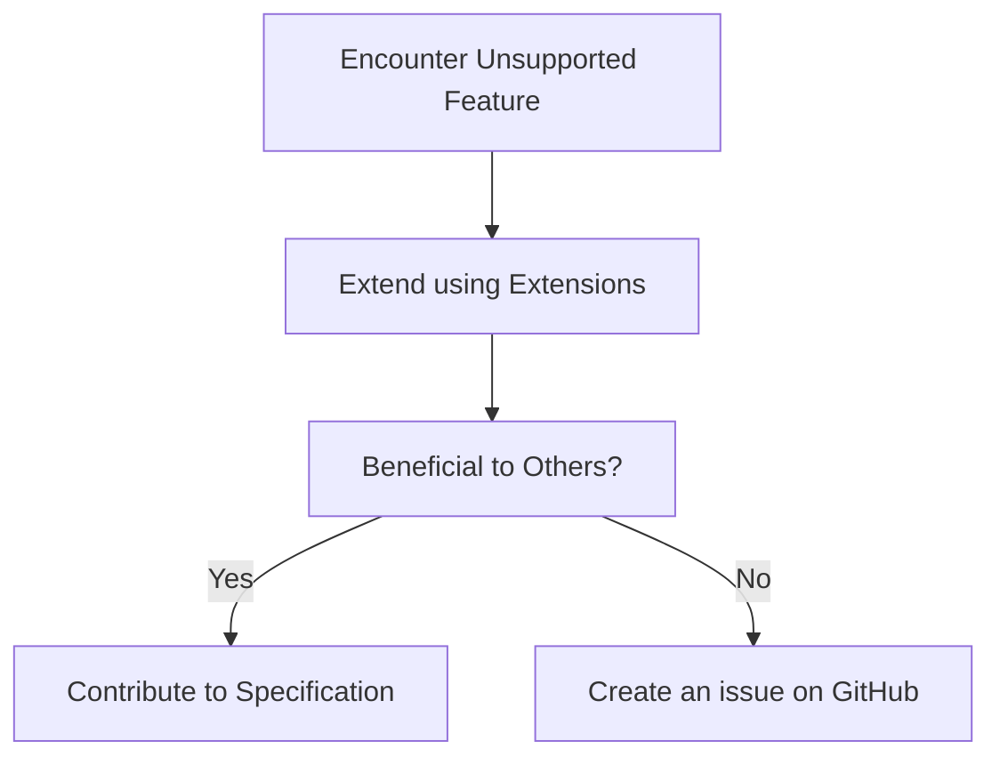
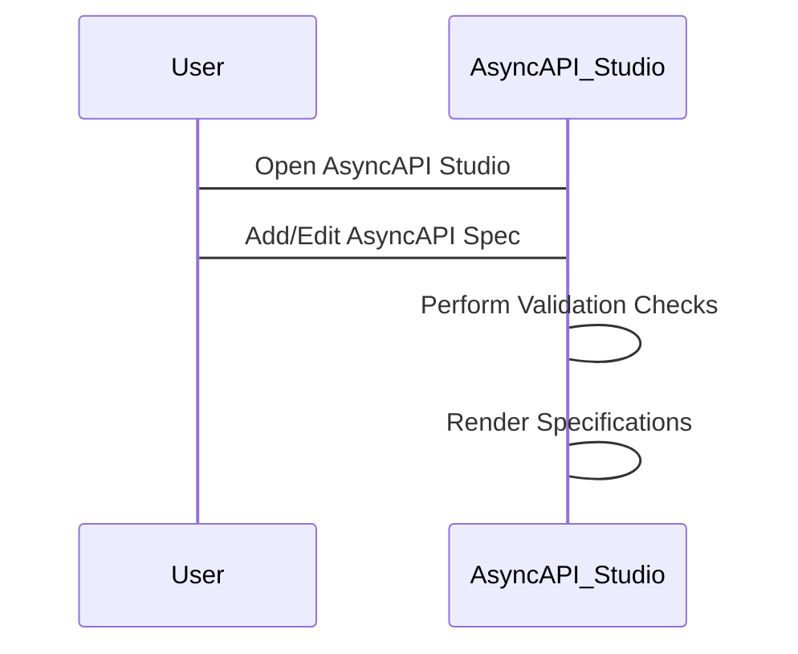

Extending the AsyncAPI specification is a technique that allows developers to include domain-specific or use-case-specific information not supported by the base specification. This extension capability provides customization, enabling APIs to accommodate unique details that would not otherwise fit within the confines of the standard AsyncAPI specification.

The benefits of extending the AsyncAPI specification include enhanced specificity — delivering a clear encoding of necessary API details to clients, and consistency — allowing reusable components across the API. However, extensions should be used sparingly. Since they go beyond the Specification, they may not be universally understood.

## AsyncAPI Specification Extensions

The AsyncAPI Specification allows the addition of custom properties through patterned fields prefixed with `x-`. This feature enables the accommodation of specific functionalities not initially included in the AsyncAPI specification.

The `x-` prefix is used to define custom properties. These properties are user-defined and won't conflict with future specification versions because any property starting with `x-` is reserved for user definitions, and the AsyncAPI organization will not use this prefix for any of their future standard properties.



Here is a simple example of how to extend the AsyncAPI specification:

```yml
asyncapi: 3.0.0
info:
  title: Cool Example
  version: 0.1.0
channels:
  userSignedUp:
    address: user/signedup
    messages:
      userSignedUp:
        description: An event describing that a user just signed up.
        $ref: '#/components/messages/UserSignedUp'
      x-custom-property: Custom Value        
```

In the above example, under the `user/signedup` channel, a custom property `x-custom-property` is added. The value assigned to this property is `Custom Value`.

The custom properties can have any valid JSON format value. For example, it could be null, a primitive, an array, or an object. The newly added custom property is compatible with the extended tooling and can supplement it with additional functionalities.

<Remember>
All available tooling might not support AsyncAPI extensions. The tooling can be extended to understand and handle the added data, especially if the tools are internal or open source.
</Remember>

## Extending Unsupported Features

When encountering a case where the AsyncAPI specification does not support the required feature, that functionality can be extended using these extensions. If the extended part also benefits other developers, contributing to the AsyncAPI specification can be advisable. This contribution can be made by [creating an issue](https://github.com/asyncapi/website/issues/new?assignees=alequetzalli+-&labels=%F0%9F%93%91+docs&projects=&template=docs.yml&title=%5B%F0%9F%93%91+Docs%5D%3A+) on the AsyncAPI GitHub repository.



## Extending Specification Tools

When extending the AsyncAPI specification, the [AsyncAPI Studio](https://studio.asyncapi.com/) is recommended. This dedicated editor for AsyncAPI specifications legibly presents specification files. Simultaneously, it performs validation checks and renders the specifications as you continue your work.



Extending the AsyncAPI specification when it doesn't support something which is needed involves:

* Using patterned fields prefixed with `x-`.
* Specifying the version of AsyncAPI the extensions comply with.
* Using the AsyncAPI Studio for easy visualization and validation of the specifications.
  
Contributions can be made to support the community by issuing the extension on the AsyncAPI GitHub repository.
