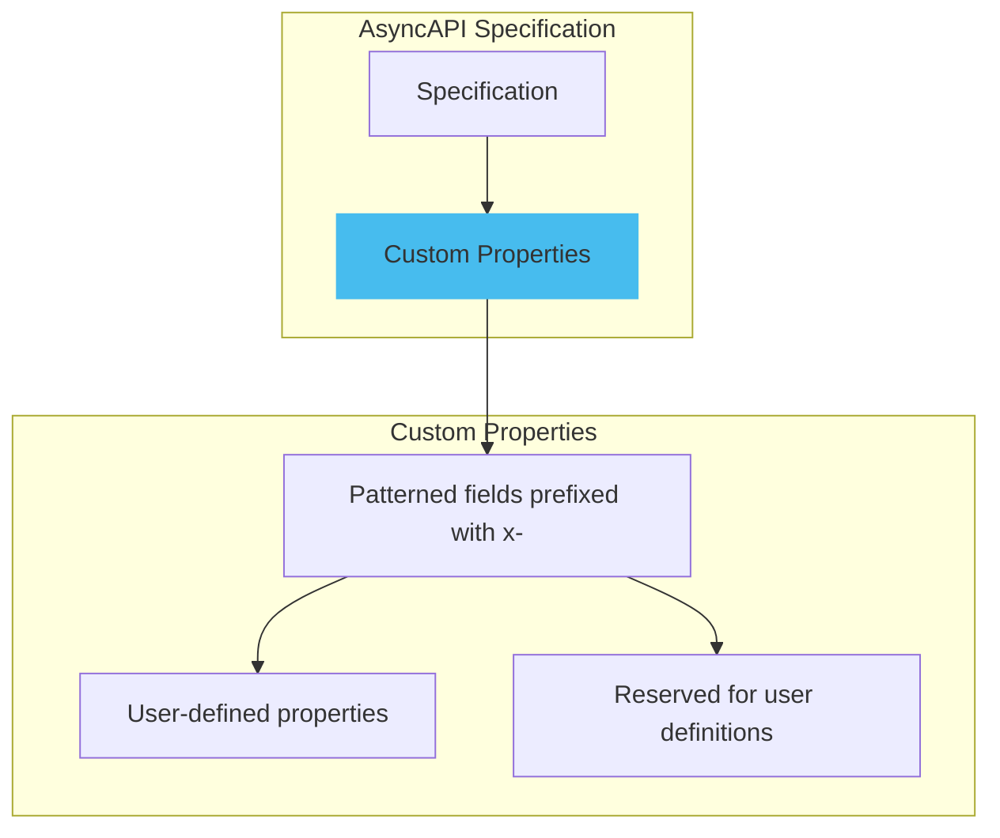
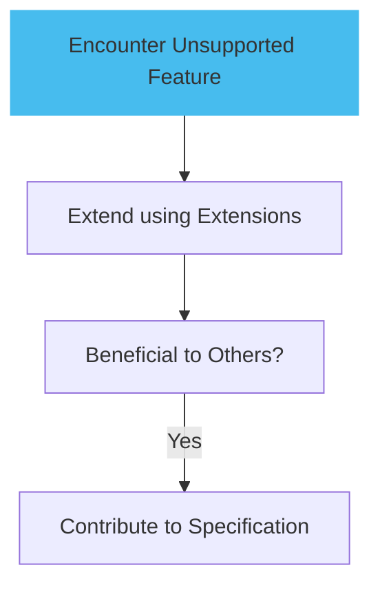

Extending the AsyncAPI specification is a technique that allows developers to include domain-specific or use-case-specific information not supported by the base specification. This extension capability provides customization, enabling APIs to accommodate unique details that would not otherwise fit within the confines of the standard AsyncAPI specification.

## Specification extensions

The AsyncAPI Specification allows the addition of custom properties through patterned fields prefixed with `x-`. This helps you create unique things without causing problems with future updates.

The `x-` prefix is used to define custom properties. These properties are user-defined and won't conflict with future specification versions because any property starting with `x-` is reserved for user definitions.

Here is a diagram explaining specification extensions:



The above diagram explains how AsyncAPI specification uses `x-` prefixed fields for custom properties.

Here is a simple example of how to extend the AsyncAPI specification:

```yml
asyncapi: 3.0.0
info:
  title: Cool Example
  version: 0.1.0
channels:
  userSignedUp:
    address: user/signedup
    messages:
      userSignedUp:
        description: An event describing that a user just signed up.
        x-custom-property: Custom Value    
```

In the above document, under the `user/signedup` channel, a custom property `x-custom-property` is added. The value assigned to this property is `Custom Value`.

<Remember>
All available tooling might not support AsyncAPI extensions. The tooling can be extended to understand and handle the added data, especially if the tools are internal or open source.
</Remember>

## Extending unsupported features

When facing a case where the AsyncAPI specification does not support the required feature, that functionality can be extended using these extensions. If the extended part also benefits other developers, you could contribute to the AsyncAPI specification. This contribution can be made by [creating an issue](https://github.com/asyncapi/spec) on the AsyncAPI GitHub repository. Please get familiar with [contribution guide](https://github.com/asyncapi/spec/blob/master/CONTRIBUTING.md) before making an contribution.

Here is a diagram showing details about extending extending unsupported features:



This diagram represents the process of extending AsyncAPI specifications when unsupported features are encountered, with an option to contribute to the specification if it benefits others.
