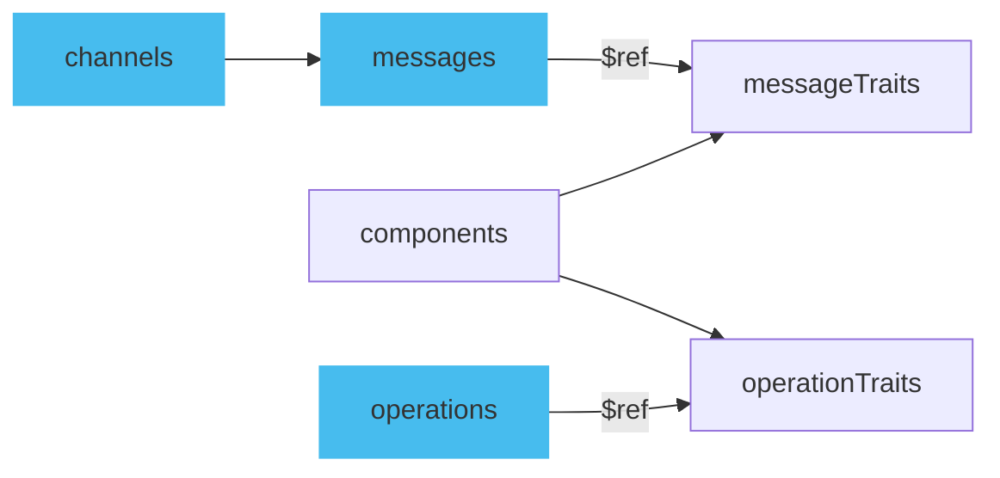

Traits work only with `operations` and `messages` fields. Traits allows to define properties that can be reused across multiple message and operations within the specification. Reusing traits promotes code maintainability, reduces duplication, and makes your AsyncAPI documents cleaner and easier to manage.

## Defining traits

You can inline traits definitions as part of an `operation` or a `message` but because goal of traits is reusability, you should do it under the `components` section of your AsyncAPI document, within `operationTraits` or `messageTraits`, depending on whether you want to apply them to operations or messages, respectively. Each trait is given a unique name and contains the properties that will be applied. Since you point to trait using `$ref` keyword, it means that you also can store your reusable traits outside AsyncAPI document. Read [Reusable parts document](/docs/concepts/asyncapi-document/reusable-parts) to learn more about different ways of using `$ref`.



[Message Trait](/docs/reference/specification/latest#messageTraitObject) do not fully cover all fields that normal message has, like for example `payload`. The same is with [Operation Trait](/docs/reference/specification/latest#operationTraitObject) that represents only selected fields you usually use in an operation.

Here is a part of a message that has a trait defined inline in a message:

```yaml
description: Example description.
traits:
  - name: UserSignup
    description: Trait description.
  - tags:
      - name: user
```

Traits are merged into the message object and later message look like in the example below:

```yaml
name: UserSignup
description: Example description.
tags:
  - name: user
```

Notice that description from trait did not override the description that was already there defined in a message outside the trait.

## Applying traits from components

Once a trait is defined, you can apply it to an operation or a message using the `$ref` keyword in the `traits` section. The `$ref` value should point to the path of the trait within the `components` section.

For example, let's say we have a trait named `commonHeaders` defined in `messageTraits`:

```yml
components:
  messageTraits:
    commonHeaders:
      headers:
        type: object
        properties:
          content-type:
            type: integer
```

To apply the above trait to a message object, you can do:

```yml
name: lightMeasured
title: Light measured
summary: Inform about environmental lighting conditions of a particular streetlight.
headers:
  type: object
  properties:
    custom-header:
      type: string
traits:
  - $ref: '#/components/messageTraits/commonHeaders'
```

In such document, the `commonHeaders` trait, which includes a `content-type` header, is merged into `headers` object in a message and will look like in the following example:

```yaml
name: lightMeasured
title: Light measured
summary: Inform about environmental lighting conditions of a particular streetlight.
headers:
  type: object
  properties:
    content-type:
      type: integer
    custom-header:
      type: string
```

## Trait merging mechanism

Traits in AsyncAPI document are merged into the message object in the same order they are defined and traits are merged into the operation or message object. There is no override of properties possible. For more info on [the merge mechanism check further specification reference documentation](/docs/reference/specification/#traitsMergeMechanism).

