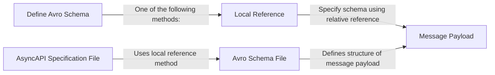

The payload schema defines the format, data types, and properties of a message's payload. To ensure that the payload follows a specific structure and data format.

In the AsyncAPI specification, you can use schema languages such as JSON or Avro Schema to create the payload schema. Enabling consumers to gain insights into the structure and data types of the payload.

To handle complex messages and structured data models, you should use Avro schemas. Avro schemas support complex types like arrays and records. You can create Avro schemas by writing the JSON representation or by utilising tools like Avro4s UI to generate the schema from valid JSON.

Use npm or yarn to install the `@asyncapi/avro-schema-parser` package to enable Avro schema parsing in AsyncAPI.

## Define Avro schema

Define the Avro schema for the message payload: You can choose one of the following methods:

- Embedded notation: Define the Avro schema within the message payload property.
- Remote reference: Specify the schema using an absolute remote endpoint, such as $ref: 'https://schemas.example.com/user'.
- Local reference: Specify the schema using a relative reference, such as $ref: './user-signedup.avsc#/User'.

Here is an example of an AsyncAPI specification file that uses the local reference method:

```yaml
asyncapi: '2.0.0'
id: 'urn:example.user'
channels:
  user/signedup:
    subscribe:
      contentType: avro/binary
      schemaFormat: application/vnd.apache.avro+json;version=1.9.0
      payload:
        $ref: './user.avsc#/User'
```

Create a separate Avro schema file with a .avsc extension. The file should define the structure of the message payload. Here is an example of an Avro schema file for the User record type:

```json
{
  "namespace": "example.avro",
  "type": "record",
  "name": "User",
  "fields": [
    { "name": "fullName", "type": "string" },
    { "name": "email", "type": "string" },
    { "name": "age", "type": "int" }
  ]
}
```



## Attach examples

Although optional, it is highly recommended to attach examples to the AsyncAPI specification. For a binary encoding like Avro, you can use JSON or YAML format. Attach the examples to the examples property within the message payload definition. Here is an example:

```yaml
asyncapi: '2.0.0'
id: 'urn:io.example'
channels:
  user/signedup:
    subscribe:
      examples:
        - laurent:
            payload: |-
              {"fullName": "Demo", "email": "demo@demo.io", "age": 19}
```

You can use a Schema Registry to separate the Avro schema from the message payload, making it easier to manage schema compatibility.

## Reuse schema

To reuse a schema in your AsyncAPI specification, define it in the components/schemas section and reference it using the $ref keyword. Using $ref helps to avoid duplication and ensures consistency. Here's an example of reusing a schema from components in AsyncAPI.

```yaml
asyncapi: '2.0.0'
info:
  title: My AsyncAPI Specification
  version: '1.0.0'
channels:
  user/signedup:
    subscribe:
      message:
        payload:
          $ref: '#/components/schemas/User'
components:
  schemas:
    User:
      type: object
      properties:
        fullName:
          type: string
        email:
          type: string
        age:
          type: integer
```
