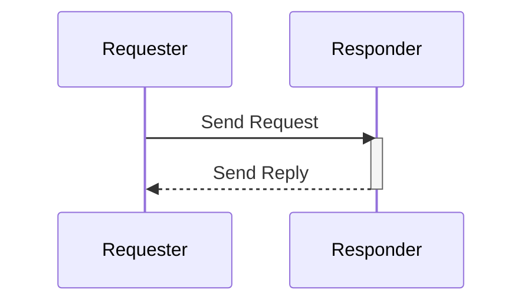

Request/Reply is a common messaging or communication pattern where one component or service, known as the requestor, sends a request to another component or service, known as the replier and waits for a response. This pattern is often used when a component needs to initiate an action and receive a specific response in return either synchronously or asynchronously. In even-driven architectures this communication pattern is asynchronous, meaning that the requester does not block and wait for an immediate response. Instead, it can continue processing other tasks or even send out other requests while waiting for the reply to arrive. 

In case of multiple requests made, each request is processed independently and sends the reply/response to the corresponding requestor when ready.

Here is diagram to illustrate the working of a basic request/reply pattern:


The request/reply pattern in AsyncAPI works in the same fashion while supporting all the different sub-patterns. Irrespective of the sub-pattern you would like to represent, the Request/reply pattern can be implemented in the AsyncAPI document in the `Operation` object.

You can add the reply info using the `Operation Reply` object under the `Operation` object. The `reply` represents the response details.

In AsyncAPI, you have the flexibility to represent the request/reply pattern in two different ways.

The first approach is when the requester specifies at runtime, within the request itself, where the response should be sent. This allows for dynamic determination of the reply channel based on factors such as the request message payload or header.

The second approach is when the requester already knows exactly where the response should be sent. In such cases, the address of the reply channel is directly specified in the AsyncAPI document.

## Dynamic response Channel
There are situations where you do not know the reply channel at the design time. Instead, the reply channel is dynamically determined at runtime, based on factors such as the request message payload or header. 

In the case where you don't know the address of the reply channel yet, you have the option to either assign null to the `address` property or omit the property entirely indicating that the address is not known at the moment. The `address` property being referred to in this case is part of the channel that the operation with the reply references to. To dynamically specify where the reply should be sent, you can use the `Operation Reply Address` object. The `Operation Reply Address` object has a property called `location` that allows you to define a runtime expression that specifies the address of the reply channel. 

For example, you can use such an expression to specify that the reply should be sent to the channel specified by the requestor in the request header under a specific property, like REPLY_TOPIC.

```yml
asyncapi: 3.0.0

info:
  title: Ping/pong example for a requester with a dynamic reply channel
  version: 1.0.0
  description: Example with a requester that initiates the request/reply pattern where the reply will happen on whatever is defined in the header `replyTo` of the request.

channels:
  ping:
    address: /ping
    messages:
      ping:
        $ref: '#/components/messages/ping'
  pong:
    address: null
    messages:
      pong:
        $ref: '#/components/messages/pong'

operations:
  pingRequest:
    action: send
    channel: 
      $ref: '#/channels/ping'
    reply:
      address:
        description: The reply address is dynamically determined based on the request header `replyTo`
        location: "$message.header#/replyTo"
      channel: 
        $ref: '#/channels/pong'
```

## Request/reply over the same channel
The request/reply pattern can also be implemented over the same channel. You can do this by specifying the same address for both the requester and the replier.

Here's a example of setting up both requestor and replier in the same channel:
```yml
asyncapi: 3.0.0

info:
  title: Ping/pong example with requester over the same channel
  version: 1.0.0
  description: Requester example initiating the request-reply pattern that are using the same channel for the reply

channels:
  ping:
    address: /
    messages:
      ping:
        $ref: '#/components/messages/ping'
  pong:
    address: /
    messages:
      pong:
        $ref: '#/components/messages/pong'

operations:
  pingRequest:
    action: send
    channel: 
      $ref: '#/channels/ping'
    reply:
      channel: 
        $ref: '#/channels/pong'
```

## Multiple messages over the same channel
When working with protocols like websockets, you can have multiple messages under the same channel. In such scenarios, you can use the `messages` property in the `Operation` object to explicitly define which message among the multiple messages available over the same channel is a request and which is a reply.  

Here's a example where we have multiple messages over the same channel with the same address and we define in the `Operation` object explicitly which message among the available messages is a request and which is a reply:
```yml
asyncapi: 3.0.0

info:
  title: Ping/pong example when a channel contains multiple messages
  version: 1.0.0
  description: Simple example with a requester that initiates the request-reply pattern, where the root channel contains multiple messages.

channels:
  rootChannel:
    address: /
    messages:
      ping:
        $ref: '#/components/messages/ping'
      pong:
        $ref: '#/components/messages/pong'

operations:
  pingRequest:
    action: send
    channel: 
      $ref: '#/channels/rootChannel'
    messages:
      - $ref: "/components/messages/ping"
    reply:
      messages:
        - $ref: "/components/messages/pong"
      channel: 
        $ref: '#/channels/rootChannel'
```