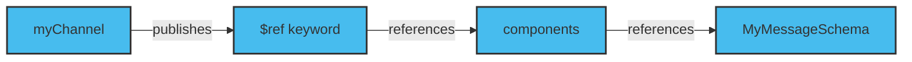
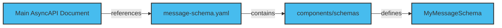
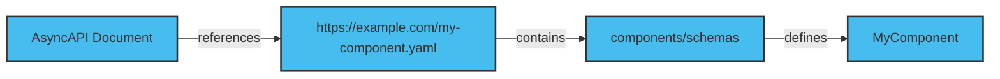

Reusable parts in AsyncAPI provide flexibility, modularity, and code reusability. Using reusable parts makes it easier to generate code and validate the specifications. You can reuse specific document sections such as Messages or schema definitions.

Reusable parts allow you to split up the AsyncAPI document into many files and reference them using the Reference Object. You can use the $ref keyword to reference the same or another local file or external URL.

## Same file

You can use the $ref keyword to reference a component within the same document. The diagram below defines referencing a component within the same document.



In the example below, you define a component called MyMessageSchema under the schemas section to describe the structure of a message. Under the publish operation of myChannel, you reference the MyMessageSchema component using the $ref keyword.

```yaml
channels:
  myChannel:
    publish:
      message:
        $ref: '#/components/schemas/MyMessageSchema'
components:
  schemas:
    MyMessageSchema:
      type: object
      properties:
        message:
          type: string
```

## Another local document

You can use the $ref keyword to reference another local document. Ensure the path to the local file is correct and accessible from your main AsyncAPI document.

The diagram below defines the process of referencing another local document.



In the example below, you reference the component from the message-schema.yaml.

```yaml
components:
  messages:
    UserSignup:
      name: UserSignup
      title: User signup
      summary: Action to sign a user up.
      description: A longer description
      contentType: application/json
      payload: null
```

To use message-schema.yaml in another local document such as consume-schema.yaml

```yaml
channels:
  user/signedup:
    publish:
      message:
        $ref: ./message-schema.yaml#/components/messages/UserSignup
```

## External URL

You can use the $ref keyword to reference an external URL. Ensure the external URL should provide the referenced component in a compatible format, such as YAML or JSON.

The diagram below defines the process of referencing an external URL.



In the example below, you reference the component from an external URL. The $ref value specifies the full URL to the external resource and the component's location.

```yaml
channels:
  myChannel:
    publish:
      message:
        $ref: https://example.com/my-component.yaml#/components/schemas/MyComponent
```
