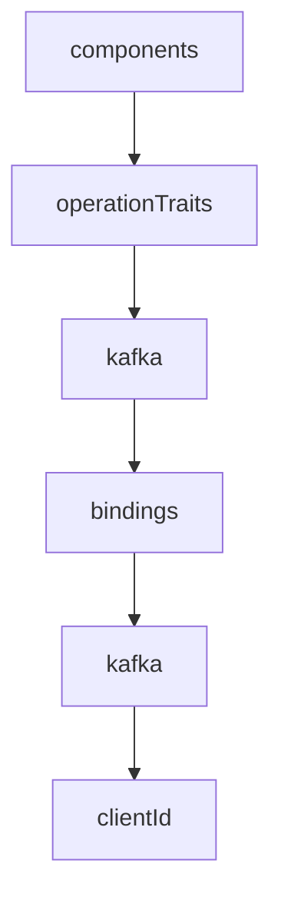
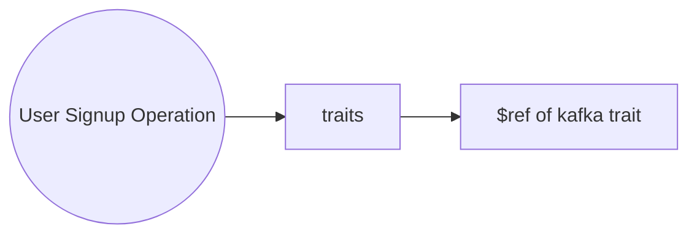
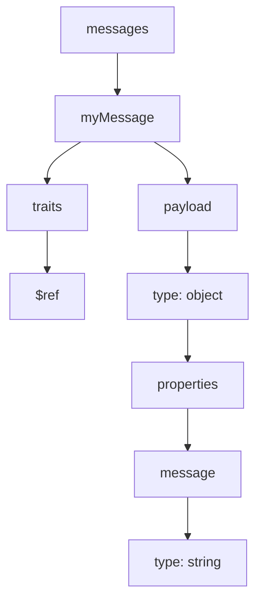
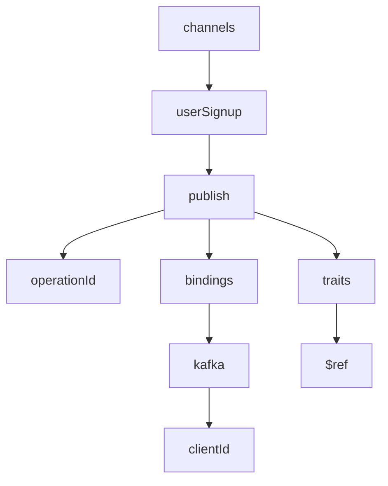

Traits are a powerful way to define a group of properties that can be reused across multiple message objects within the specification. Reusing traits promotes code maintainability, reduces duplication, and makes your AsyncAPI documents cleaner and easier to manage.

## Defining Traits

Traits are defined under the `components` section of your AsyncAPI document, within `operationTraits`or `messageTraits`, depending on whether you want to apply them to operations or messages, respectively. Each trait is given a unique name and contains the properties that will be applied.



Here's an example of a trait named `kafka`:

```yml
components:
  operationTraits:
    kafka:
      bindings:
        kafka:
          clientId: my-app-id
```

In this example, the `kafka` trait includes the `clientId` property for Kafka bindings.

## Applying Traits to Operations

Once a trait is defined, you can apply it to an operation using the `$ref` keyword in the `traits` section of the operation. The `$ref` value should point to the path of the trait within the `components` section.



Here's applying the `kafka` trait to an operation:

```yml
channel:
  $ref: '#/channels/userSignup'
action: send
tags:
  - name: user
  - name: signup
  - name: register
bindings:
  amqp:
    ack: false
traits:
  - $ref: '#/components/operationTraits/kafka'
```

In this case, the `userSignup` operation in the `userSignup` channel applies the `kafka` trait, which includes the `clientId` property for Kafka bindings.

## Applying Traits to Messages

Traits can also be applied to `message` objects in the messages section of the AsyncAPI document. This is done using the `$ref` keyword within the `traits` section of the message object.



For example, let's say we have a trait named commonHeaders defined in messageTraits:

```yml
components:
  messageTraits:
    commonHeaders:
      headers:
        - name: Content-Type
          type: string
```

To apply this trait to a message object, you can do:

```yml
channels:
  userSignup:
    publish:
      message:
        $ref: '#/components/messages/commonMessage'
        traits:
          - $ref: '#/components/messageTraits/commonHeaders'
```

In this example, the `commonHeaders` trait, which includes a `Content-Type` header, is applied to the `commonMessage` within the `userSignup` operation.

## Trait Merging and Overriding

Traits in AsyncAPI are merged into the message object using the [JSON Merge Patch](https://datatracker.ietf.org/doc/html/rfc7386) protocol, which means that traits are merged into the operation or message object, and any conflicting properties will be overridden based on the order of evaluation.



For example, let's consider the following trait and operation:

```yml
components:
  operationTraits:
    kafka:
      bindings:
        kafka:
          clientId: my-app-id
          groupId: default-group

channels:
  userSignup:
    publish:
      operationId: userSignup
      traits:
        - $ref: '#/components/operationTraits/kafka'
      bindings:
        kafka:
          groupId: custom-group
```

In this case, the operation applies the `kafka` trait, which provides the default `clientId` and `groupId` properties. However, in the operation itself, the `groupId` property is overridden with a custom value. The final result would be:

```yml
channels:
  userSignup:
    publish:
      operationId: userSignup
      bindings:
        kafka:
          clientId: my-custom-app-id # this will override the clientId defined in trait
      traits:
        - $ref: '#/components/operationTraits/kafka'
```

As demonstrated, the `groupId` property defined in the operation overrides the value defined in the trait.
