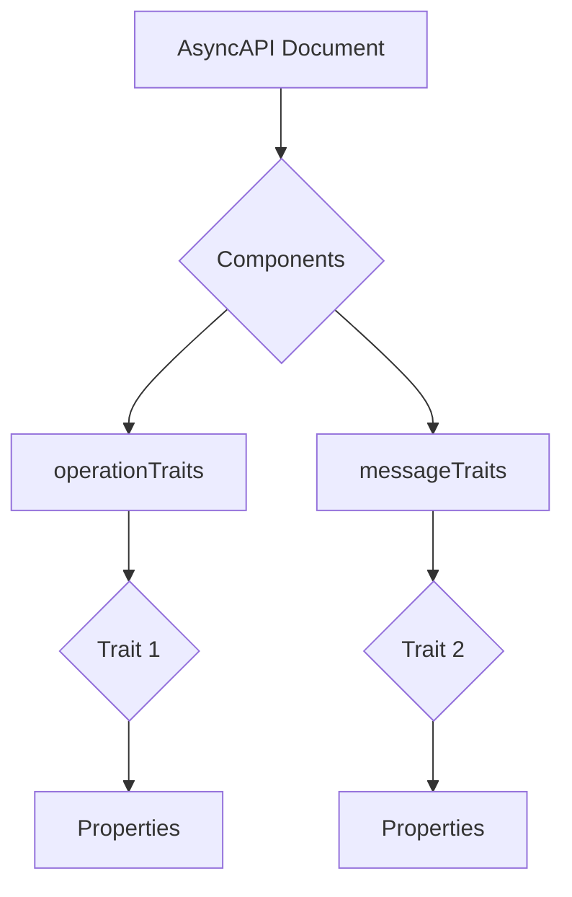
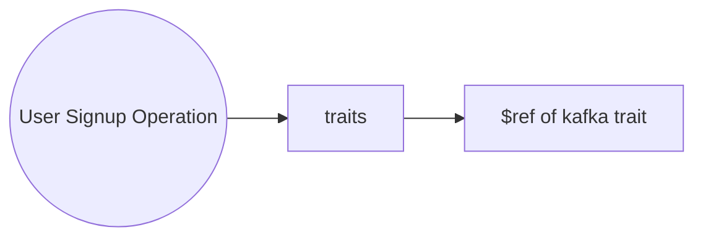
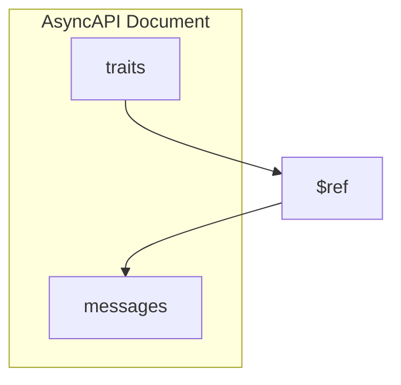
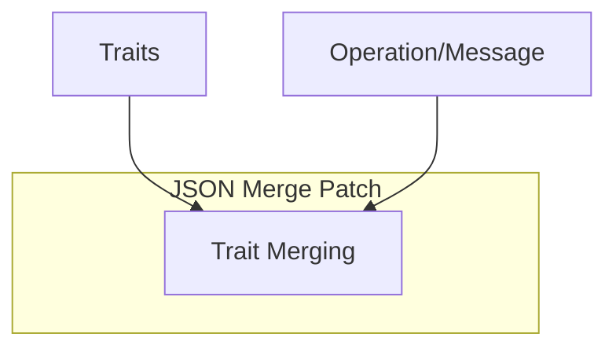

Traits are a powerful way to define properties that can be reused across multiple message objects within the specification. Reusing traits promotes code maintainability, reduces duplication, and makes your AsyncAPI documents cleaner and easier to manage.

## Defining traits

Traits are defined under the `components` section of your AsyncAPI document, within `operationTraits` or `messageTraits`, depending on whether you want to apply them to operations or messages, respectively. Each trait is given a unique name and contains the properties that will be applied.



## Applying traits to operations

Once a trait is defined, you can apply it to an operation using the `$ref` keyword in the `traits` section of the operation. The `$ref` value should point to the path of the trait within the `components` section.



Here's applying the `kafka` trait to an operation:

```yml
channel:
  $ref: '#/channels/userSignup'
action: send
tags:
  - name: user
  - name: signup
  - name: register
traits:
  - $ref: '#/components/operationTraits/kafka'
```

In this document, the `userSignup` operation in the `userSignup` channel applies the `kafka` trait.

## Applying traits to messages

Traits can also be applied to `message` objects in the messages section of the AsyncAPI document. This is done using the `$ref` keyword within the `traits` section of the message object.



For example, let's say we have a trait named `commonHeaders` defined in `messageTraits`:

```yml
components:
  messageTraits:
    commonHeaders:
      headers:
        type: object
        properties:
          Content-Type:
            type: integer
```

To apply the above trait to a message object, you can do:

```yml
traits:
  - $ref: '#/components/messageTraits/commonHeaders'
```

In this document, the `commonHeaders` trait, which includes a `Content-Type` header, is applied to the `commonMessage`.

## Trait merging

Traits in AsyncAPI are merged into the message object using the [JSON Merge Patch](https://datatracker.ietf.org/doc/html/rfc7386) protocol, which means that traits are merged into the operation or message object.


