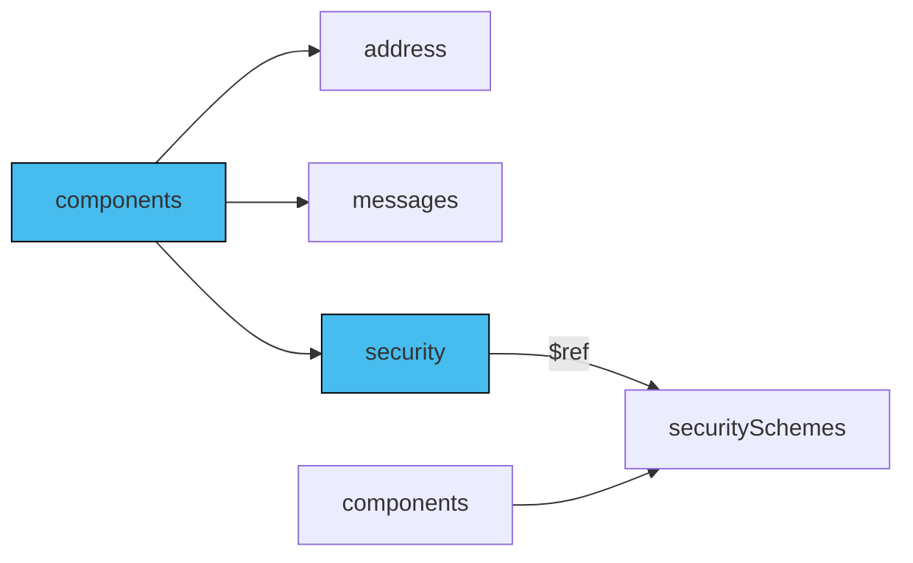

The server security concept implies that the security measures defined at the server level apply to all operations within all channels by default. To change that default behaviour for specific operation, you need to apply security information directly on that operation.

## Add security

To accommodate such scenarios, the AsyncAPI document allows you to use the `security` field at the `operation` level. You can have multiple security schemes but only one must be satisfied to authorize such operation.

The diagram below describes how to use reusable security schemes:



## Operation section

Operation security information is represented by [Security scheme](/docs/reference/specification/v3.0.0#securitySchemeObject) on operation level. You can also use `$ref` keyword to reference the scheme stored in different location, like for example `components.securitySchemes`.

```yaml
operations:
  sendAuthRevoke:
    action: send
    channel:
      $ref: '#/channels/authRevoke'
    security:
      - type: oauth2
        description: The oauth security descriptions
        flows:
          clientCredentials:
            tokenUrl: 'https://example.com/api/oauth/dialog'
            availableScopes:
              'subscribe:auth_revocations': Scope required for authorization revocation topic
        scopes:
          - 'subscribe:auth_revocations'
```

Above example shows an `sendAuthRevoke` operation from AsyncAPI document that explains what operations client app can perform with existing notification service. In case there would be a server with separate server security, operation must satisfy it as well.

## `securitySchemes` section

To reuse security schemes between operations, place them in `components.securitySchemes` and reference through `$ref` keyword in your operation:

```yaml
operations:
  sendAuthRevoke:
    action: send
    channel:
      $ref: '#/channels/authRevoke'
    security:
      - $ref: '#/components/securitySchemes/oauth'

components:
  securitySchemes:
    oauth:
       type: oauth2
        description: The oauth security descriptions
        flows:
          clientCredentials:
            tokenUrl: 'https://example.com/api/oauth/dialog'
            availableScopes:
              'subscribe:auth_revocations': Scope required for authorization revocation topic
        scopes:
          - 'subscribe:auth_revocations'
```

With above approach you can reuse scheme within multiple operations, even across multiple AsyncAPI documents.
