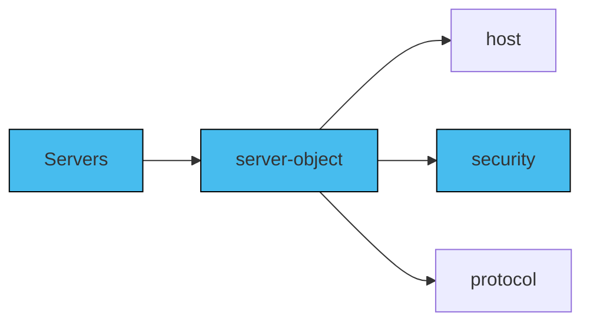

Server security refers to the measures and practices implemented to protect servers from unauthorized access, data breaches, and other security threats. Server security involves implementing various security mechanisms to ensure the confidentiality, integrity, and availability of server resources.

In the context of AsyncAPI, securing servers ensures secure exchange of messages between clients and servers. While also protecting sensitive data, preventing unauthorized access, and maintaining the overall security of the API or server.

You can secure a server by using the `security` property where you define or declare which security schemes can be used with the server in context. Each `server` in the AsyncAPI document can have one or more security schemes declared. A security scheme defines a security requirement that must be satisfied to authorize an operation such as a API key or username and password. 

Here is a example of adding security to your server:
```yml
asyncapi: 3.0.0
info:
  title: Streetlights Kafka API
  version: 1.0.0
servers:
  scram-connections:
    host: 'test.mykafkacluster.org:18092'
    protocol: kafka-secure
    description: Test broker secured with scramSha256
    security:
      - $ref: '#/components/securitySchemes/saslScram'
  mtls-connections:
    host: 'test.mykafkacluster.org:28092'
    protocol: kafka-secure
    description: Test broker secured with X509
    security:
      - $ref: '#/components/securitySchemes/certs'
components:
  securitySchemes:
    saslScram:
      type: scramSha256
      description: Provide your username and password for SASL/SCRAM authentication
    certs:
      type: X509
      description: Download the certificate files from service provider
```

Here is a illustration of securing servers: 


Here are some of the security schemes that AsyncAPI supports:
- User/Password
  ```yml
  type: userPassword
  ```

- API key (either as a user or as a password)
```yml
type: apiKey
in: user
```

- X.509 certificate
```yml
type: X509
```

- End-to-end encryption (either symmetric or asymmetric)
```yml
type: symmetricEncryption
```

- HTTP authentication
```yml
type: http
scheme: basic
```

- HTTP API key
```yml
type: httpApiKey
name: api_key
in: header
```

- JWT Bearer
```yml
type: http
scheme: bearer
bearerFormat: JWT
```

- Implicit oauth2
```yml
type: oauth2
flows:
  implicit:
    authorizationUrl: https://example.com/api/oauth/dialog
    availableScopes:
      write:pets: modify pets in your account
      read:pets: read your pets
scopes:
  - 'write:pets'
```

- SASL (Simple Authentication and Security Layer) as defined in RFC4422
```yml
type: scramSha512
```

Although, the `security` property is not mandatory to be implemented, it is a good practise to always secure your server(s) in production. Similarly, having multiple security schemes declared does not necessarily mean that the server is more secure, it really depends on other factors such as the protocol used, use case, business perspective and more.