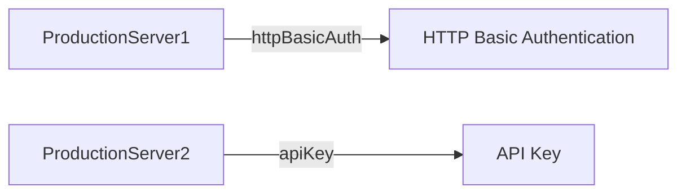

Each server in the AsyncAPI document can have one or more security schemes declared. A security scheme defines a security requirement that must be satisfied to authorize an operation. This page shows how to add security details to servers in the AsyncAPI document.

Here is a Mermaid diagram to visually represent the relationship:



This diagram represents two servers, `ProductionServer1` and `ProductionServer2`, and their respective security schemes, `httpBasicAuth` and `apiKey`. The arrows (-->) indicate the relationship between the servers and their security schemes.

## Supported Security Protocols

Here are some security schemes that can be applied to operations:

- User/Password
  
  ```yml
  type: userPassword
  ```

- API key (either as user or as password)

 ```yml
type: apiKey
in: user
  ```

- X.509 certificate
  
```yml
type: X509
```

- End-to-end encryption (either symmetric or asymmetric)
  
```yml
type: symmetricEncryption
```

- HTTP authentication

```yml
type: http
scheme: basic
```

- HTTP API key
  
```yml
type: httpApiKey
name: api_key
in: header
```

- JWT Bearer
  
```yml
type: http
scheme: bearer
bearerFormat: JWT
```

- Implicit oauth2
  
```yml
type: oauth2
flows:
  implicit:
    authorizationUrl: https://example.com/api/oauth/dialog
    availableScopes:
      write:pets: modify pets in your account
      read:pets: read your pets
scopes:
  - 'write:pets'
```

- SASL (Simple Authentication and Security Layer) as defined in RFC4422

```yml
type: scramSha512
```

This guide should help you understand how to add security details to servers in your AsyncAPI document.
