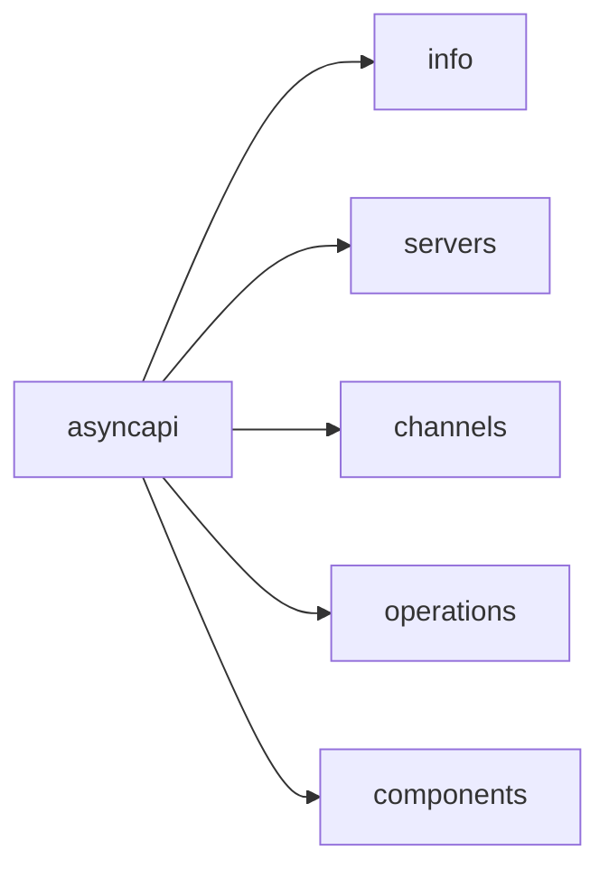
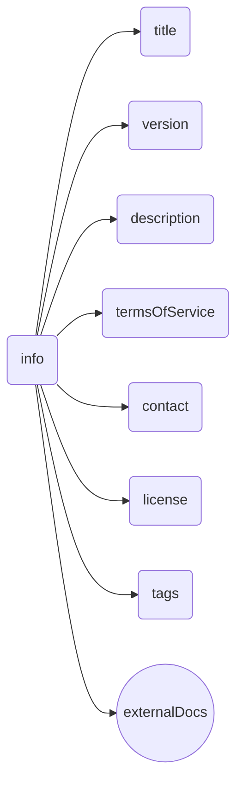
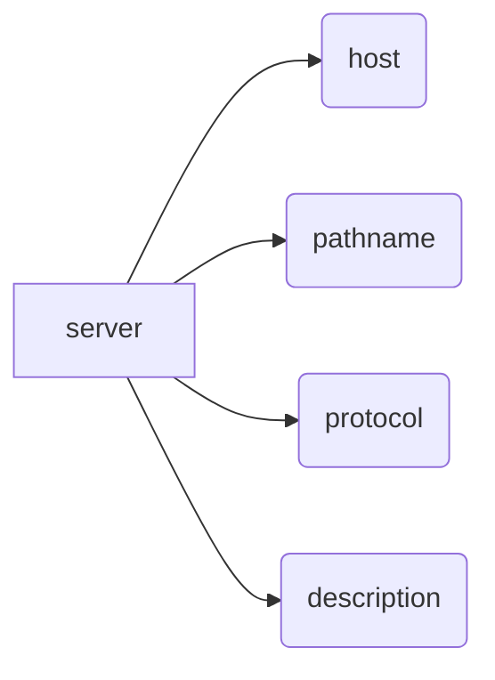
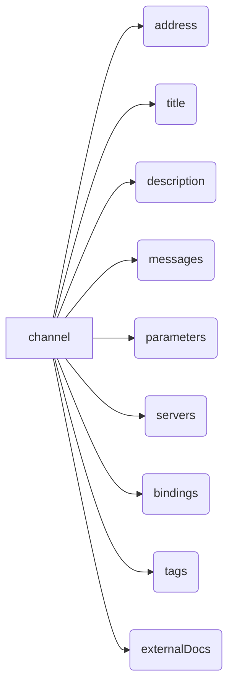
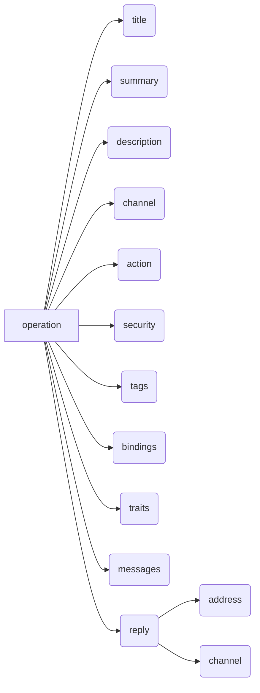
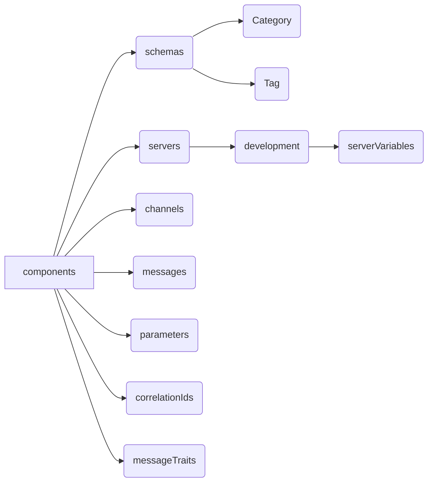

The structure of an AsyncAPI document can be defined as a specific format in which the document of the specification is to be written and defined. The structure of an AsyncAPI document has certain fields that need to be followed and implemented.

## Root Elements 
Root elements of an AsyncAPI document provide an overview of the API's characteristics and behaviour. These root elements collectively define the metadata, channels, components and more of an AsyncAPI document. They provide a comprehensive overview of the API's characteristics and behaviour.



### `Info` object
The `info` object in an AsyncAPI document provides essential information about the API in the form of fields such as title, version, description, contact details and license. It serves as metadata that gives consumers a high-level understanding of the API's purpose and functionality.

The purpose of the `info` object is to provide descriptive and contact information about the specific API. It helps developers, architects, and other stakeholders quickly identify and comprehend the API's characteristics without diving into the technical details. Plus, `info` is a required component of the AsyncAPI document and often the first point of reference for users exploring the API documentation.

Some of the fields `info` object holds are:

- `title`: The title of the API.
- `version`: The version of the API.
- `description`: A brief description explaining the purpose and features of the API.
- `termsOfService`: The URL or document specifying the terms of service for using the API.
- `contact`: Contact information for the owner or maintainer of the API, including name, email, and URL.
- `license`: Information about the license under which the API is provided, including name and URL.
- `tags`: A list of tags for application API documentation control. Tags can be used for logical grouping of applications.
- `externalDocs`: Additional external documentation of the exposed API.

Here's a visual representation of the `info` object and its properties:


Below is an example of the `info` object in the AsyncAPI document:
```yaml
asyncapi: 3.0.0
info:
  title: My Event-Driven API
  version: 1.0.0
  description: This API provides real-time event streaming capabilities.
  termsOfService: https://example.com/terms-of-service
  contact:
    name: Rohit
    email: rohit@asyncapi.com
  license:
    name: Apache 2.0
    url: https://www.apache.org/licenses/LICENSE-2.0.html
  tags:
    - name: Events
      description: APIs related to event streaming
    - name: Authentication
      description: APIs for authentication and authorization
  externalDocs:
    description: Additional documentation 
    url: https://example.com/docs
```

### `Servers` object
The `servers` object in an AsyncAPI document is a map of `server` objects that defines the network endpoints or brokers that applications can connect to for exchanging messages. It specifies the details necessary to establish a connection, such as the protocol, host, port, and additional connection options.

The purpose of the `servers` object is to provide the necessary information for clients to connect to the message broker or server and participate in the message exchange or listen to the events. By defining multiple servers, the AsyncAPI document can accommodate different environments or deployment scenarios, such as production, staging, or development.

Some of the fields `servers` object holds for each server object are:

- `host`: The server host name. It may include the port. 
- `protocol`: The protocol or messaging protocol used by the server (e.g., AMQP, MQTT, WebSocket).
- `protocolVersion`: The version of the protocol used for the connection.
- `pathname`: The path to a resource in the host.
- `description`: An optional string describing the server.
- `title`: A human-friendly title for the server.
- `summary`: A summary of the server.
- `security`: A declaration of which security schemes can be used with this server. 
- `tags`: A list of tags for logical grouping and categorization of servers.
- `externalDocs`: Additional external documentation for this server.
- `bindings`: A map where the keys describe the name of the protocol and the values describe protocol-specific definitions for the server.

Here's a visual representation of the `server` object and its properties:


Here's a code example of the servers object with multiple servers in an AsyncAPI document:
```yaml
host: rabbitmq.in.mycompany.com:5672
pathname: /production
protocol: amqp
description: Production RabbitMQ broker (uses the `production` vhost).
```

### `Channels` object
The `channels` object in an AsyncAPI document holds all the individual `channel` object definitions that the application must use during runtime. The `channels` represent the communication pathways through which messages are exchanged. The `channel` object describes a shared communication channel. 

The purpose of the `channels` object is to provide a structured way to define the messaging patterns and topics within the API. It allows API developers to specify the available channels, their purpose, and the expected message formats for communication. Consumers of the specific API can understand the supported message-based interactions and the corresponding data models.

Some of the fields `channels` object holds for each channel object are:

- `address`: A string representation of this channel's address.
- `messages`: A map of the messages that will be sent to this channel by any application at any time.
- `title`: A human-readable title for the channel.
- `summary`: A short yet brief summary of the channel.
- `description`: A description of the channel, providing additional context and details of the message.
- `servers`: An array of `$ref` pointers to the definition of the servers in which this channel is available. If servers are absent or empty, this channel must be available on all the servers defined in the `Servers` Object. 
- `parameters`: A map of the parameters included in the channel address.
- `tags`: A list of tags for logical grouping of channels.
- `externalDocs`: Additional external documentation for this channel.
- `bindings`: A map where the keys describe the name of the protocol and the values describe protocol-specific definitions for the channel.

Here's a visual representation of the `channels` object and its properties:


Here's a code example illustrating the structure of the channels object in an AsyncAPI document:
```yaml
address: 'users.{userId}'
title: Users channel
description: This channel is used to exchange messages about user events.
messages:
  userSignedUp:
    $ref: '#/components/messages/userSignedUp'
  userCompletedOrder:
    $ref: '#/components/messages/userCompletedOrder'
parameters:
  userId:
    $ref: '#/components/parameters/userId'
servers:
  - $ref: '#/servers/rabbitmqInProd'
  - $ref: '#/servers/rabbitmqInStaging'
bindings:
  amqp:
    is: queue
    queue:
      exclusive: true
tags:
  - name: user
    description: User-related messages
externalDocs:
  description: 'Find more info here'
  url: 'https://example.com'
```
### `Operations` object
The `operations` object holds a dictionary with all the operations the application must implement. The purpose of the `operations` object is to provide a clear and structured definition of the operations that an application must support within an event-driven API.

The `operations` object is located within the AsyncAPI document and is separate from the components/operations section, which is used for optional or additional operations that may or may not be implemented by the application.

Some of the fields `operations` object holds for each `operation` object are:

- `action`: Use `send` type when it's expected that the application will send a message to the given channel, and `receive` type when the application should expect to receive messages from the given channel.
- `channel`: A `$ref` pointer to the definition of the channel in which this operation is performed. 
- `title`:	A human-friendly title for the operation.
- `summary`: A short summary of what the operation is about.
- `description`: A verbose explanation of the operation. 
- `security`:	A declaration of which security schemes are associated with this operation.
- `tags`:	A list of tags for logical grouping and categorization of operations.
- `externalDocs`:	Additional external documentation for this operation.
- `bindings`	A map where the keys describe the name of the protocol and the values describe protocol-specific definitions for the operation.
- `traits`:	A list of traits to apply to the operation object. 
- `messages`:	A list of $ref pointers pointing to the supported Message Objects that can be processed by this operation.
- `reply`:	The definition of the reply in a request-reply operation.

Here's a visual representation of the `operations` object and its properties:


Here's a code example illustrating the structure of the `operations` object in an AsyncAPI document:
```yaml
title: User sign up
summary: Action to sign a user up.
description: A longer description
channel:
  $ref: '#/channels/userSignup'
action: send
security:
  - petstore_auth:
    - write:pets
    - read:pets
tags:
  - name: user
  - name: signup
  - name: register
bindings:
  amqp:
    ack: false
traits:
  - $ref: "#/components/operationTraits/kafka"
messages:
  - $ref: '#/components/messages/userSignedUp'
reply:
  address:
    location: '$message.header#/replyTo'
  channel:
    $ref: '#/channels/userSignupReply'
  messages:
    - $ref: '#/components/messages/userSignedUpReply'
```

### `Components` object
The `components` object in an AsyncAPI document serves as a container for reusable structures or definitions that can be used across different parts of the AsyncAPI document. It allows you to define and manage common elements such as message schemas, security schemes, headers, and other custom components that are referenced throughout the API specification.

All objects defined within the `components` object will not affect the specific API unless they are explicitly referenced from properties outside the components object.

The purpose of the `components` object is to promote reusability and maintainability of the AsyncAPI document. By centralizing common definitions in the components section, you can avoid duplicating code and ensure consistency across different parts of the API specification. It also enhances the readability and understandability of the document by providing a clear separation of concerns.

Some of the fields `components` object holds are:

- `schemas`: An object to hold reusable [Schema Object](https://www.asyncapi.com/docs/reference/specification/v3.0.0-next-major-spec.12#schemaObject). 
- `servers`: An object to hold reusable [Server Objects](https://www.asyncapi.com/docs/reference/specification/v3.0.0-next-major-spec.12#serverObject).
- `channels`: An object to hold reusable [Channel Objects](https://www.asyncapi.com/docs/reference/specification/v3.0.0-next-major-spec.12#channelObject).
- `operations`: An object to hold reusable [Operation Item Objects](https://www.asyncapi.com/docs/reference/specification/v3.0.0-next-major-spec.12#operationObject).
- `messages`: An object to hold reusable [Messages Objects](https://www.asyncapi.com/docs/reference/specification/v3.0.0-next-major-spec.12#messageObject).
- `securitySchemes`: An object to hold reusable [Security Scheme Objects](https://www.asyncapi.com/docs/reference/specification/v3.0.0-next-major-spec.12#securitySchemeObject).
- `serverVariables`: An object to hold reusable [Server Variable Objects](https://www.asyncapi.com/docs/reference/specification/v3.0.0-next-major-spec.12#serverVariableObject).
- `parameters`: Contains reusable [parameter objects](https://www.asyncapi.com/docs/reference/specification/v3.0.0-next-major-spec.12#parameterObject) that can be used in various parts of the AsyncAPI document.
- `correlationIds`: An object to hold reusable [Correlation ID Objects](https://www.asyncapi.com/docs/reference/specification/v3.0.0-next-major-spec.12#correlationIdObject).
- `replies`: An object to hold reusable [Operation Reply Objects](https://www.asyncapi.com/docs/reference/specification/v3.0.0-next-major-spec.12#operationReplyObject).
- `replyAddresses`: An object to hold reusable [Operation Reply Address Objects](https://www.asyncapi.com/docs/reference/specification/v3.0.0-next-major-spec.12#operationReplyAddressObject).
- `externalDocs`: An object to hold reusable [External Documentation Objects](https://www.asyncapi.com/docs/reference/specification/v3.0.0-next-major-spec.12#externalDocumentationObject).
- `tags`: An object to hold reusable [Tag Objects](https://www.asyncapi.com/docs/reference/specification/v3.0.0-next-major-spec.12#tagObject).
- `operationTraits`: An object to hold reusable [Operation Trait Objects](https://www.asyncapi.com/docs/reference/specification/v3.0.0-next-major-spec.12#operationTraitObject).
- `messageTraits`: Represents common traits or characteristics that can be applied to messages or hold reusable [Message Trait Objects](https://www.asyncapi.com/docs/reference/specification/v3.0.0-next-major-spec.12#messageTraitObject).
- `serverBindings`: An object to hold reusable [Server Bindings Objects](https://www.asyncapi.com/docs/reference/specification/v3.0.0-next-major-spec.12#serverBindingsObject).
- `channelBindings`: An object to hold reusable [Channel Bindings Objects](https://www.asyncapi.com/docs/reference/specification/v3.0.0-next-major-spec.12#channelBindingsObject).
- `operationBindings`: An object to hold reusable [Operation Bindings Objects](https://www.asyncapi.com/docs/reference/specification/v3.0.0-next-major-spec.12#operationBindingsObject).
- `messageBindings`: An object to hold reusable [Message Bindings Objects](https://www.asyncapi.com/docs/reference/specification/v3.0.0-next-major-spec.12#messageBindingsObject).

Here's a visual representation of the `components` object and its properties:


Here's a code example of the components object in an AsyncAPI document:
```yaml
components:
  schemas:
    Category:
      type: object
      properties:
        id:
          type: integer
          format: int64
        name:
          type: string
    Tag:
      type: object
      properties:
        id:
          type: integer
          format: int64
        name:
          type: string
    AvroExample:
      schemaFormat: application/vnd.apache.avro+json;version=1.9.0
      schema:
        $ref: 'path/to/user-create.avsc/#UserCreate'
  servers:
    development:
      url: "{stage}.in.mycompany.com:{port}"
      description: RabbitMQ broker
      protocol: amqp
      protocolVersion: 0-9-1
      variables:
        stage:
          $ref: "#/components/serverVariables/stage"
        port:
          $ref: "#/components/serverVariables/port"
  serverVariables:
    stage:
      default: demo
      description: This value is assigned by the service provider, in this example `mycompany.com`
    port:
      enum: [5671, 5672]
      default: 5672
  channels:
  messages:
    userSignUp:
      summary: Action to sign a user up.
      description: |
        Multiline description of what this action does.
        Here you have another line.
      tags:
        - name: user
        - name: signup
      headers:
        type: object
        properties:
          applicationInstanceId:
            description: Unique identifier for a given instance of the publishing application
            type: string
      payload:
        type: object
        properties:
          user:
            $ref: "#/components/schemas/userCreate"
          signup:
            $ref: "#/components/schemas/signup"
  parameters:
    userId:
      description: Id of the user.
      schema:
        type: string
  correlationIds:
    default:
      description: Default Correlation ID
      location: $message.header#/correlationId
  messageTraits:
    commonHeaders:
      headers:
        type: object
        properties:
          my-app-header:
            type: integer
            minimum: 0
            maximum: 100
```
