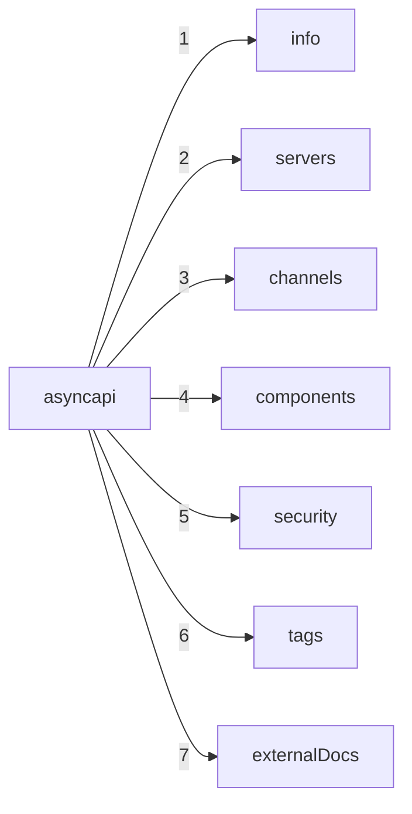
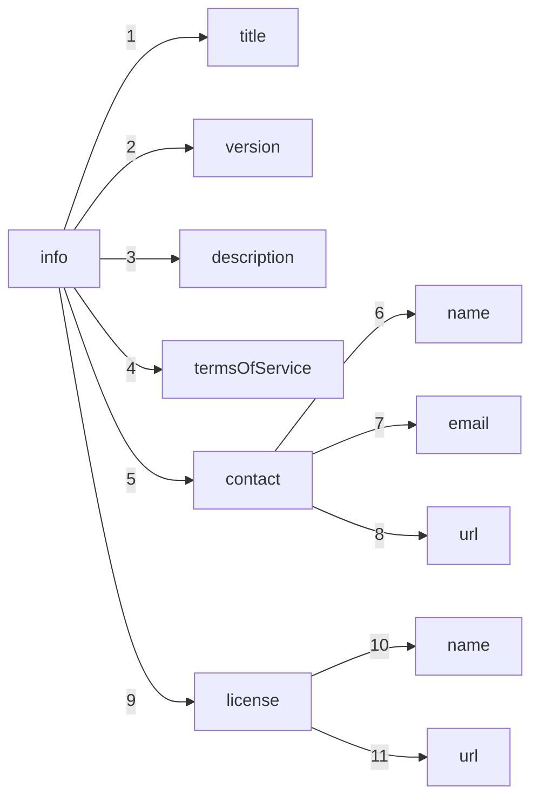
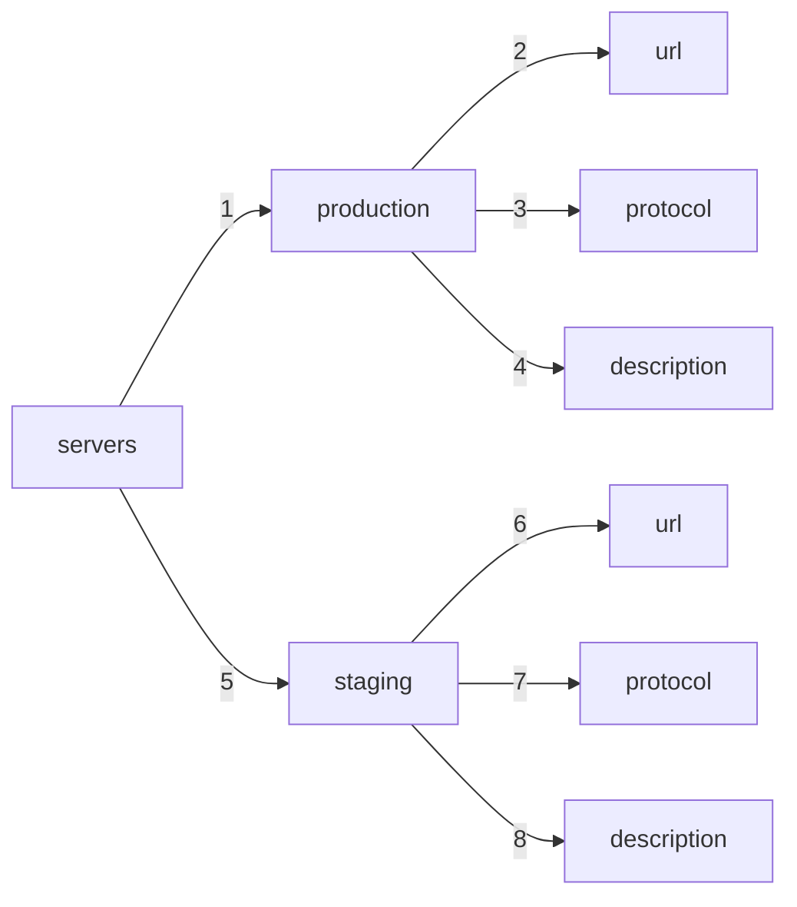
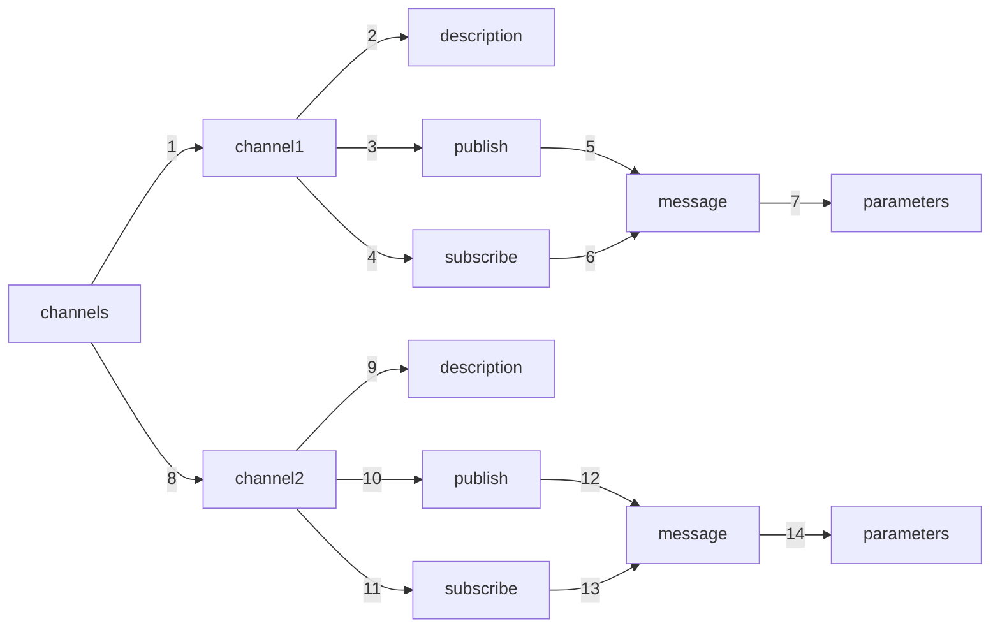
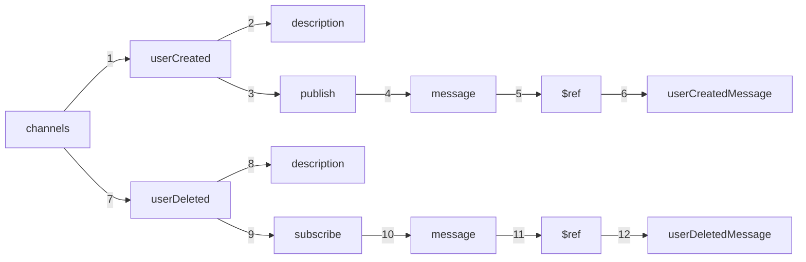
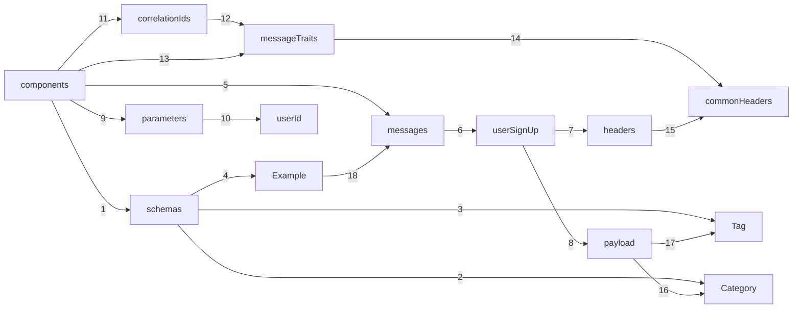

<!-- What is structure in an AsyncAPI document?
What can I do with it? how does it work?
what is it's relation to asyncapi spec? -->

## What's a AysncAPI Document?
An AsyncAPI document is a file written in the AsyncAPI specification format. It is a machine-readable document that describes the structure, format, and behavior of a specific asynchronous API or event-driven API. The document provides a standardized way to define the messages, topics, channels, protocols, and other components involved in the communication.

An AsyncAPI document typically has a YAML or JSON format and contains various sections that define different aspects of the API like a structure that defines and explains what the specific API needs to do or does.

## Root Elements 
Root elements provide a overview of the API's characteristics and behavior.These root elements collectively define the structure, metadata, endpoints, channels, components and more of an AsyncAPI document. They provide a comprehensive overview of the API's characteristics and behavior.



### `Info` object
The `info` object in an AsyncAPI document provides essential information about the API in the form of fields such as title, version, description, contact details and license. It serves as metadata that gives consumers a high-level understanding of the API's purpose and functionality.

The purpose of the `info` object is to provide descriptive and contact information about the specific API. It helps developers, architects, and other stakeholders quickly identify and comprehend the API's characteristics without diving into the technical details. Plus, Info is a required component of the AsyncAPI document and often the first point of reference for users exploring the API documentation.

The `info` object includes properties such as:

- title: The title of the API.
- version: The version of the API.
- description: A brief description explaining the purpose and features of the API.
- termsOfService: The URL or document specifying the terms of service for using the API.
- contact: Contact information for the owner or maintainer of the API, including name, email, and URL.
- license: Information about the license under which the API is provided, including name and URL.



Below is a example of the `info` object in the AsyncAPI document:
```yaml
info:
  title: My AsyncAPI Example
  version: 1.0.0
  description: An example of info object
  termsOfService: https://example.com/terms
  contact:
    name: Rohit
    email: rohit@asyncapi.com
    url: https://example.com/contact
  license:
    name: Apache 2.0
    url: https://www.apache.org/licenses/LICENSE-2.0
```

### `Servers` object
The `servers` object in an AsyncAPI document is a map of `server` objects that defines the network endpoints or brokers that applications can connect to for exchanging messages. It specifies the details necessary to establish a connection, such as the protocol, host, port, and additional connection options. The `server` object is used to capture details such as URIs, protocols and security configuration. 

The purpose of the `servers` object is to provide the necessary information for clients to connect to the message broker or server and participate in the message exchange or listen to the events. By defining multiple servers, the AsyncAPI document can accommodate different environments or deployment scenarios, such as production, staging, or development.

The `servers` object typically includes the following properties(few are mandatory, few are optional) for each server:

- url: The URL or address of the server.
- protocol: The protocol or messaging protocol used by the server (e.g., AMQP, MQTT, WebSocket).
- description: A brief description or label for the server.
- variables: Variables that can be used to parameterize the server URL, allowing dynamic configuration based on runtime factors.



Here's a code example of the servers object with multiple servers in an AsyncAPI document:
```json
{
  "servers": {
    "development": {
      "url": "development.my-server.com",
      "description": "Development server",
      "protocol": "amqp",
      "protocolVersion": "0.9.1"
    },
    "staging": {
      "url": "staging.exmaple-server.com",
      "description": "Staging server",
      "protocol": "amqp",
      "protocolVersion": "0.9.1"
    },
    "production": {
      "url": "api.demo-server.com",
      "description": "Production server",
      "protocol": "amqp",
      "protocolVersion": "0.9.1"
    }
  }
}
```

### `Channels` object
The `channels` object in an AsyncAPI document hold the relative paths to the individual channels and their operations. Channel paths are relative to servers.
The `channels` represents the communication pathways through which messages are exchanged. It defines the events or topics that applications can subscribe to or publish messages on. Each channel can have properties such as a description, message definitions, and parameters.

The purpose of the `channels` object is to provide a structured way to define the messaging patterns and topics within the API. It allows API developers to specify the available channels, their purpose, and the expected message formats for communication. Consumers of the specific API can understand the supported message-based interactions and the corresponding data models.

The `channels` object typically includes properties for each channel, such as:

- description: A brief description of the channel, providing additional context and details of the message.
- parameters: Optional parameters associated with the channel, allowing customization or configuration options.
- publish: Defines the message format and structure for publishing messages on the channel basically for the publish operation.
- subscribe: Defines the message format and structure for subscribing to messages on the channel.

Some of the properties are optional


Here's a code example illustrating the structure of the channels object in an AsyncAPI document:

Visual representation of the above code example:


### `Components` object
The `components` object in an AsyncAPI document serves as a container for reusable structures or definitions that can be used across different parts of the AsyncAPI document. It allows you to define and manage common elements such as message schemas, security schemes, headers, and other custom components that are referenced throughout the API specification.

All objects defined within the `components` object will have no effect on the spcific API unless they are explicitly referenced from properties outside the components object.

The purpose of the `components` object is to promote reusability and maintainability of the AsyncAPI document. By centralizing common definitions in the components section, you can avoid duplicating code and ensure consistency across different parts of the API specification. It also enhances the readability and understandability of the document by providing a clear separation of concerns.

The `components` object includes 'sub-objects' such as:

- schemas: Defines message schemas or payload structures used within the API.
- securitySchemes: Specifies the security schemes or authentication mechanisms used by the API.
- parameters: Contains reusable parameters that can be used in various parts of the AsyncAPI document.
- messageTraits: Represents common traits or characteristics that can be applied to messages.
- operationTraits: Represents common traits or characteristics that can be applied to operations.
- correlationIds: Defines reusable correlation identifier objects that can be used to correlate messages.
- message: Represents a single message object that can be referenced throughout the AsyncAPI document.

Here's a code example of the components object in an AsyncAPI document:
```json
{
  "components": {
    "schemas": {
      "Category": {
        "type": "object",
        "properties": {
          "id": {
            "type": "integer",
            "format": "int64"
          },
          "name": {
            "type": "string"
          }
        }
      },
      "Tag": {
        "type": "object",
        "properties": {
          "id": {
            "type": "integer",
            "format": "int64"
          },
          "name": {
            "type": "string"
          }
        }
      },
      "Example": {
        "schemaFormat": "application/vnd.apache.avro+json;version=1.9.0",
        "schema": {
          "$ref": "path/to/user-create.avsc#/UserCreate"
        }
      }
    },
    "messages": {
      "userSignUp": {
        "summary": "Action to sign a user up.",
        "description": "Multiline description of what this action does.\nHere you have another line.\n",
        "tags": [
          {
            "name": "user"
          },
          {
            "name": "signup"
          }
        ],
        "headers": {
          "type": "object",
          "properties": {
            "applicationInstanceId": {
              "description": "Unique identifier for a given instance of the publishing application",
              "type": "string"
            }
          }
        },
        "payload": {
          "type": "object",
          "properties": {
            "user": {
              "$ref": "#/components/schemas/userCreate"
            },
            "signup": {
              "$ref": "#/components/schemas/signup"
            }
          }
        }
      }
    },
    "parameters": {
      "userId": {
        "description": "Id of the user.",
        "schema": {
          "type": "string"
        }
      }
    },
    "correlationIds": {
      "default": {
        "description": "Default Correlation ID",
        "location": "$message.header#/correlationId"
      }
    },
    "messageTraits": {
      "commonHeaders": {
        "headers": {
          "type": "object",
          "properties": {
            "my-app-header": {
              "type": "integer",
              "minimum": 0,
              "maximum": 100
            }
          }
        }
      }
    }
  }
}
```
