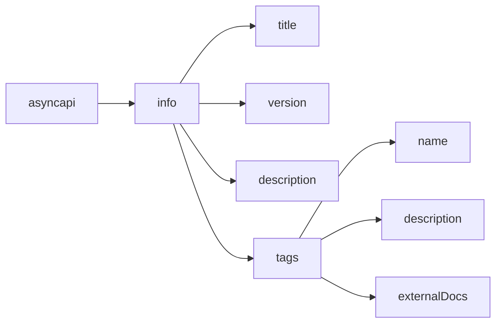
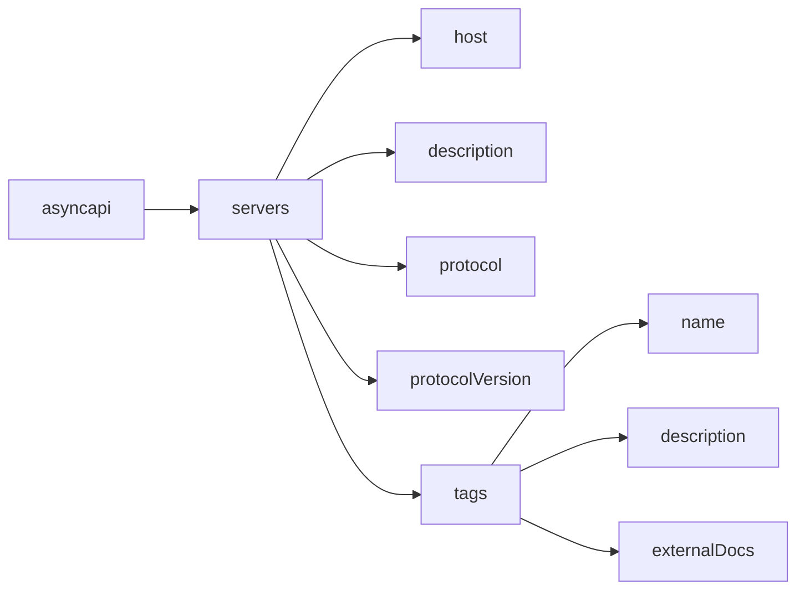
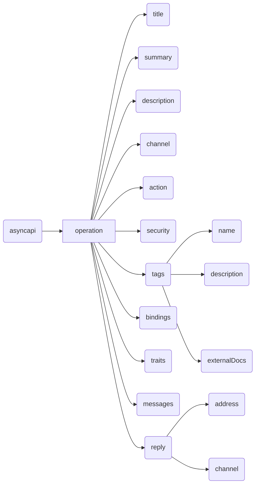
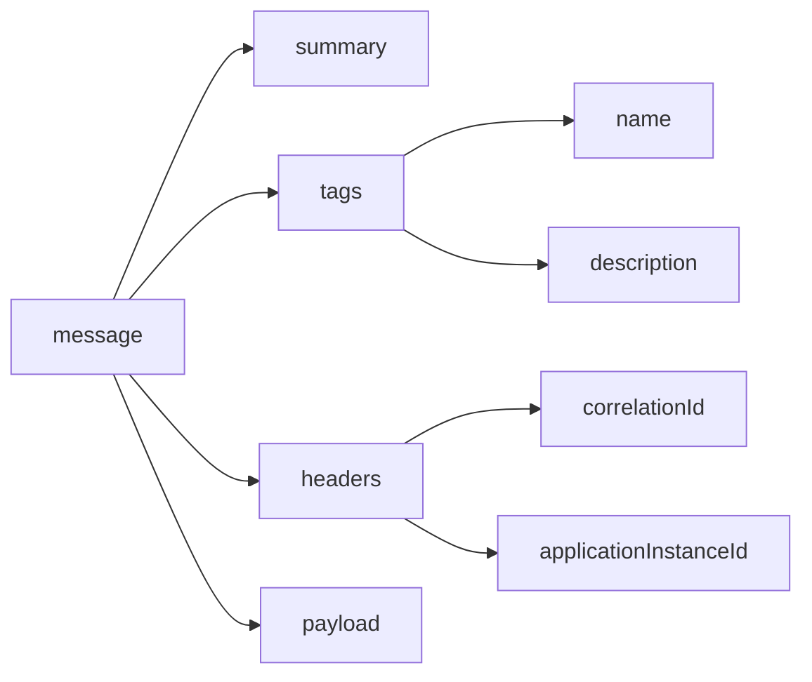

--- Unique Description about AsyncAPI document to be inserted here ---

A `tag` is a label or category that helps you logically group related objects such as channels or servers within an event-driven system. The `tags` object provide a structured way to group channels, operations or other components based on their functionality, purpose and/or any other relevant criteria.

The `tags` object serves as a container for defining and managing tags in a systematic manner. Within the `tags` object, you can define individual tags, specifying a name and providing an optional description that adds further context to the tag's purpose or usage. 

Once tags are defined within the `tags` object, they can be assigned to channels, operations or any other component using the tags property. By including the relevant tag names in the tags property, objects such as channels, servers or components are associated with the appropriate tags, grouping them together based on their shared characteristics.

Additionally, `tags` can also be included in the [`components` object](https://v3.asyncapi.com/docs/reference/specification/v3.0.0-next-major-spec.12#componentsObject) of a AsyncAPI document, which enables the reusuability of the tags. `tags` included in the `components` object can re-used by [reference objects](https://v3.asyncapi.com/docs/reference/specification/v3.0.0-next-major-spec.12#referenceObject).

## `Tags` in AsyncAPI Document
The `tags` object is a list of `tag` objects which can be referenced by [reference object](https://v3.asyncapi.com/docs/reference/specification/v3.0.0-next-major-spec.12#referenceObject).

The `tags` object within the AsyncAPI specification contains some fields that define and describe individual tags.

The behavior and impact of the `tags` object within the AsyncAPI document can vary depending on the context of the object in which it is being used. For instance, The way `tags` object impacts a server object is different from when it is used under the channels object.

Some of the fields that `tags` object holds are:
- `name`: The name of the tag.
- `description`: A short description for the tag.
- `externalDocs`: Additional external documentation for this tag.

### `Tags` in `Info` Object
Tags when defined within the `tags` property of the `info` object provides a high-level categorization and classification for the entire AsyncAPI document. These tags that are defined under the `info` object give a global context to the entire application, representing overarching themes or functional areas within the event-driven system. They serve as a way to group objects such as channels or servers based on their broader significance, providing a holistic understanding of the application's structure.

Here's a visual representation of `tags` object inside a `info` object in a AsyncAPI document:


Below is a example of the `tags` object inside the `info` object in a AsyncAPI document:
```yaml
asyncapi: 3.0.0
info:
  title: AsyncAPI Documentation
  version: 1.0.0
  description: |
    This AsyncAPI document provides a overview
    of the event-driven system.
  tags:
    - name: Finance
      description: APIs related to financial transactions
    - name: Customer
      description: APIs related to customer interactions
    - name: Inventory
      description: APIs related to inventory management
```

### `Tags` in `Servers` Object
Tags when used within the `tags` property of the `servers` object, they are specific to the servers configurations and relate to the server-level characteristics. These tags allow for the categorization of server instances based on their properties or criteria, such as geographical location, environment (e.g., production, development), or specific server capabilities. Using tags in servers object allows for the categorization and organization of servers based on specific tags or labels.

Here's a visual representation of `tags` object inside a `servers` object in a AsyncAPI document:


Below is a example of the `tags` object inside the `servers` object in a AsyncAPI document:
```yaml
servers:
    development:
        host: localhost:5672
        description: Development AMQP broker.
        protocol: amqp
        protocolVersion: 0-9-1
        tags:
            - name: "env:development"
              description: "This environment is meant for developers to run their own tests."
    production:
        host: rabbitmq.in.mycompany.com:5672
        description: RabbitMQ broker for the production environment.
        protocol: amqp
        protocolVersion: 0-9-1
        tags:
            - name: "env:production"
              description: "This environment is the live environment available for final users."
```

### `Tags` in `Channels` object
Tags are associated with individual channels allowing for logical grouping and categorization of channels based on specific functionalities or business domains. The `tags` object when used within a `channels` object, the context is restricted to the `channels` object and the individual `channel` of the AsyncAPI document, meaning they only impact the `channels` object of the AsyncAPI document. 

Here's a visual representation of `tags` object inside a `channels` object in a AsyncAPI document:
```marmaid
graph LR
  A[channel]
  B(address)
  C(title)
  D(description)
  E(messages)
  H(parameters)
  J(servers)
  M(bindings)
  P(tags)
  R(externalDocs)
  F(name)
  G(description)
  I(externalDocs)
  Z(asyncapi)

  Z --> A
  A --> B
  A --> C
  A --> D
  A --> E
  A --> H
  A --> J
  A --> M
  A --> P
  A --> R
  P --> F
  P --> G 
  P --> I 
```

Below is a example of the `tags` object inside the `channels` object in a AsyncAPI document:
```yaml
channels:
  SignedUp:
    address: 'user.signedup'
    messages:
      userSignedUp:
        $ref: '#/components/messages/userSignedUp'
    tags:
      - name: user
        description: User-related messages
```

### `Tags` in `Operations` Object
The `tags` object within the `operations` object of the AsyncAPI document allows for logical grouping and categorization of individual `operation` objects based on type of operation or functionality and more. The `tags` object when used within a `operations` object, the context is restricted to the `operations` object and the individual `operation` of the AsyncAPI document, meaning they only impact the `operations` object of the AsyncAPI document. 

Here's a visual representation of `tags` object inside a `operations` object in a AsyncAPI document:


Below is a example of the `tags` object inside the `operations` object in a AsyncAPI document:
```yaml
operations:
  onUserSignUp:
    title: User sign up
    summary: Action to sign a user up.
    description: A longer description
    channel:
      $ref: '#/channels/userSignup'
    action: send
    tags:
      - name: user
        description: operation related to user
      - name: signup
        description: operation related to a user's signUp
      - name: register
        description: operation related to a new registration
    bindings:
      amqp:
        ack: false
    traits:
      - $ref: '#/components/operationTraits/kafka'
```

### `Tags` in `message` object
Tags are associated with individual message objects allowing for logical grouping and categorization of meassages based on specific requirements or criteria or given channel and operation and more. The `tags` object when used within a `message` object, the context is restricted to the `message` object of the AsyncAPI document, meaning they only impact the `message` object of the AsyncAPI document. 

Here's a visual representation of `tags` object inside a `message` object in a AsyncAPI document:


Below is a example of the `tags` object inside the `message` object in a AsyncAPI document:
```yaml
 name: SimpleSignup
summary: A simple UserSignup example message
tags: 
    - name: userSignUp
      description: some message related to user signup
headers:
  correlationId: my-correlation-id
  applicationInstanceId: myInstanceId
payload:
  user:
    someUserKey: someUserValue
  signup:
    someSignupKey: someSignupValue
```

