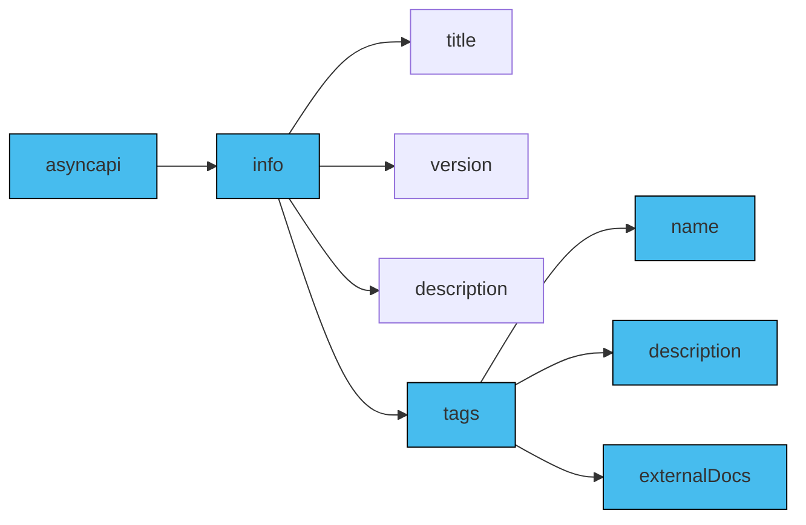
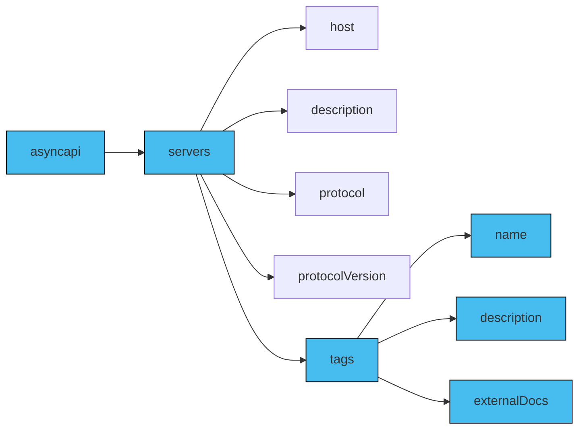
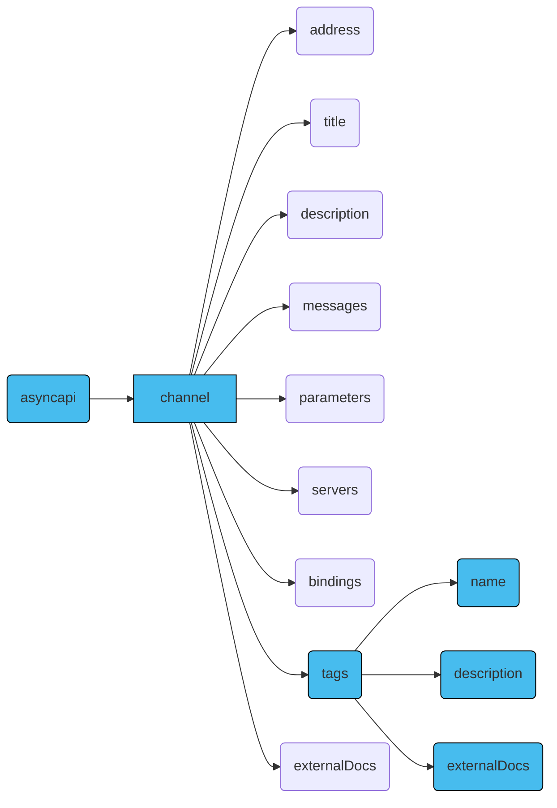
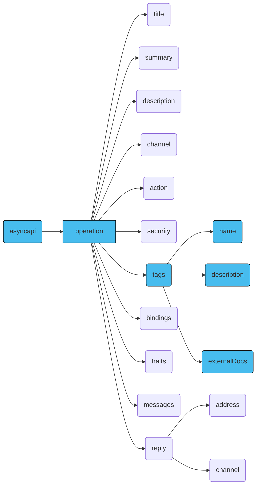
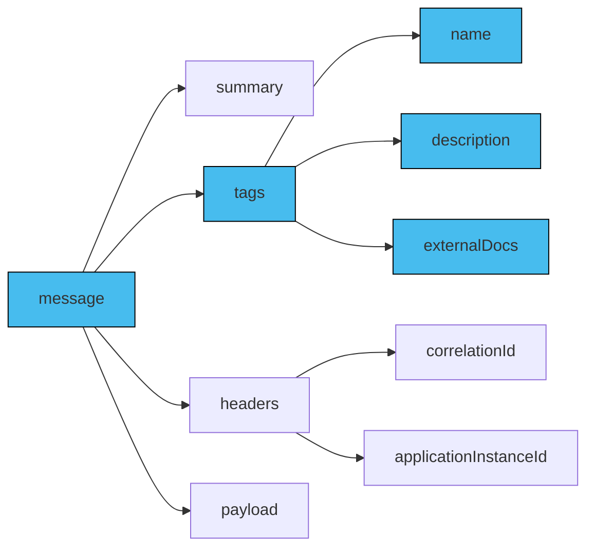

A tag is a label or category that helps you logically group related objects such as channels or servers within an event-driven system. The `tag` object enables you to group channels, operations or other components based on their functionality, purpose and/or any other relevant criteria.

In AyncAPI, the `tags` object is essentially a list of `tag` objects. Within the `tags` object, you can define individual `tag`s, specifying a name and providing an optional description that adds further context to the tag's purpose or usage.

`tags` can be defined in the [`components` object](../../reference/specification/v3.0.0-next-major-spec.12.md#componentsObject) of an AsyncAPI document, which enables the reusability of the tags. `tags` included in the `components` object can be re-used by using [reference objects](../../reference/specification/v3.0.0-next-major-spec.12.md#referenceObject).

Additionally, you can define a list of tags you wanna use across the document under the `tags` object on the `info` level and you can reuse those tags under individual components such as `servers` or `channels` allowing you to group components logically.

## `Tags` in AsyncAPI Document
The `tags` object is a list of `tag` objects that can be referenced by [reference object](../../reference/specification/v3.0.0-next-major-spec.12.md#referenceObject).

The `tags` object is a list of tags and individual `tag` objects contain some fields.

The behaviour of tags inside the `tags` object in the AsyncAPI document can vary based on the context of the object it is being used in. For instance, you can use the `tags` object to have tags used consistently across the AsyncAPI document for logical grouping of components or you can use tags under individual components like on `servers` or `channels` for a specific purpose.

Some of the fields that the `tags` object holds are:
- `name`: The name of the tag.
- `description`: A short description for the tag.
- `externalDocs`: Additional external documentation for this tag.

### `Tags` in `Info` Object
When defined within the `tags` property of the info object, tags provide a high-level categorization and classification for the entire AsyncAPI document. These tags that are defined under the `info` object give a global context to the entire application, representing overarching themes or functional areas within the event-driven system. They serve as a way to group objects such as channels or servers based on their broader significance, providing a holistic understanding of the application's structure.

Here's a visual representation of the `tags` object inside an `info` object in an AsyncAPI document:


Below is an example of the `tags` object inside the `info` object in an AsyncAPI document:
```yaml
asyncapi: 3.0.0
info:
  title: AsyncAPI Documentation
  version: 1.0.0
  description: |
    This AsyncAPI document provides an overview
    of the event-driven system.
  tags:
    - name: Applications
      description: All applications related topics. 
      externalDocs:
        description: More info about applications
        url: https://applications.example.com/docs
    - name: Time
      description: All time related topics.
      externalDocs:
        description: More info about time
        url: https://time.example.com/docs
```

### `Tags` in `Servers` Object
Tags when used within the `tags` property of the `servers` object, are specific to the servers' configurations and relate to the server-level characteristics. These tags allow for the categorization of server instances based on their properties or criteria, such as geographical location, environment (e.g., production, development), or specific server capabilities. Using `tags` in the `servers` object allows for the categorization and organization of servers based on specific tags or labels. Using the `tags` object under the `servers` object is optional.

Here's a visual representation of the `tags` object inside a `servers` object in an AsyncAPI document:


Below is an example of the `tags` object inside the `servers` object in an AsyncAPI document:
```yaml
asyncapi: 3.0.0

info:
  title: AsyncAPI Documentation
  version: 1.0.0

servers:
  development:
    host: localhost:5672
    description: Development AMQP broker.
    protocol: amqp
    protocolVersion: 0-9-1
    tags:
      - name: "env:development"
        description: "This environment is meant for developers to run their tests."
  production:
    host: rabbitmq.in.mycompany.com:5672
    description: RabbitMQ broker for the production environment.
    protocol: amqp
    protocolVersion: 0-9-1
    tags:
      - name: "env:production"
        description: "This environment is the live environment available for final users."
```

### `Tags` in `Channels` object
Tags are associated with individual channels allowing for logical grouping and categorization of channels based on specific functionalities or business domains. The `tags` object when used within a `channels` object, the context is either restricted to the `channels` object and the individual `channel` of the AsyncAPI document, meaning they only affect the `channels` object of the AsyncAPI document or they could be used for consistency of tags across the document for logical grouping. Using the `tags` object under the `channels` object is optional.


Here's a visual representation of the `tags` object inside a `channels` object in an AsyncAPI document:


Below is an example of the `tags` object inside the `channels` object in an AsyncAPI document:
```yaml
asyncapi: 3.0.0

info:
  title: AsyncAPI Documentation
  version: 1.0.0

channels:
  SignedUp:
    address: 'user.signedup'
    messages:
      userSignedUp:
        payload:
          type: object
    tags:
      - name: user
        description: User-related messages
```

### `Tags` in `Operations` Object
The `tags` object within the `operations` object of the AsyncAPI document allows for logical grouping and categorization of individual `operation` objects based on the type of operation or functionality and more. The `tags` object when used within an `operations` object, it can either only affect the `operations` object for a specific purpose or it could be to be in consistent use of tags for logical grouping of components. Using the `tags` object in the `operations` object is optional.

Here's a visual representation of the `tags` object inside a `operations` object in an AsyncAPI document:


Below is an example of the `tags` object inside the `operations` object in an AsyncAPI document:
```yaml
operations:
  onUserSignUp:
    title: User sign up
    summary: Action to sign a user up.
    description: A longer description
    channel:
      $ref: '#/channels/userSignup'
    action: send
    tags:
      - name: user
        description: operation related to user
      - name: signup
        description: operation related to a user's signUp
      - name: register
        description: operation related to a new registration
    bindings:
      amqp:
        ack: false
    traits:
      - $ref: '#/components/operationTraits/kafka'
```

### `Tags` in `message` object
Tags are associated with individual message objects allowing for logical grouping and categorization of messages based on specific requirements or criteria or given channels and operations and more. The `tags` object when used within a `message` object, the context is either restricted to the `message` object of the AsyncAPI document, meaning they only affect the `message` object of the AsyncAPI document or it could be a part of consistent use of tags across the document for logical grouping. 

Here's a visual representation of a `tags` object inside a `message` object in an AsyncAPI document:


Below is an example of the `tags` object inside the `message` object in an AsyncAPI document:
```yaml
 name: SimpleSignup
summary: A simple UserSignup example message
tags: 
    - name: userSignUp
      description: some message related to user signup
headers:
  correlationId: my-correlation-id
  applicationInstanceId: myInstanceId
payload:
  user:
    someUserKey: someUserValue
  signup:
    someSignupKey: someSignupValue
```

## Example
Here's an example illustrating all the tags being defined in the `components` object and then referenced in other components such as `servers`, `channels` and more:
```yml
asyncapi: 3.0.0

components:
  tags:
    speech:
      name: Speech
      description: All speech related topics.
    video:
      name: Video
      description: All video related topics.
      
info:
  title: AsyncAPI Documentation
  version: 1.0.0
  description: |
    This AsyncAPI document provides an overview
    of the event-driven system.
  tags:
    - $ref: '#/components/tags/speech'
    - $ref: '#/components/tags/audio'

servers:
  speech:
    host: localhost:5672
    description: RabbitMQ broker for sending speech data.
    protocol: amqp
    tags:
      - $ref: '#/components/tags/speech'
  video:
    host: localhost:5673
    description: RabbitMQ broker for audio information.
    protocol: amqp
    tags:
       - $ref: '#/components/tags/video'

channels:
  getSpeech:
      address: 'application/speech/get'
      servers: 
        - $ref: '#/servers/speech'
      messages:
        voice:
          name: Voice
          summary: Add info about the voice stream data.
          tags:
            - $ref: '#/components/tags/speech'
  getVideo:
      address: 'application/video/get'
      servers: 
        - $ref: '#/servers/video'
      messages:
        voice:
          name: Video
          summary: Add info about the video data live bitrate and others.
          tags: 
            - $ref: '#/components/tags/video'

operations:
  onVoiceStreamed:
    title: Get speech data
    channel:
      $ref: '#/channels/getSpeech'
    action: receive
    tags:
      - $ref: '#/components/tags/speech'

  onVideoStreamed:
    title: Get video data
    channel:
      $ref: '#/channels/getVideo'
    action: receive
    tags:
      - $ref: '#/components/tags/video'
```