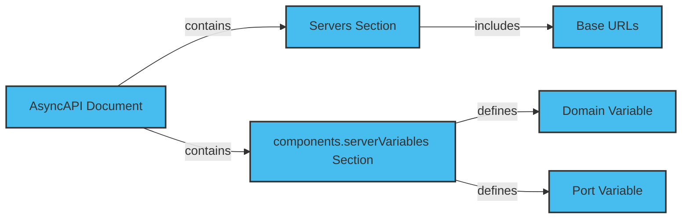

Event-driven architecture benefits from a defined base URL and rules for URL variables. You can easily manage multiple API endpoints, handling various server configurations and environments.

URL variables are placeholders for values you can replace during runtime. AsyncAPI enables you to construct dynamic URLs with query parameters and additional information while enhancing the flexibility and maintainability of your API specifications.

This article assumes that you have a basic understanding of AsyncAPI. For more information, refer to the [Event-Driven Architectures](../../tutorials/getting-started/event-driven-architectures.md).

## Add Dynamic Variables

To add variables to the URL using AsyncAPI between two servers. You can use the `server.url` and `components.serverVariables` fields to enable reusable variables across multiple servers.

The diagram below depicts how to construct dynamic URLs with query parameters.



### Servers section:

Define the servers section in your AsyncAPI document, and include the base URLs for your API servers. Use placeholders enclosed in curly braces {} to represent the variables in the server URL. For example:

```yaml
servers:
 production:
  url: 'https://{domain}.example.com:{port}/v1'
  description:
    Production server staging: url: 'https://{domain}.example.com:{port}/v1'
    description: Staging server
```

### ServerVariables section

Define the components.serverVariables section in your AsyncAPI document. For each variable used in the server URLs, provide a default value and an optional description:

```yaml
components:
  serverVariables:
    domain:
      default: 'api'
      description:
        The domain of the API server port:
          default: '8080'
          description: The port of the API server
```

### Define domain and port variables

Both servers use the components.serverVariables definitions for the domain and port variables. To change the values of these variables, update their default values in the components.serverVariables section. Both servers' URLs will reflect the changes.

Here's the complete AsyncAPI document with the server URL variables:

```yaml
info:
  title: Example API
  version: '1.0.0'
  servers:
    production:
      url: 'https://{domain}.example.com:{port}/v1'
      description: Production server
      staging:
        url: 'https://{domain}.example.com:{port}/v1'
        description: Staging server
        components:
          serverVariables:
            domain:
              default: 'api'
              description: The domain of the API server
              port:
                default: '8080'
                description: The port of the API server channels:# ...channel definitions...
```
