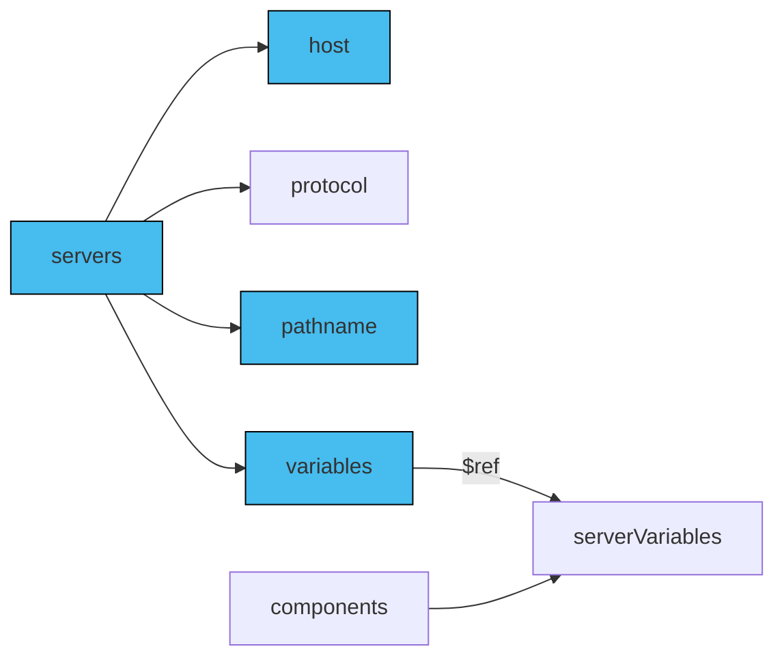

Server's URL consists of `host` and `pathname` fields. These values are not always known when you design your system. AsyncAPI enables you to construct dynamic URLs while enhancing the flexibility and maintainability of your AsyncAPI documents. These dynamic values (variables) are placeholders for values you can replace during runtime. This way you can easily manage multiple endpoints, handling various server configurations and environments.

## Add variables

You can add variables to `server.host` and `server.pathname` and you do it by adding a variable in between curly braces like `{braces}`. Next, you use `server.variables` to provide definitions of your variables. Leverage `components.serverVariables` to enable reusable variable definitions across multiple servers.

The diagram below describes how to use reusable variables in AsyncAPI.



You put variables in `host` and/or `pathname`. Next, you define reusable variables in `components.serverVariables`. Last, you make sure that `server.variables` from your server reference definitions from `components.serverVariables` using `$ref`.

### Servers section

Define the servers section in your AsyncAPI document, and include the `host` and `pathname` for your API servers. Use placeholders enclosed in curly braces {} to represent the variables in the server. For example:

```yaml
servers:
  production:
    host: '{subdomain}.example.com:{port}'
    pathname: '/{version}
    variables:
      subdomain:
        enum:
          - development
          - staging
          - production
      port:
        default: '8080'
      version:
        enum:
          - v1
          - v2
```

### `serverVariables` section

Define the `components.serverVariables` section in your AsyncAPI document. For each variable used in the server `host` or `pathname`, provide a default value and an optional description. This helps you avoid repeating variable defination. For example:

```yaml
components:
  serverVariables:
    subdomain:
      enum:
        - development
        - staging
        - production
      default: development
    port:
      default: '8080'
    version:
      enum:
        - v1
        - v2
```

### Define domain and port variables

Use `components.serverVariables` in your server using [Reference Object](/docs/reference/specification/v3.0.0#referenceObject) to avoid repeating the information:

```yml
    variables:
      subdomain:
        $ref: '#/components/serverVariables/subdomain'
```

Here's the complete AsyncAPI document with the servers' variables for the `host` field:

```yaml
asyncapi: 3.0.0
info:
  title: Example API
  version: '1.0.0'
servers:
  production:
    host: '{subdomain}.example.com:{port}'
    pathname: '/{version}'
    protocol: amqp
    variables:
      subdomain:
        $ref: '#/components/serverVariables/subdomain'
      port:
        $ref: '#/components/serverVariables/port'
      version:
        $ref: '#/components/serverVariables/version'
  development:
    host: '{subdomain}.dev.example.com:{port}'
    pathname: /v1
    protocol: amqp
    variables:
      subdomain:
        $ref: '#/components/serverVariables/subdomain'
      port:
        $ref: '#/components/serverVariables/port'
      version:
        $ref: '#/components/serverVariables/version'
components:
  serverVariables:
    subdomain:
      enum:
        - development
        - staging
        - production
      default: development
    port:
      default: '8080'
    version:
      enum:
        - v1
        - v2
```
