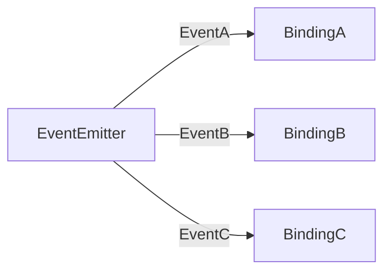

## What are bindings?
Bindings are functions or codes that are bound to listen for specific events emitted by an EventEmitter. When the EventEmitter emits an event, the corresponding binding is executed, allowing the system to respond to the event in a flexible and decoupled way.

Bindings are typically used to handle user input, network events, and other kinds of asynchronous occurrences that require a system to take some action.

Here are a few examples of binding in an event-driven architecture:

1. Binding a button click event to a function that processes the user's input and updates the user interface
2. Binding a key press event to a function that allows the user to navigate through a form or menu

In each of these examples, the binding connects the event to the appropriate event handling function, allowing the system to respond to user actions or system events in a specific and predictable way.

## Why do we need bindings?
Without bindings, the system would not know how to respond to events. Bindings are a key component of an event-driven architecture, as they allow different parts of the system to communicate and respond to events without needing to know about each other. This decoupling of components makes it easier to develop, maintain, and scale the system.

In the diagram above, the EventEmitter emits events which can be any action or occurrence in the system. For example, the events might be user input, network requests, or data updates.

Bindings A, B, and C represent functions or codes that are bound to listen to events A, B, and C respectively.

When the EventEmitter emits one of these events, the corresponding Binding is executed. This allows the system to respond to events in a flexible and decoupled way.

<DocsButton
 suggestions={[
    {
      href:'/docs/concepts/message',
      type: 'back',  
      title: 'Message',
   },
   {
      href:'/docs/tutorials',
      type: 'next',  
      title: 'Tutorials - Overview',
   }
 ]}
/>