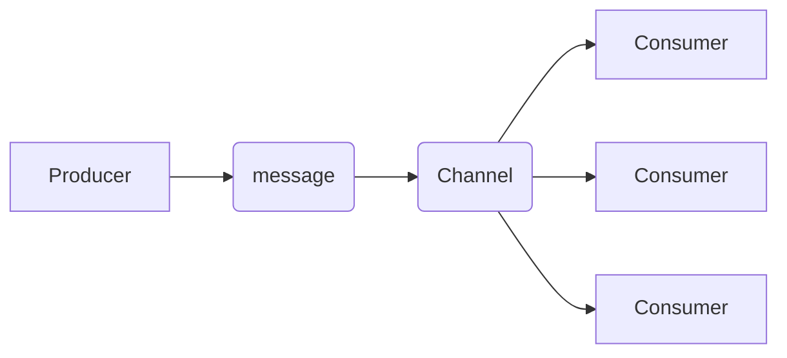

# What is a channel?
A `channel` is a mechanism that is created by the server for the organization and transmission of messages. Channels can also be defined as a _topic ,queue, routing key, path, or subject_ depending on the protocol being used.

# What is the purpose of a channel?
Channels play a crucial role when it comes to the communication between `producers` and `consumers`. A producer can send a message through the channel and the consumer receives messages from a particular channel. A channel's sole purpose is to make sure that the right messages route to the right consumers.

The diagram above shows the communication between the producer and the consumer. The producer sends a message through the channel and the channel queues the message to the specific consumer.
