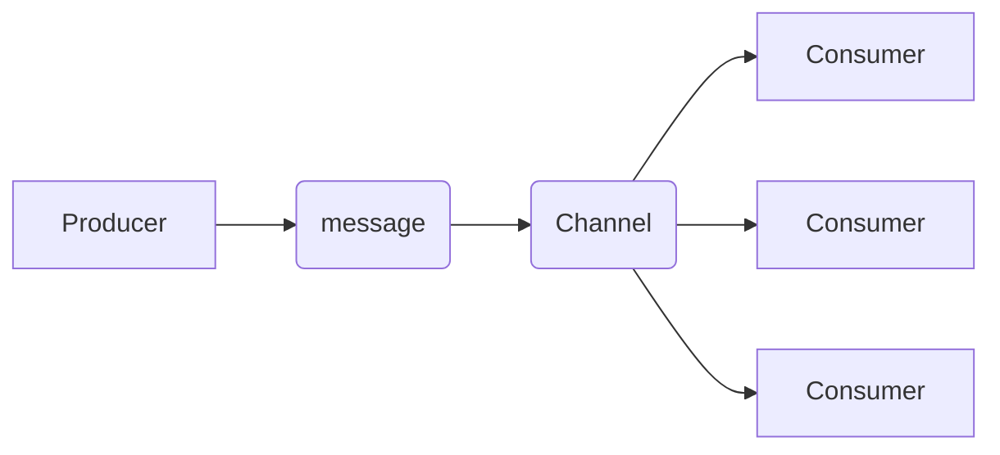

# What is a channel?
A channel is a mechanism that is created by the server for the organization and transmission of messages. 

# What is the purpose of a channel?
Channels play a crucial role when it comes to the communication between producers and consumers. A producer can send a message through the channel and the consumer receives messages from a particular channel.

