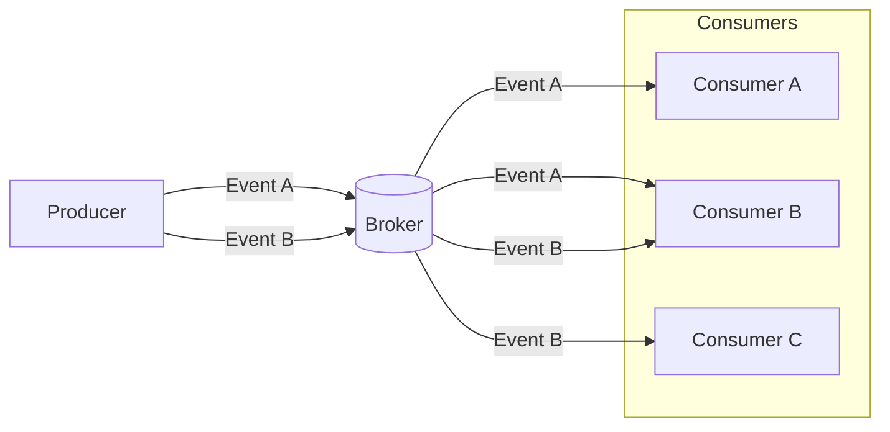

## What is a consumer?
In an Event Driven Architecture (EDA), a consumer is an application that listens for a particular event from a broker and reacts to it.

## Why do we need consumers?
Unlike traditional REST APIs, in EDA, event consumers are not expected to respond immediately on the same connection. In this architecture, a consumer is unaware of the producer or other consumers; all they know is that when a broker sends them an event, it is because they subscribed to it.

When you want events processed asynchronously in your application, the consumer plays an important role in completing that event data flow in the event channel.

The above diagram depicts a sample flow of events from `producer` to `broker` to `consumer`. In this instance, the `producer` publishes two events _(A and B)_ and sends them to the `broker`. Then each `consumer` subscribes to receive those events.
<Remember>
<b>Subscribers</b> can also be <a href="https://www.asyncapi.com/docs/concepts/producer">producers</a>.
</Remember>
