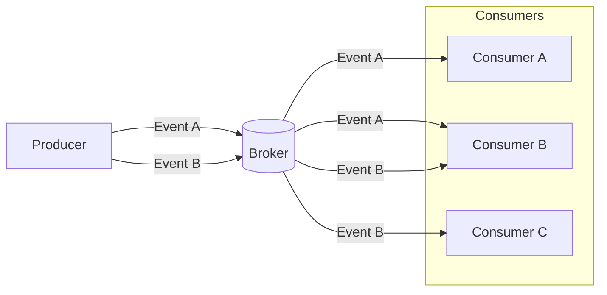

## What is a Consumer?
In an Event Driven Architecture (EDA), a consumer is an application that listens for a particular event from a broker and reacts to it.

## What is the purpose of Consumers?
Unlike traditional REST APIs, in EDA, consumers of the event are not expected to respond immediately on the same connection. In this architecture, a consumer is unaware of the producer or other consumers; all they know is that when a broker sends them an event, it is because they subscribed to it.

When you want events processed asynchronously in your application, the consumer plays an important role in completing that flow of event data in the event channel.

The diagram above depicts an example of the flow of events from a producer to a broker and then to the consumers. In this instance, the producer publishes two events, A & B, and sends them to the broker. Then each consumer receives events that they are subscribed to.

>Note subscribers can actually be producers. Visit this [link](https://www.asyncapi.com/docs/concepts/producer) to learn more about what a producer is.