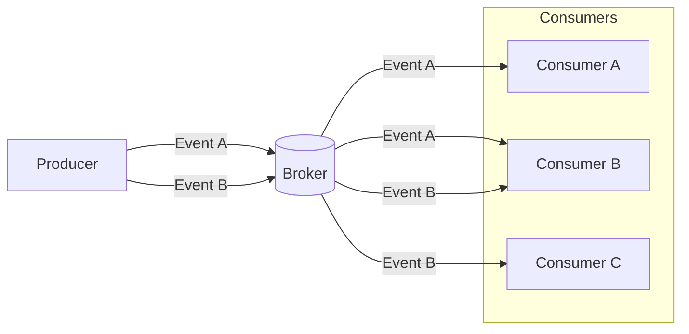

## What is a Consumer?
In an Event Driven Architecture (EDA), a consumer is a component of an application or messaging system that listens for a particular event from a broker and takes the necessary action in response.

## Why do we need Consumers?
Unlike traditional RestAPIs, EDA creates a setting where there is never a wait for requests or responses to an event. In this pattern, a consumer is unaware of the producer or other consumers; all they know is that when a broker sends them an event they are subscribed to, they receive it.

When you want events processed asynchronously in your application, the consumer plays an important role in completing that flow of event data in the event channel.

The diagram above depicts an example of the flow of events from a producer to a broker and then to the consumers. In this instance, the producer publishes two events, A & B and sends to the broker. Then each consumer receives events from what it is subscribed to.