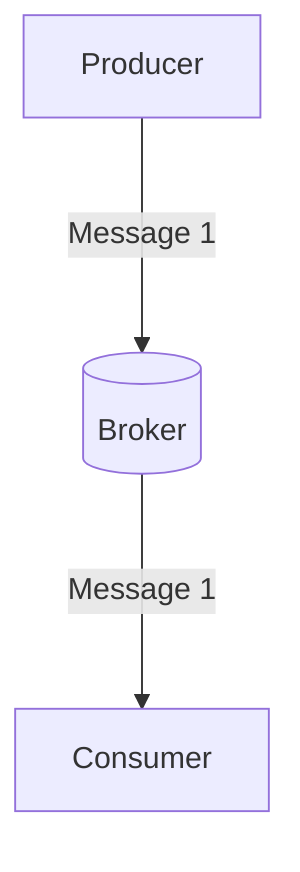
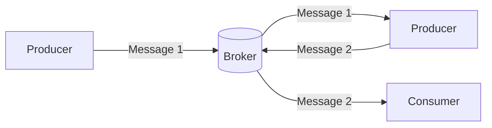

## What is a Producer? 

An event indicates a state change or update that is triggered by a user's/device's action; this could be something like an item being placed in a shopping cart on an e-commerce website, clicking the subscribe button on a YouTube channel, or a temperature change in a sensor. 

A producer is a type of application that senses that state change and then publishes that event as a message.

## Why do we need Producers? 

One of the core concepts of event-driven architecture is the publish/subscribe communication model. Producers are publishers in this model and the first logical layer responsible for publishing to the broker messages that others can subscribe to receive.

The diagram above depicts the communication between a **producer** publishing events to a specific channel in a **broker** and a consumer subscribed to the same channel.

In some cases, an entity can be both a producer publishing messages to a specific channel in the broker and a consumer subscribing to messages from a different channel in the broker.

In the diagram above, we see a producer publishing messages to a specific channel and a consumer subscribing to messages from that channel. We also have a second producer who publishes to one channel but subscribes to messages from another.
