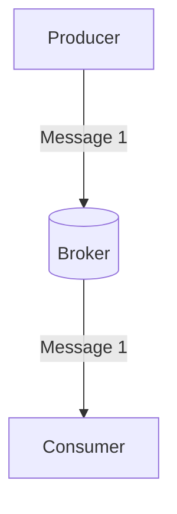
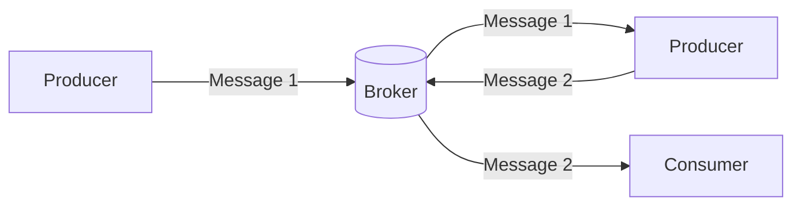

## What is a Producer? 
A producer is an application that senses state changes (events) and publishes those events as messages. An event indicates a state change or update triggered by a user's/device's action. 

The following are sample events:
* Placing an item in a shopping cart on an e-commerce website.
* Clicking the subscribe button on a YouTube channel.
* A temperature change in a sensor.

## Why do we need Producers? 
One of the core concepts of event-driven architecture is the publish/subscribe communication model. Producers are publishers in this model; they're the first logical layer responsible for distributing messages to the broker so that others can subscribe to receive messages.

The diagram above depicts the communication between a **producer** publishing events to a specific channel in a **broker** and a **consumer** subscribed to the same channel.

In some cases, an entity can be both a producer publishing messages to a specific channel in the broker and a consumer subscribing to messages from a different channel in the broker.

In the diagram above, we see a producer publishing messages to a specific channel and a consumer subscribing to messages from that channel. We also have a second producer who publishes to one channel, but subscribes to messages from another.
