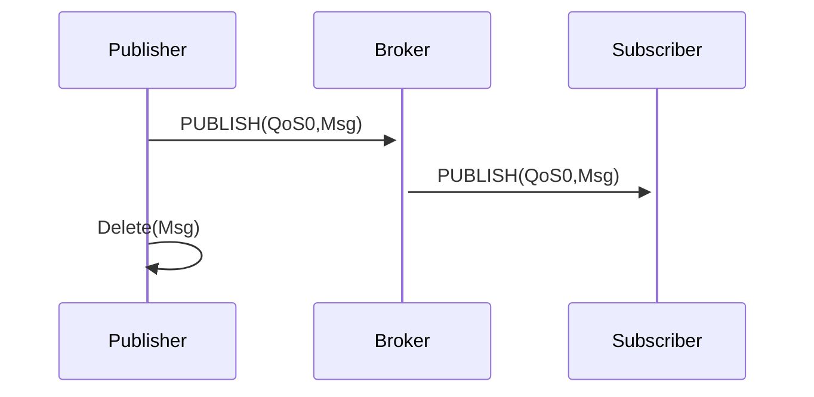

## What is a protocol?
A protocol is a set of rules that specifies how information is exchanged between applications and/or servers.

Protocol examples:
* [WebSockets](https://developer.mozilla.org/en-US/docs/Web/API/WebSocket)
* [HTTP](https://developer.mozilla.org/en-US/docs/Web/HTTP)
* [Kafka](https://kafka.apache.org/)
* [MQTT](https://mqtt.org/)

## Why do we need protocols?
Whenever a producer detects a state change (events) and publishes those events as messages, a protocol carries those messages to the channel and then to a consumer. Protocol plays a vital role in message transmission.

The diagram above depicts the message exchange flow from `producer` to `broker` to `consumer` using the MQTT protocol with QoS0 (quality of service 0). This means that information exchanged from `producer` to `broker` to `consumer` is delivered at most once.

The quality of service information rule is specified on a protocol level. Broker implementations and other involved actors must act accordingly.

In AsyncAPI documents, all protocol-specific details that the application follows can be described using [bindings](/docs/reference/specification/v2.5.0#definitionsBindings).
