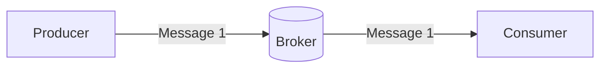

## What is a protocol?
A protocol is a set of rules that specifies how information is exchanged between applications and/or servers.

`Protocol` examples:
* [WebSockets](https://developer.mozilla.org/en-US/docs/Web/API/WebSocket)
* [HTTP](https://developer.mozilla.org/en-US/docs/Web/HTTP)
* [Kafka](https://kafka.apache.org/)
* [MQTT](https://mqtt.org/)

## Why do we need protocols?
Whenever a producer detects a state change (events) and publishes those events as messages, a protocol carries those messages to the channel and then to a consumer. Protocol plays a vital role in message transmission.

<DocsButton
 suggestions={[
    {
      href:'/docs/concepts/application',
      type: 'back',  
      title: 'Application',
   },
   {
      href:'/docs/tutorials',
      type: 'next',  
      title: 'Tutorials - Overview',
   }
 ]}
/>