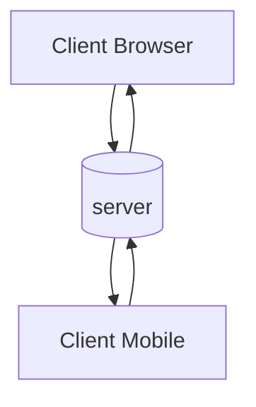
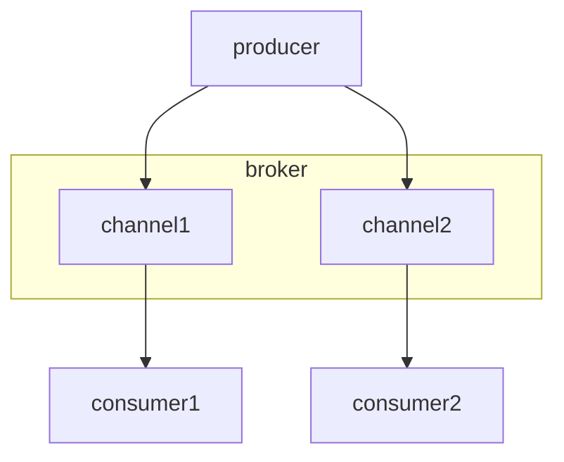

## What is a server?
A server represents a messaging broker system where connections and communication between a producer and a consumer are established. Unlike traditional API servers which are dependent on request/response, message broker interactions occur back and forth over different channels.

## What is the purpose of servers?
Servers play an important role in maintaining a relationship between producers and consumers. When designing and setting up an event-driven application, servers are in charge of delivering asynchronous messages from the producer to the consumers through the use of channels. By integrating different messaging protocols, servers can transmit and exchange messages between clients.

### Clients and Server

The diagram above describes a bi-directional communication between several **clients** and one **server**. In this case, in your AsyncAPI file, you describe the `server`, and therefore the [`Server Object`](https://www.asyncapi.com/docs/reference/specification/latest#serverObject) holds information about the actual server, including its physical location.

### Broker Centric

The diagram above shows the *Broker Centric Architecture*. In this case, we created three AsyncAPI files for the `producer`, `consumer1`, and `consumer2`. In these AsyncAPI files, the [`Server Object`](https://www.asyncapi.com/docs/reference/specification/latest#serverObject) provides information about the `broker`, so that API users know where to connect to start receiving or sending messages.
